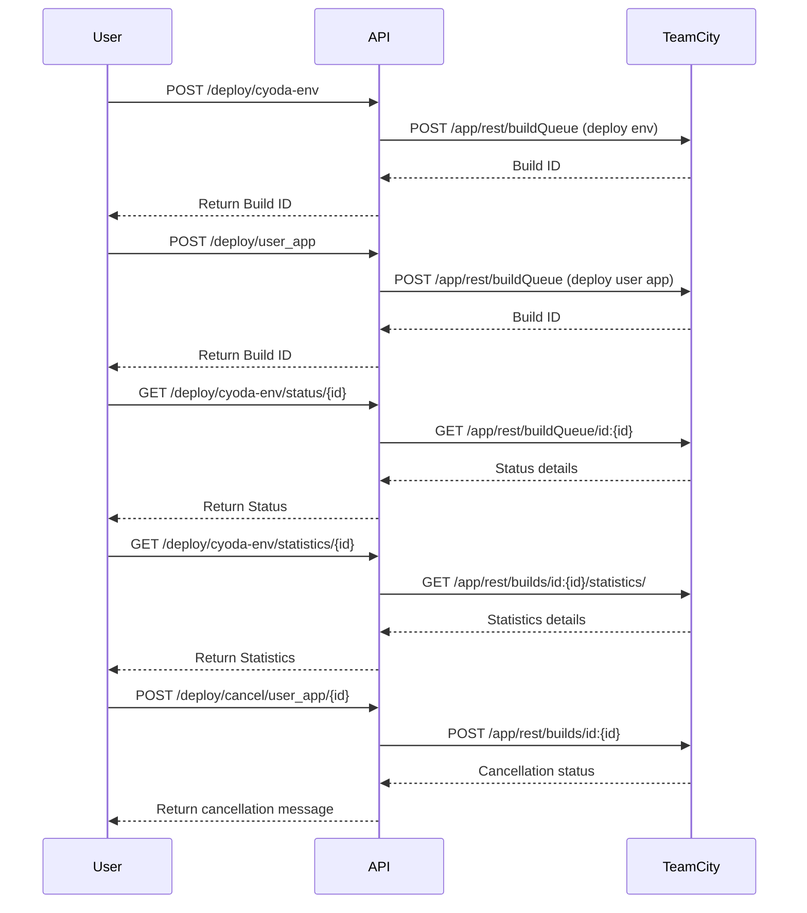

Here’s a well-structured outline of functional requirements for your application, organized into user stories and use cases. Each requirement includes relevant API endpoints and request/response formats. Additionally, I'll provide Mermaid diagrams to represent user-app interactions.

### User Stories and Use Cases

#### User Story 1: User Deployment of Environment
**As a** user, **I want** to deploy an environment using a specific configuration, **so that** I can manage my application settings.

**Use Case 1.1: Deploying Environment**
- **API Endpoint:** `POST /deploy/cyoda-env`
- **Request Body:**
    ```json
    {
        "user_name": "test"
    }
    ```
- **Action:**
  - Forward request to `POST https://teamcity.cyoda.org/app/rest/buildQueue` with payload:
    ```json
    {
        "buildType": {
            "id": "KubernetesPipeline_CyodaSaas"
        },
        "properties": {
            "property": [
                {
                    "name": "user_defined_keyspace",
                    "value": "test"
                },
                {
                    "name": "user_defined_namespace",
                    "value": "test"
                }
            ]
        }
    }
    ```
- **Response:**
    ```json
    {
        "build_id": "123456"
    }
    ```

#### User Story 2: User Application Deployment
**As a** user, **I want** to deploy my application code, **so that** it can be processed in the environment I configured.

**Use Case 2.1: Deploying User Application**
- **API Endpoint:** `POST /deploy/user_app`
- **Request Body:**
    ```json
    {
        "repository_url": "http://example.com/my-repo.git",
        "is_public": "true"
    }
    ```
- **Action:**
  - Forward request to `POST https://teamcity.cyoda.org/app/rest/buildQueue` with payload:
    ```json
    {
        "buildType": {
            "id": "KubernetesPipeline_CyodaSaasUserEnv"
        },
        "properties": {
            "property": [
                {
                    "name": "user_defined_keyspace",
                    "value": "test"
                },
                {
                    "name": "user_defined_namespace",
                    "value": "test"
                }
            ]
        }
    }
    ```
- **Response:**
    ```json
    {
        "build_id": "234567"
    }
    ```

#### User Story 3: Check Deployment Status
**As a** user, **I want** to check the status of my deployment, **so that** I can know if it succeeded or failed.

**Use Case 3.1: Get Environment Status**
- **API Endpoint:** `GET /deploy/cyoda-env/status/{id}`
- **Action:** Fetch status using `GET https://teamcity.cyoda.org/app/rest/buildQueue/id:{id}`
- **Response:**
    ```json
    {
        "status": "success/failure",
        "details": "Details about the build"
    }
    ```

#### User Story 4: Get Deployment Statistics
**As a** user, **I want** to obtain statistics of my deployment, **so that** I can analyze its performance.

**Use Case 4.1: Get Environment Statistics**
- **API Endpoint:** `GET /deploy/cyoda-env/statistics/{id}`
- **Action:** Fetch statistics using `GET https://teamcity.cyoda.org/app/rest/builds/id:{id}/statistics/`
- **Response:**
    ```json
    {
        "statistics": {
            // statistics details
        }
    }
    ```

#### User Story 5: Cancel Deployment
**As a** user, **I want** to cancel a deployment that is in progress, **so that** I can stop unwanted processing.

**Use Case 5.1: Cancel User Application Deployment**
- **API Endpoint:** `POST /deploy/cancel/user_app/{id}`
- **Request Body:**
    ```json
    {
        "comment": "Canceling a queued build",
        "readdIntoQueue": false
    }
    ```
- **Action:** Forward request to `POST https://teamcity.cyoda.org/app/rest/builds/id:{id}`
- **Response:**
    ```json
    {
        "message": "Build cancelled successfully"
    }
    ```

### User-App Interaction

Here are the Mermaid diagrams to visualize user interactions with your app:


```mermaid
sequenceDiagram
    participant User
    participant API
    participant TeamCity

    User->>API: POST /deploy/cyoda-env
    API->>TeamCity: POST /app/rest/buildQueue (deploy env)
    TeamCity-->>API: Build ID
    API-->>User: Return Build ID

    User->>API: POST /deploy/user_app
    API->>TeamCity: POST /app/rest/buildQueue (deploy user app)
    TeamCity-->>API: Build ID
    API-->>User: Return Build ID

    User->>API: GET /deploy/cyoda-env/status/{id}
    API->>TeamCity: GET /app/rest/buildQueue/id:{id}
    TeamCity-->>API: Status details
    API-->>User: Return Status

    User->>API: GET /deploy/cyoda-env/statistics/{id}
    API->>TeamCity: GET /app/rest/builds/id:{id}/statistics/
    TeamCity-->>API: Statistics details
    API-->>User: Return Statistics

    User->>API: POST /deploy/cancel/user_app/{id}
    API->>TeamCity: POST /app/rest/builds/id:{id}
    TeamCity-->>API: Cancellation status
    API-->>User: Return cancellation message
```

### Summary
The structured functional requirements provide a clear perspective on what needs to be implemented for your app. The outlined user stories, use cases, endpoints, and the visual representation using Mermaid diagrams will facilitate the development process, ensuring your application's API meets user needs effectively.