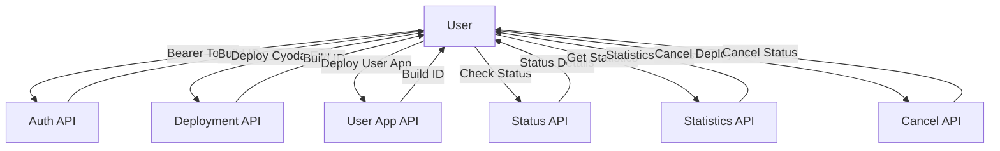

Here’s a detailed outline of the functional requirements for your application, structured as user stories and use cases. Each user story includes its respective API endpoints with request and response formats. Additionally, you'll find a visual representation using Mermaid diagrams for user-app interaction.

### Functional Requirements

#### User Story 1: User Authentication
**As a** user,  
**I want to** authenticate using a Bearer token,  
**So that** I can securely access the deployment configurations.

- **API Endpoint:** `POST /deploy/cyoda-env`
- **Request Format:**
    ```json
    {
        "user_name": "test"
    }
    ```
- **Response Format:**
    ```json
    {
        "build_id": "12345"
    }
    ```

#### User Story 2: Deploy Cyoda Environment
**As a** user,  
**I want to** initiate a deployment process for my configurations,  
**So that** I can manage my applications effectively.

- **API Endpoint:** `POST https://teamcity.cyoda.org/app/rest/buildQueue`
- **Request Format:**
    ```json
    {
        "buildType": {
            "id": "KubernetesPipeline_CyodaSaas"
        },
        "properties": {
            "property": [
                {
                    "name": "user_defined_keyspace",
                    "value": "test"
                },
                {
                    "name": "user_defined_namespace",
                    "value": "test"
                }
            ]
        }
    }
    ```
- **Response Format:**
    ```json
    {
        "build_id": "12345"
    }
    ```

#### User Story 3: Deploy User Application
**As a** user,  
**I want to** deploy my application from a repository,  
**So that** it can be accessible to others.

- **API Endpoint:** `POST /deploy/user_app`
- **Request Format:**
    ```json
    {
        "repository_url": "http://....",
        "is_public": "true"
    }
    ```
- **Response Format:**
    ```json
    {
        "build_id": "12346"
    }
    ```

#### User Story 4: Check Deployment Status for Cyoda Environment
**As a** user,  
**I want to** check the status of my deployment,  
**So that** I can understand if it was successful or not.

- **API Endpoint:** `GET /deploy/cyoda-env/status/{id}`
- **Response Format:**
    ```json
    {
        "status": "success|failure",
        "details": "Deployment details here"
    }
    ```

#### User Story 5: Get Deployment Statistics for Cyoda Environment
**As a** user,  
**I want to** retrieve statistics related to my deployment,  
**So that** I can analyze the performance and results.

- **API Endpoint:** `GET /deploy/cyoda-env/statistics/{id}`
- **Response Format:**
    ```json
    {
        "statistics": "Detailed statistics here"
    }
    ```

#### User Story 6: Check Deployment Status for User Application
**As a** user,  
**I want to** check the status of my user application deployment,  
**So that** I can confirm the ongoing process.

- **API Endpoint:** `GET /deploy/user_app/status/{id}`
- **Response Format:**
    ```json
    {
        "status": "success|failure",
        "details": "Deployment details here"
    }
    ```

#### User Story 7: Get Deployment Statistics for User Application
**As a** user,  
**I want to** get statistics of my user application deployment,  
**So that** I can assess its performance.

- **API Endpoint:** `GET /deploy/user_app/statistics/{id}`
- **Response Format:**
    ```json
    {
        "statistics": "Detailed statistics here"
    }
    ```

#### User Story 8: Cancel User Application Deployment
**As a** user,  
**I want to** cancel an ongoing deployment,  
**So that** I can avoid unnecessary resource use.

- **API Endpoint:** `POST /deploy/cancel/user_app/{id}`
- **Request Format:**
    ```json
    {
        "comment": "Canceling a queued build",
        "readdIntoQueue": false
    }
    ```
- **Response Format:**
    ```json
    {
        "status": "canceled"
    }
    ```

### Mermaid Diagram Representation of User-App Interaction


```mermaid
graph TD
    A[User] -->|Bearer Token| B[Auth API]
    B -->|Build ID| A
    A -->|Deploy Cyoda Env| C[Deployment API]
    C -->|Build ID| A
    A -->|Deploy User App| D[User App API]
    D -->|Build ID| A
    A -->|Check Status| E[Status API]
    E -->|Status Details| A
    A -->|Get Statistics| F[Statistics API]
    F -->|Statistics Details| A
    A -->|Cancel Deployment| G[Cancel API]
    G -->|Cancel Status| A    
```

### Summary
The functional requirements cover various user stories to ensure the application meets user needs effectively. These include authentication, deployment, status checking, and cancellation functionalities, all structured around clearly defined API endpoints and corresponding request/response formats. The Mermaid diagram visually represents the interaction between the user and the application functionalities, providing a clear overview of the workflow.