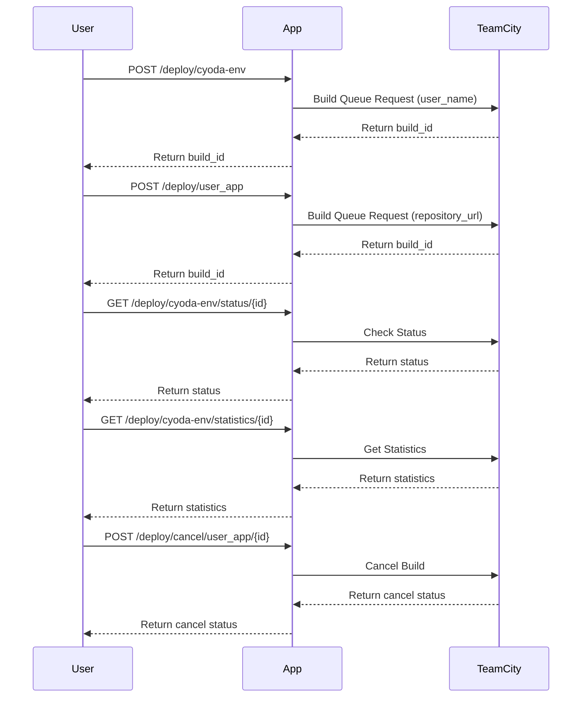

Here are the functional requirements for your application structured as user stories and use cases, along with the necessary API endpoints and request/response formats. Additionally, I’ve included Mermaid diagrams for visual representation.

### User Stories and Use Cases

#### User Story 1: User Environment Deployment
**As a** user  
**I want to** deploy an environment  
**So that** I can manage my application settings.

**Use Case: Deploy Environment**
- **Precondition:** User is authenticated with a valid Bearer token.
- **Trigger:** User sends a POST request to deploy an environment.
- **API Endpoint:** `POST /deploy/cyoda-env`
- **Request Format:**
    ```json
    {
        "user_name": "test"
    }
    ```
- **Action:**
    Sends a request to the build queue API to initiate a build.
- **Response Format:**
    ```json
    {
        "build_id": "12345"
    }
    ```

---

#### User Story 2: User Application Deployment
**As a** user  
**I want to** deploy my application  
**So that** I can manage my application's settings.

**Use Case: Deploy User Application**
- **Precondition:** User is authenticated with a valid Bearer token.
- **Trigger:** User sends a POST request to deploy an application.
- **API Endpoint:** `POST /deploy/user_app`
- **Request Format:**
    ```json
    {
        "repository_url": "http://repository.url",
        "is_public": "true"
    }
    ```
- **Action:**
    Sends a request to the build queue API to initiate a build.
- **Response Format:**
    ```json
    {
        "build_id": "67890"
    }
    ```

---

#### User Story 3: Check Deployment Status
**As a** user  
**I want to** check the status of my deployment  
**So that** I can know if it completed successfully or is still running.

**Use Case: Get Deployment Status**
- **Precondition:** User is authenticated with a valid Bearer token.
- **Trigger:** User sends a GET request to check deployment status.
- **API Endpoint:** `GET /deploy/cyoda-env/status/{id}`
- **Response Format:**
    ```json
    {
        "status": "running/completed",
        "repository_url": "http://repository.url",
        "is_public": "true"
    }
    ```

---

#### User Story 4: Get Build Statistics
**As a** user  
**I want to** get the statistics of my deployment  
**So that** I can analyze its performance.

**Use Case: Get Deployment Statistics**
- **Precondition:** User is authenticated with a valid Bearer token.
- **Trigger:** User sends a GET request to retrieve build statistics.
- **API Endpoint:** `GET /deploy/cyoda-env/statistics/{id}`
- **Response Format:**
    ```json
    {
        "statistics": {
            "duration": "time",
            "success": true,
            "...other metrics..."
        },
        "repository_url": "http://repository.url",
        "is_public": "true"
    }
    ```

---

#### User Story 5: Cancel User Application Deployment
**As a** user  
**I want to** cancel my application's deployment  
**So that** I can stop an ongoing process.

**Use Case: Cancel User Application Deployment**
- **Precondition:** User is authenticated with a valid Bearer token.
- **Trigger:** User sends a POST request to cancel a deployment.
- **API Endpoint:** `POST /deploy/cancel/user_app/{id}`
- **Request Format:**
    ```json
    {
        "comment": "Canceling a queued build",
        "readdIntoQueue": false
    }
    ```
- **Response Format:**
    ```json
    {
        "status": "canceled",
        "build_id": "67890"
    }
    ```

### Visual Representation of User-App Interaction


```mermaid
sequenceDiagram
    participant User
    participant App
    participant TeamCity

    User->>App: POST /deploy/cyoda-env
    App->>TeamCity: Build Queue Request (user_name)
    TeamCity-->>App: Return build_id
    App-->>User: Return build_id

    User->>App: POST /deploy/user_app
    App->>TeamCity: Build Queue Request (repository_url)
    TeamCity-->>App: Return build_id
    App-->>User: Return build_id

    User->>App: GET /deploy/cyoda-env/status/{id}
    App->>TeamCity: Check Status
    TeamCity-->>App: Return status
    App-->>User: Return status

    User->>App: GET /deploy/cyoda-env/statistics/{id}
    App->>TeamCity: Get Statistics
    TeamCity-->>App: Return statistics
    App-->>User: Return statistics

    User->>App: POST /deploy/cancel/user_app/{id}
    App->>TeamCity: Cancel Build
    TeamCity-->>App: Return cancel status
    App-->>User: Return cancel status
```

### Conclusion
These functional requirements will guide the development of the application and help ensure that the desired features are implemented correctly. Let me know if you need any additional details or modifications.