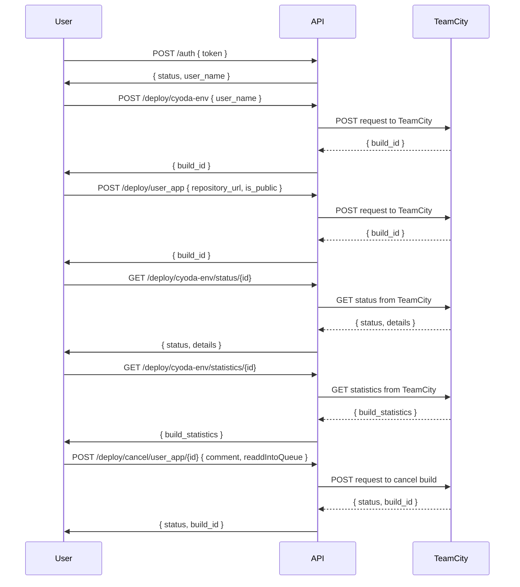

Here are the functional requirements for your application expressed as user stories and use cases, along with the necessary API endpoints, request/response formats, and user-app interaction visualizations using Mermaid diagrams.

### User Stories and Use Cases

#### User Story 1: User Authentication
**As a user,** I want to authenticate using a Bearer token so that I can access the deployment management features.

- **API Endpoint:**
  - `POST /auth`
- **Request Format:**
  ```json
  {
      "token": "your_bearer_token"
  }
  ```
- **Response Format:**
  ```json
  {
      "status": "success",
      "user_name": "test_user"
  }
  ```

---

#### User Story 2: Deploy Cyoda Environment
**As a user,** I want to initiate the deployment of a Cyoda environment so that my application can be properly configured.

- **Use Case:**
  - **Initiate Deployment**
- **API Endpoint:**
  - `POST /deploy/cyoda-env`
- **Request Format:**
  ```json
  {
      "user_name": "test_user"
  }
  ```
- **Response Format:**
  ```json
  {
      "build_id": "12345"
  }
  ```

---

#### User Story 3: Deploy User Application
**As a user,** I want to deploy a user application so that it can be available for use.

- **Use Case:**
  - **Initiate User Application Deployment**
- **API Endpoint:**
  - `POST /deploy/user_app`
- **Request Format:**
  ```json
  {
      "repository_url": "http://example.com/repo",
      "is_public": "true"
  }
  ```
- **Response Format:**
  ```json
  {
      "build_id": "67890"
  }
  ```

---

#### User Story 4: Check Deployment Status
**As a user,** I want to check the status of my Cyoda environment deployment so that I can monitor its progress.

- **Use Case:**
  - **Get Cyoda Environment Status**
- **API Endpoint:**
  - `GET /deploy/cyoda-env/status/{id}`
- **Response Format:**
  ```json
  {
      "status": "in_progress",
      "details": {
          "repository_url": "http://example.com/repo",
          "is_public": true
      }
  }
  ```

---

#### User Story 5: Get Deployment Statistics
**As a user,** I want to retrieve statistics for my deployments so that I can analyze their performance.

- **Use Case:**
  - **Get Deployment Statistics**
- **API Endpoint:**
  - `GET /deploy/cyoda-env/statistics/{id}`
- **Response Format:**
  ```json
  {
      "build_statistics": {
          "duration": "30 minutes",
          "success": true,
          "details": "Deployment Successful"
      }
  }
  ```

---

#### User Story 6: Cancel Deployment
**As a user,** I want to cancel a queued user application deployment so that I can stop the process if necessary.

- **Use Case:**
  - **Cancel User Application Deployment**
- **API Endpoint:**
  - `POST /deploy/cancel/user_app/{id}`
- **Request Format:**
  ```json
  {
      "comment": "Canceling a queued build",
      "readdIntoQueue": false
  }
  ```
- **Response Format:**
  ```json
  {
      "status": "canceled",
      "build_id": "67890"
  }
  ```

---

### Visual Representation of User-App Interaction


```mermaid
sequenceDiagram
    participant User
    participant API
    participant TeamCity

    User->>API: POST /auth { token }
    API->>User: { status, user_name }

    User->>API: POST /deploy/cyoda-env { user_name }
    API->>TeamCity: POST request to TeamCity
    TeamCity-->>API: { build_id }
    API->>User: { build_id }

    User->>API: POST /deploy/user_app { repository_url, is_public }
    API->>TeamCity: POST request to TeamCity
    TeamCity-->>API: { build_id }
    API->>User: { build_id }

    User->>API: GET /deploy/cyoda-env/status/{id}
    API->>TeamCity: GET status from TeamCity
    TeamCity-->>API: { status, details }
    API->>User: { status, details }

    User->>API: GET /deploy/cyoda-env/statistics/{id}
    API->>TeamCity: GET statistics from TeamCity
    TeamCity-->>API: { build_statistics }
    API->>User: { build_statistics }

    User->>API: POST /deploy/cancel/user_app/{id} { comment, readdIntoQueue }
    API->>TeamCity: POST request to cancel build
    TeamCity-->>API: { status, build_id }
    API->>User: { status, build_id }
```

These functional requirements, along with the sequence diagrams, should provide a clear outline of the application’s features and interactions, setting you up nicely for next steps such as implementation and testing. If you have any further questions or need adjustments, feel free to ask.