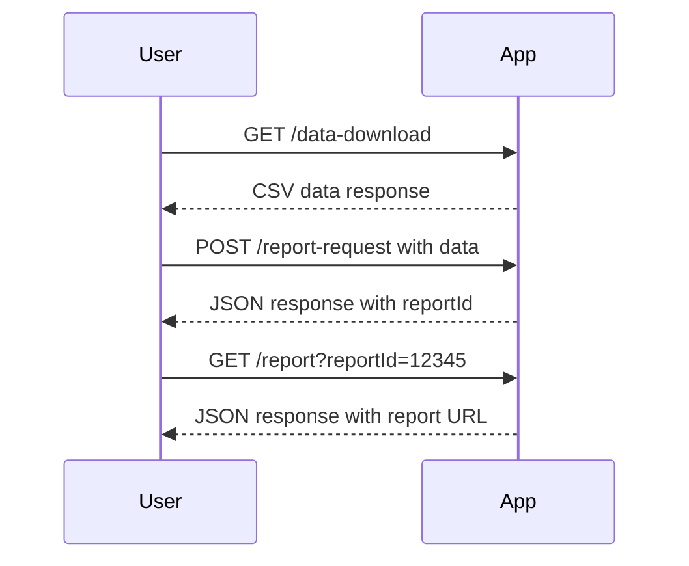

Here are the functional requirements for your project, structured in the form of user stories and use cases, along with the necessary API endpoints including details on request/response formats. I've also included a visual representation of the user-app interaction using Mermaid diagrams.

### User Stories

1. **User Story 1: Data Download**
   - **As a** user,  
   - **I want to** download the London Houses data,  
   - **So that** I can analyze it using pandas.

   **API Endpoint:**
   - **Method:** GET  
   - **Endpoint:** `/data-download`  
   - **Request Format:** None  
   - **Response Format:** CSV (Content-Type: `text/csv`)  
   - **Example Response:**
     ```
     Address,Neighborhood,Bedrooms,Bathrooms,Square Meters,Building Age,Garden,Garage,Floors,Property Type,Heating Type,Balcony,Interior Style,View,Materials,Building Status,Price (£)
     78 Regent Street,Notting Hill,2,3,179,72,No,No,3,Semi-Detached,Electric Heating,High-level Balcony,Industrial,Garden,Marble,Renovated,2291200
     198 Oxford Street,Westminster,2,1,123,34,Yes,No,1,Apartment,Central Heating,High-level Balcony,Industrial,City,Laminate Flooring,Old,1476000
     ```

2. **User Story 2: Report Generation**
   - **As a** user,  
   - **I want to** generate and save a report based on the downloaded data,  
   - **So that** I can review the analysis.

   **API Endpoint:**
   - **Method:** POST  
   - **Endpoint:** `/report-request`  
   - **Request Format:** JSON  
   - **Example Request:**
     ```json
     {
       "data": "<CSV data as string>",
       "analysisType": "summary"
     }
     ```
   - **Response Format:** JSON  
   - **Example Response:**
     ```json
     {
       "reportId": "12345",
       "status": "processing"
     }
     ```

3. **User Story 3: Retrieve Report**
   - **As a** user,  
   - **I want to** retrieve the generated report,  
   - **So that** I can view or download the analysis results.

   **API Endpoint:**
   - **Method:** GET  
   - **Endpoint:** `/report`  
   - **Request Format:** Query Parameter (reportId)  
   - **Example Request:** `/report?reportId=12345`  
   - **Response Format:** JSON  
   - **Example Response:**
     ```json
     {
       "reportId": "12345",
       "status": "completed",
       "reportUrl": "https://example.com/reports/12345.pdf",
       "summary": "Summary of the London Houses data analysis"
     }
     ```

### Use Cases

1. **Use Case 1: Download Data**
   - **Preconditions:** User has internet connectivity.
   - **Main Flow:**
     1. User makes a GET request to the `/data-download` endpoint.
     2. System responds with the London Houses data in CSV format.
   - **Postconditions:** CSV data is available for analysis.

2. **Use Case 2: Generate Report**
   - **Preconditions:** User must have downloaded data.
   - **Main Flow:**
     1. User sends a POST request to `/report-request` with the CSV data and analysis type.
     2. System processes the request and returns a report ID.
   - **Postconditions:** Report is being generated.

3. **Use Case 3: Retrieve Report**
   - **Preconditions:** A report has been generated.
   - **Main Flow:**
     1. User sends a GET request to `/report` with the relevant report ID.
     2. System returns the status and a URL to download the report if completed.
   - **Postconditions:** User can access the generated report.

### User-App Interaction Diagram (Mermaid)


```mermaid
sequenceDiagram
    participant User
    participant App

    User->>App: GET /data-download
    App-->>User: CSV data response

    User->>App: POST /report-request with data
    App-->>User: JSON response with reportId

    User->>App: GET /report?reportId=12345
    App-->>User: JSON response with report URL
```

These functional requirements provide a clear understanding of the user's interactions with the application, the necessary API endpoints, and the data formats involved. Feel free to ask for any modifications or additional details you may need.