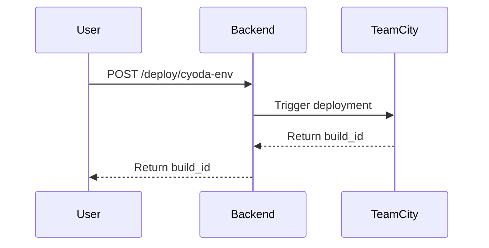
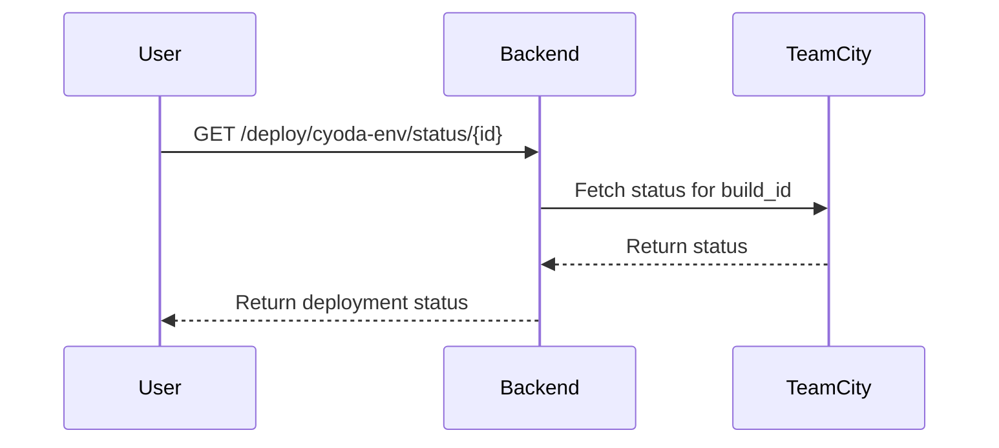
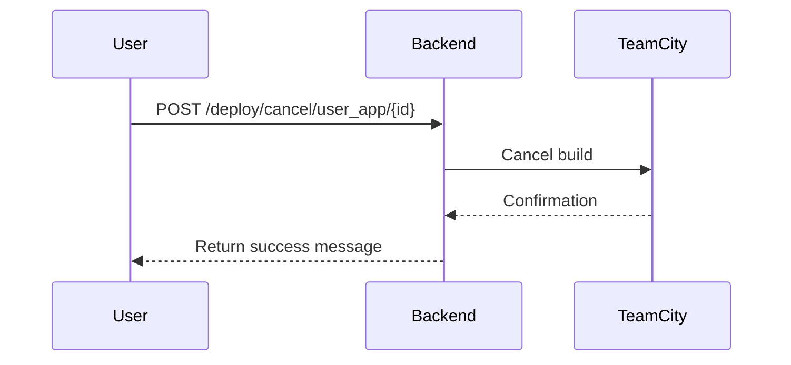

Here’s a structured approach to defining the functional requirements for your application using user stories, use cases, and corresponding API endpoints. I’ll also include Mermaid diagrams for better visualization of user-app interaction.

### Functional Requirements

#### User Stories

1. **User Authentication**
   - As a user, I want to authenticate myself using a Bearer token so that I can access the deployment management features.
   - **API Endpoint:** 
     - **POST** `/deploy/cyoda-env`
       - **Request:**
         ```json
         {
           "user_name": "test"
         }
         ```
       - **Response:**
         ```json
         {
           "token": "your_bearer_token"
         }
         ```

2. **Deploy Environment**
   - As a user, I want to deploy an environment using a specific configuration so that my application can run with user-specific parameters.
   - **API Endpoint:** 
     - **POST** `/deploy/cyoda-env`
       - **Request:**
         ```json
         {
           "user_name": "test"
         }
         ```
       - **Response:**
         ```json
         {
           "build_id": "12345"
         }
         ```
       
3. **Deploy User Application**
   - As a user, I want to deploy my application repository so that it can be used publicly or privately.
   - **API Endpoint:** 
     - **POST** `/deploy/user_app`
       - **Request:**
         ```json
         {
           "repository_url": "http://....",
           "is_public": "true"
         }
         ```
       - **Response:**
         ```json
         {
           "build_id": "67890"
         }
         ```

4. **Check Deployment Status**
   - As a user, I want to check the status of a deployed environment so that I can monitor its deployment status.
   - **API Endpoint:**
     - **GET** `/deploy/cyoda-env/status/{id}`
       - **Response:**
         ```json
         {
           "status": "success|failure|running",
           "build_id": "12345"
         }
         ```

5. **Check Deployment Statistics**
   - As a user, I want to view statistics regarding my deployment so that I can analyze its performance.
   - **API Endpoint:**
     - **GET** `/deploy/cyoda-env/statistics/{id}`
       - **Response:**
         ```json
         {
           "statistics": {
             "duration": "120s",
             "success_rate": "95%"
           }
         }
         ```

6. **Cancel User Application Deployment**
   - As a user, I want to cancel my queued deployment so that I can manage my build queue effectively.
   - **API Endpoint:**
     - **POST** `/deploy/cancel/user_app/{id}`
       - **Request:**
         ```json
         {
           "comment": "Canceling a queued build",
           "readdIntoQueue": false
         }
         ```
       - **Response:**
         ```json
         {
           "message": "Build canceled successfully"
         }
         ```

#### Use Cases

1. **Use Case: User Authentication**
   - **Actor:** User
   - **Precondition:** User must have valid credentials.
   - **Postcondition:** User is authenticated and receives a Bearer token.

2. **Use Case: Deploy Environment**
   - **Actor:** User
   - **Precondition:** User is authenticated.
   - **Postcondition:** Environment is deployed, and build ID is returned.

3. **Use Case: Deploy User Application**
   - **Actor:** User
   - **Precondition:** User is authenticated.
   - **Postcondition:** User application is deployed, and build ID is returned.

4. **Use Case: Check Deployment Status**
   - **Actor:** User
   - **Precondition:** User is authenticated.
   - **Postcondition:** User receives the current status of the deployment.

5. **Use Case: Check Deployment Statistics**
   - **Actor:** User
   - **Precondition:** User is authenticated.
   - **Postcondition:** User receives deployment statistics.

6. **Use Case: Cancel User Application Deployment**
   - **Actor:** User
   - **Precondition:** User has a queued deployment.
   - **Postcondition:** Deployment is canceled.

### Visual Representation with Mermaid Diagrams

#### Deployment Process

```mermaid
sequenceDiagram
    participant User
    participant Backend
    participant TeamCity

    User->>Backend: POST /deploy/cyoda-env
    Backend->>TeamCity: Trigger deployment
    TeamCity-->>Backend: Return build_id
    Backend-->>User: Return build_id
```

#### Status Check

```mermaid
sequenceDiagram
    participant User
    participant Backend
    participant TeamCity

    User->>Backend: GET /deploy/cyoda-env/status/{id}
    Backend->>TeamCity: Fetch status for build_id
    TeamCity-->>Backend: Return status
    Backend-->>User: Return deployment status
```

#### Cancel Deployment

```mermaid
sequenceDiagram
    participant User
    participant Backend
    participant TeamCity

    User->>Backend: POST /deploy/cancel/user_app/{id}
    Backend->>TeamCity: Cancel build
    TeamCity-->>Backend: Confirmation
    Backend-->>User: Return success message
```

### Summary
These functional requirements define key user interactions with the application, outline necessary API endpoints, and provide a visual representation of the interactions. This structure should serve as a solid foundation for further iterations and development planning.