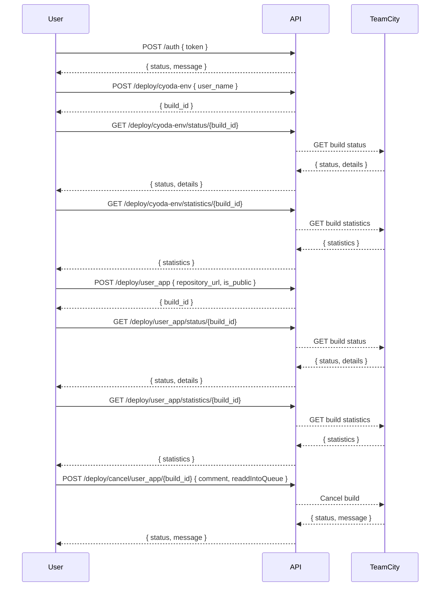

Here's a set of functional requirements defined as user stories and use cases, along with the necessary API endpoints and a visual representation using Mermaid diagrams. 

### Functional Requirements

#### User Stories

1. **User Authentication**
   - **As a** user, **I want** to authenticate myself using Bearer token so that I can securely access the deployment features.
   - **API Endpoint:** 
     - `POST /auth`
     - **Request Body:** `{ "token": "<Bearer token>" }`
     - **Response:** `{ "status": "success", "message": "Authenticated" }`

2. **Submit Cyoda Environment Deployment**
   - **As a** user, **I want** to submit a deployment request for a Cyoda environment **so that** I can initiate a build with specific configurations.
   - **API Endpoint:** 
     - `POST /deploy/cyoda-env`
     - **Request Body:** `{ "user_name": "test" }`
     - **Response:** `{ "build_id": "<build_id>" }`
   - **Action:** Triggers a build queue post to TeamCity.

3. **Retrieve Cyoda Environment Deployment Status**
   - **As a** user, **I want** to check the deployment status of my Cyoda environment **so that** I can monitor build progress.
   - **API Endpoint:** 
     - `GET /deploy/cyoda-env/status/{id}`
     - **Response:** `{ "status": "SUCCESS/FAILURE", "details": {...} }`
   - **Action:** Retrieves build status from TeamCity using the build ID.

4. **Retrieve Cyoda Environment Deployment Statistics**
   - **As a** user, **I want** to view deployment statistics of my Cyoda environment **so that** I can analyze past performance.
   - **API Endpoint:** 
     - `GET /deploy/cyoda-env/statistics/{id}`
     - **Response:** `{ "statistics": {...} }`
   - **Action:** Retrieves statistics from TeamCity using the build ID.

5. **Submit User App Deployment**
   - **As a** user, **I want** to submit a deployment request for my user app **so that** I can initiate a build for my application.
   - **API Endpoint:** 
     - `POST /deploy/user_app`
     - **Request Body:** `{ "repository_url": "http://...", "is_public": "true" }`
     - **Response:** `{ "build_id": "<build_id>" }`
   - **Action:** Triggers a build queue post to TeamCity.

6. **Retrieve User App Deployment Status**
   - **As a** user, **I want** to check the deployment status of my user app **so that** I can monitor build progress.
   - **API Endpoint:** 
     - `GET /deploy/user_app/status/{id}`
     - **Response:** `{ "status": "SUCCESS/FAILURE", "details": {...} }`
   - **Action:** Retrieves build status from TeamCity using the build ID.

7. **Retrieve User App Deployment Statistics**
   - **As a** user, **I want** to view deployment statistics of my user app **so that** I can analyze past performance.
   - **API Endpoint:** 
     - `GET /deploy/user_app/statistics/{id}`
     - **Response:** `{ "statistics": {...} }`
   - **Action:** Retrieves statistics from TeamCity using the build ID.

8. **Cancel User App Deployment**
   - **As a** user, **I want** to cancel my ongoing user app deployment **so that** I can stop unnecessary processes.
   - **API Endpoint:** 
     - `POST /deploy/cancel/user_app/{id}`
     - **Request Body:** `{ "comment": "Canceling a queued build", "readdIntoQueue": false }`
     - **Response:** `{ "status": "success", "message": "Build canceled" }`
   - **Action:** Cancels building the user app in TeamCity.

### API Request/Response Formats

The APIs follow common RESTful design principles. For each endpoint, request/response formats are specified within the user stories above. 

### Visual Representation

Below is a Mermaid diagram illustrating the user-app interaction:

```mermaid
sequenceDiagram
    participant User
    participant API
    participant TeamCity

    User->>API: POST /auth { token }
    API-->>User: { status, message }

    User->>API: POST /deploy/cyoda-env { user_name }
    API-->>User: { build_id }

    User->>API: GET /deploy/cyoda-env/status/{build_id}
    API-->>TeamCity: GET build status
    TeamCity-->>API: { status, details }
    API-->>User: { status, details }

    User->>API: GET /deploy/cyoda-env/statistics/{build_id}
    API-->>TeamCity: GET build statistics
    TeamCity-->>API: { statistics }
    API-->>User: { statistics }

    User->>API: POST /deploy/user_app { repository_url, is_public }
    API-->>User: { build_id }

    User->>API: GET /deploy/user_app/status/{build_id}
    API-->>TeamCity: GET build status
    TeamCity-->>API: { status, details }
    API-->>User: { status, details }

    User->>API: GET /deploy/user_app/statistics/{build_id}
    API-->>TeamCity: GET build statistics
    TeamCity-->>API: { statistics }
    API-->>User: { statistics }

    User->>API: POST /deploy/cancel/user_app/{build_id} { comment, readdIntoQueue }
    API-->>TeamCity: Cancel build
    TeamCity-->>API: { status, message }
    API-->>User: { status, message }
```

### Final Thoughts

This specification outlines the key functional requirements of your application clearly and systematically, defining user stories, use cases, API endpoints, and a visual flow of interaction. Feel free to ask if you need any additional details or further adjustments.