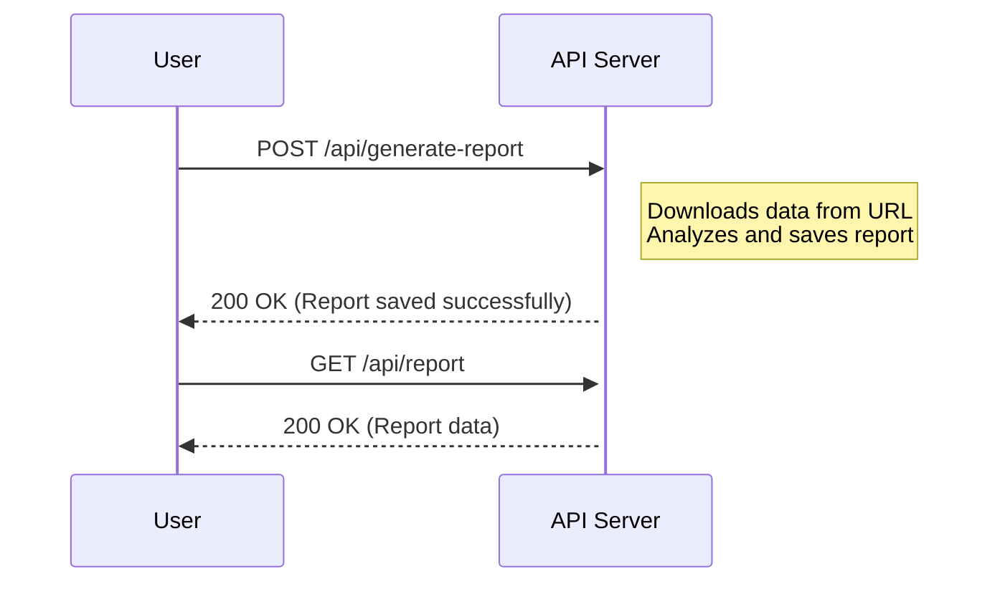

Here are the functional requirements for your project, presented in the form of user stories and use cases, along with the necessary API endpoints, request/response formats, and visual representations using Mermaid diagrams.

### User Stories

1. **User Story: Download and Analyze Data**
   - As a user, I want to download the London Houses data, analyze it, and save the report so that I can review insights about the properties.

   **Use Case: Generate and Save Report**
   - **API Endpoint**: `POST /api/generate-report`
   - **Request Format**:
     ```json
     {
       "url": "https://raw.githubusercontent.com/Cyoda-platform/cyoda-ai/refs/heads/ai-2.x/data/test-inputs/v1/connections/london_houses.csv"
     }
     ```
   - **Response Format**:
     ```json
     {
       "message": "Report generated and saved successfully.",
       "report_data": {
         "average_price": 1728000,
         "total_properties": 2
         // Additional analysis results as needed
       }
     }
     ```

2. **User Story: Retrieve Generated Report**
   - As a user, I want to retrieve the saved report so that I can view the analysis results.

   **Use Case: Get Report**
   - **API Endpoint**: `GET /api/report`
   - **Response Format**:
     ```json
     {
       "report_data": {
         "average_price": 1728000,
         "total_properties": 2
         // Additional analysis results as needed
       }
     }
     ```

### API Endpoints Summary
- **POST /api/generate-report**
  - **Description**: Downloads the data from the specified URL, performs the analysis, and saves the report.
  - **Request Body**: 
    - URL of the CSV data to be downloaded.
  - **Response**: Confirmation message and report data upon successful report generation.

- **GET /api/report**
  - **Description**: Retrieves the previously generated report.
  - **Response**: Contains the report data including analysis results.

### Visual Representation of User-App Interaction


```mermaid
sequenceDiagram
    participant User
    participant API as API Server

    User->>API: POST /api/generate-report
    activate API
    Note right of API: Downloads data from URL<br>Analyzes and saves report
    API-->>User: 200 OK (Report saved successfully)

    User->>API: GET /api/report
    activate API
    API-->>User: 200 OK (Report data)
```

This structured format provides a clear understanding of the functional requirements for your application, allowing for well-defined development and future enhancements based on non-functional requirements. If you have any further questions or need clarification on any aspect, feel free to ask!