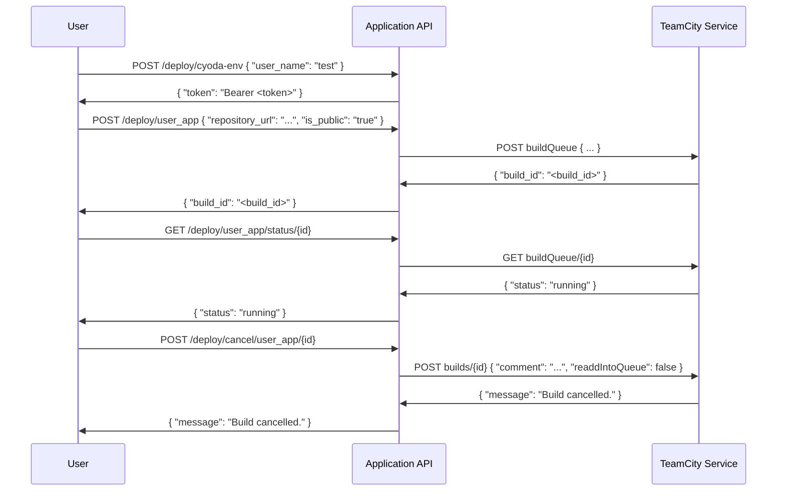

Here are the functional requirements for your application, articulated through user stories and use cases. Each section includes necessary API endpoints, request/response formats, and visual representations using Mermaid diagrams.

### User Story 1: User Authentication
As a user, I want to authenticate with the application using a Bearer token so that I can perform actions securely.

- **API Endpoint**: `POST /deploy/cyoda-env`
- **Request Format**:
  ```json
  {
      "user_name": "test"
  }
  ```
- **Response Format**:
  ```json
  {
      "token": "Bearer <token>"
  }
  ```

### User Story 2: Deploy Environment for User
As a user, I want to initiate a deployment for my environment, so that I can manage my custom configurations.

- **API Endpoint**: `POST /deploy/cyoda-env`
- **Request Format**:
  ```json
  {
      "user_name": "test"
  }
  ```
- **Response Format**:
  ```json
  {
      "build_id": "<build_id>"
  }
  ```
  
### User Story 3: Deploy User Application
As a user, I want to deploy my application, specifying the repository URL and its visibility.

- **API Endpoint**: `POST /deploy/user_app`
- **Request Format**:
  ```json
  {
      "repository_url": "http://example.com/repo.git",
      "is_public": true
  }
  ```
- **Response Format**:
  ```json
  {
      "build_id": "<build_id>"
  }
  ```

### User Story 4: Get Deployment Status
As a user, I want to check the status of my deployment by build ID.

- **API Endpoint**: `GET /deploy/cyoda-env/status/{id}`
- **Response Format**:
  ```json
  {
      "status": "queued | running | finished"
  }
  ```

### User Story 5: Get Deployment Statistics
As a user, I want to retrieve the statistics of my deployment by build ID.

- **API Endpoint**: `GET /deploy/cyoda-env/statistics/{id}`
- **Response Format**:
  ```json
  {
      "statistics": {...}
  }
  ```

### User Story 6: Cancel User Application Deployment
As a user, I want to cancel a queued deployment of my application using the build ID.

- **API Endpoint**: `POST /deploy/cancel/user_app/{id}`
- **Request Format**:
  ```json
  {
      "comment": "Canceling a queued build",
      "readdIntoQueue": false
  }
  ```
- **Response Format**:
  ```json
  {
      "message": "Build cancelled."
  }
  ```

### Visual Representation of User-App Interaction
Here is a Mermaid diagram representing the interaction between the user and the application using the defined endpoints.


```mermaid
sequenceDiagram
    participant User
    participant API as Application API
    participant TeamCity as TeamCity Service

    User->>API: POST /deploy/cyoda-env { "user_name": "test" }
    API->>User: { "token": "Bearer <token>" }

    User->>API: POST /deploy/user_app { "repository_url": "...", "is_public": "true" }
    API->>TeamCity: POST buildQueue { ... }
    TeamCity->>API: { "build_id": "<build_id>" }
    API->>User: { "build_id": "<build_id>" }

    User->>API: GET /deploy/user_app/status/{id}
    API->>TeamCity: GET buildQueue/{id}
    TeamCity->>API: { "status": "running" }
    API->>User: { "status": "running" }

    User->>API: POST /deploy/cancel/user_app/{id}
    API->>TeamCity: POST builds/{id} { "comment": "...", "readdIntoQueue": false }
    TeamCity->>API: { "message": "Build cancelled." }
    API->>User: { "message": "Build cancelled." }
```

### Summary
This structured approach defines the required functionalities and outlines the necessary API endpoints. You can use these specifications to develop the backend application while considering aspects such as security, resource management, and error handling in future iterations. Please let me know if there are additional requirements or modifications needed.