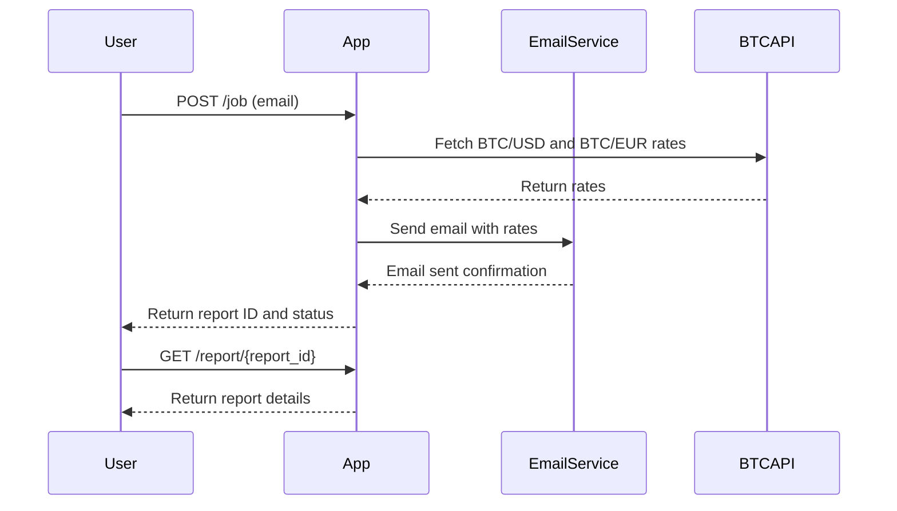

Here are the final functional requirements formatted clearly for your project:

### Functional Requirements

#### User Stories

1. **Report Creation**
   - **As a user**, I want to initiate the report creation process so that I can receive the latest Bitcoin conversion rates.
     - **Endpoint**: `POST /job`
     - **Request Format**:
       ```json
       {
         "email": "user@example.com"
       }
       ```
     - **Response Format**:
       - **Success**:
       ```json
       {
         "report_id": "12345",
         "status": "processing"
       }
       ```
       - **Error**:
       ```json
       {
         "error": "Invalid email format."
       }
       ```

2. **Retrieve Report**
   - **As a user**, I want to retrieve a stored report by its ID so that I can view the conversion rates.
     - **Endpoint**: `GET /report/{report_id}`
     - **Response Format**:
       - **Success**:
       ```json
       {
         "report_id": "12345",
         "btc_usd": "50000",
         "btc_eur": "42000",
         "timestamp": "2023-10-01T12:00:00Z"
       }
       ```
       - **Error**:
       ```json
       {
         "error": "Report not found."
       }
       ```

#### API Endpoints Summary

| Method | Endpoint          | Description                              |
|--------|-------------------|------------------------------------------|
| POST   | /job              | Initiates report creation and sends email. |
| GET    | /report/{report_id} | Retrieves the stored report by ID.     |

#### User-App Interaction Diagram


```mermaid
sequenceDiagram
    participant User
    participant App
    participant EmailService
    participant BTCAPI

    User->>App: POST /job (email)
    App->>BTCAPI: Fetch BTC/USD and BTC/EUR rates
    BTCAPI-->>App: Return rates
    App->>EmailService: Send email with rates
    EmailService-->>App: Email sent confirmation
    App-->>User: Return report ID and status

    User->>App: GET /report/{report_id}
    App-->>User: Return report details
```

These requirements provide a comprehensive overview of the functionality of your application. If you need further adjustments or additional details, please let me know!