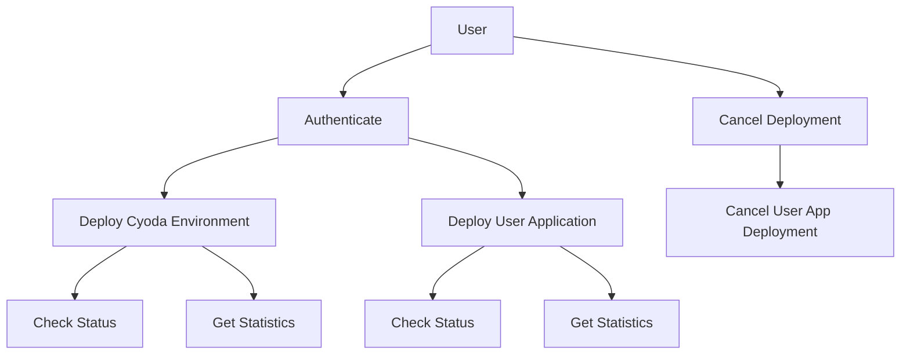

Below are the structured functional requirements for your application, organized into user stories and use cases. Each entry includes the relevant API endpoints, request and response formats, as well as a visual representation of the user-app interaction using Mermaid diagrams.

### User Stories and Use Cases

#### User Story 1: User Authentication
As a user, I want to authenticate using a Bearer token so that I can securely access the API.

**Use Case 1.1: Authenticate User**
- **API Endpoint:** `POST /deploy/cyoda-env`
- **Request Format:**
    ```json
    {
        "user_name": "test"
    }
    ```
- **Response Format:**
    ```json
    {
        "status": "success",
        "build_id": "12345"
    }
    ```

---

#### User Story 2: Deploy Cyoda Environment
As an authenticated user, I want to deploy the Cyoda environment with specified configurations.

**Use Case 2.1: Deploy Cyoda Environment**
- **API Endpoint:** `POST /deploy/cyoda-env`
- **Request Format:**
    ```json
    {
        "user_name": "test"
    }
    ```
- **Response Format:**
    ```json
    {
        "status": "success",
        "build_id": "12345"
    }
    ```

**Use Case 2.2: Check Deployment Status**
- **API Endpoint:** `GET /deploy/cyoda-env/status/{id}`
- **Response Format:**
    ```json
    {
        "status": "in progress",
        "details": {}
    }
    ```

**Use Case 2.3: Get Deployment Statistics**
- **API Endpoint:** `GET /deploy/cyoda-env/statistics/{id}`
- **Response Format:**
    ```json
    {
        "status": "success",
        "statistics": {}
    }
    ```

---

#### User Story 3: Deploy User Application
As an authenticated user, I want to deploy my application.

**Use Case 3.1: Deploy User Application**
- **API Endpoint:** `POST /deploy/user_app`
- **Request Format:**
    ```json
    {
        "repository_url": "http://example.com/repo",
        "is_public": "true"
    }
    ```
- **Response Format:**
    ```json
    {
        "status": "success",
        "build_id": "67890"
    }
    ```

**Use Case 3.2: Check User App Status**
- **API Endpoint:** `GET /deploy/user_app/status/{id}`
- **Response Format:**
    ```json
    {
        "status": "completed",
        "details": {}
    }
    ```

**Use Case 3.3: Get User App Statistics**
- **API Endpoint:** `GET /deploy/user_app/statistics/{id}`
- **Response Format:**
    ```json
    {
        "status": "success",
        "statistics": {}
    }
    ```

---

#### User Story 4: Cancel Deployment
As a user, I want to cancel a queued deployment to manage my resources effectively.

**Use Case 4.1: Cancel User Application Deployment**
- **API Endpoint:** `POST /deploy/cancel/user_app/{id}`
- **Request Format:**
    ```json
    {
        "comment": "Canceling a queued build"
    }
    ```
- **Response Format:**
    ```json
    {
        "status": "success",
        "message": "Build canceled successfully."
    }
    ```

---

### User-App Interaction Diagram
Below is a visual representation using Mermaid syntax to illustrate interactions between the user and the app:


```mermaid
graph TD;
    User-->A[Authenticate]
    A-->B[Deploy Cyoda Environment]
    A-->C[Deploy User Application]
    B-->D[Check Status]
    B-->E[Get Statistics]
    C-->F[Check Status]
    C-->G[Get Statistics]
    User-->H[Cancel Deployment]
    H-->I[Cancel User App Deployment]
```

### Summary
These functional requirements are structured in a way to facilitate further iterations, such as specifying non-functional requirements, testing, and eventually deployment. Further discussions can be held to refine each aspect as needed.