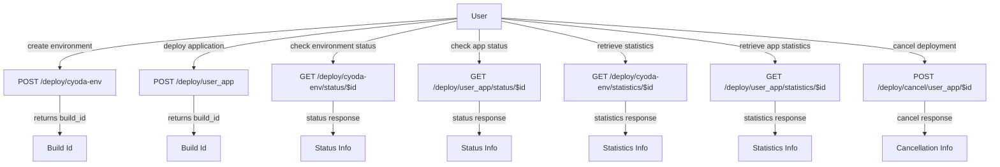

Certainly! Below are the functional requirements for your application presented in the form of user stories and use cases. Each user story is accompanied by the necessary API endpoints, including details on request and response formats. Additionally, I've created Mermaid diagrams to visualize user-app interactions.

### User Stories and Use Cases

#### User Story 1: User Deployment Environment Management
**As a** user, **I want** to create and manage a deployment environment, **so that** I can deploy applications in my configured environment.

- **Use Case 1.1: Create Cyoda Environment**
  - **Endpoint:** `POST /deploy/cyoda-env`
    - **Request Format:**
      ```json
      {
        "user_name": "test"
      }
      ```
    - **Response Format:**
      ```json
      {
        "build_id": "12345"
      }
      ```

#### User Story 2: User Application Deployment
**As a** user, **I want** to deploy my application, **so that** it can be managed in the system.

- **Use Case 2.1: Deploy User Application**
  - **Endpoint:** `POST /deploy/user_app`
    - **Request Format:**
      ```json
      {
        "repository_url": "http://....",
        "is_public": "true"
      }
      ```
    - **Response Format:**
      ```json
      {
        "build_id": "67890"
      }
      ```

#### User Story 3: Monitor Deployment Status
**As a** user, **I want** to check the status of my deployed environment, **so that** I can monitor its progress.

- **Use Case 3.1: Get Status of Cyoda Environment**
  - **Endpoint:** `GET /deploy/cyoda-env/status/$id`
    - **Response Format:**
      ```json
      {
        "status": "in progress or finished",
        "repository_url": "http://....",
        "is_public": "true"
      }
      ```

- **Use Case 3.2: Get Status of User Application**
  - **Endpoint:** `GET /deploy/user_app/status/$id`
    - **Response Format:**
      ```json
      {
        "status": "in progress or finished",
        "repository_url": "http://....",
        "is_public": "true"
      }
      ```

#### User Story 4: Retrieve Deployment Statistics
**As a** user, **I want** to retrieve statistics related to my deployment, **so that** I can analyze the performance.

- **Use Case 4.1: Get Statistics of Cyoda Environment**
  - **Endpoint:** `GET /deploy/cyoda-env/statistics/$id`
    - **Response Format:**
      ```json
      {
        "statistics": {}
      }
      ```

- **Use Case 4.2: Get Statistics of User Application**
  - **Endpoint:** `GET /deploy/user_app/statistics/$id`
    - **Response Format:**
      ```json
      {
        "statistics": {}
      }
      ```

#### User Story 5: Cancel Deployment
**As a** user, **I want** to cancel an ongoing deployment, **so that** I can stop unnecessary resource consumption.

- **Use Case 5.1: Cancel User Application Deployment**
  - **Endpoint:** `POST /deploy/cancel/user_app/$id`
    - **Request Format:**
      ```json
      {
        "comment": "Canceling a queued build",
        "readdIntoQueue": false
      }
      ```
    - **Response Format:**
      ```json
      {
        "message": "Deployment cancelled successfully"
      }
      ```

### Mermaid Diagram Representation


```mermaid
graph TD;
    A[User] -->|create environment| B[POST /deploy/cyoda-env];
    B -->|returns build_id| C[Build Id];

    A -->|deploy application| D[POST /deploy/user_app];
    D -->|returns build_id| E[Build Id];

    A -->|check environment status| F[GET /deploy/cyoda-env/status/$id];
    F -->|status response| G[Status Info];

    A -->|check app status| H[GET /deploy/user_app/status/$id];
    H -->|status response| I[Status Info];

    A -->|retrieve statistics| J[GET /deploy/cyoda-env/statistics/$id];
    J -->|statistics response| K[Statistics Info];

    A -->|retrieve app statistics| L[GET /deploy/user_app/statistics/$id];
    L -->|statistics response| M[Statistics Info];

    A -->|cancel deployment| N[POST /deploy/cancel/user_app/$id];
    N -->|cancel response| O[Cancellation Info];
```

### Summary

The defined functional requirements outline the capabilities of the application from the user's perspective, providing clear instructions for the necessary API endpoints, as well as request and response formats. Additionally, the Mermaid diagrams visualize the interactions, helping to understand the flow of actions within the application.

If you have further refinements or additional features in mind, we can continue to iterate on this document.