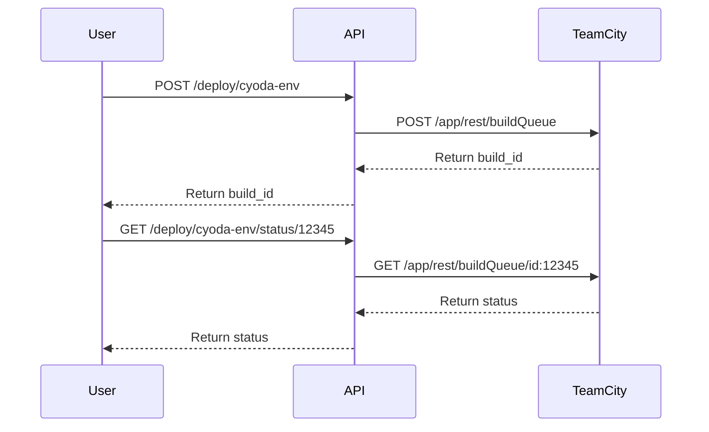
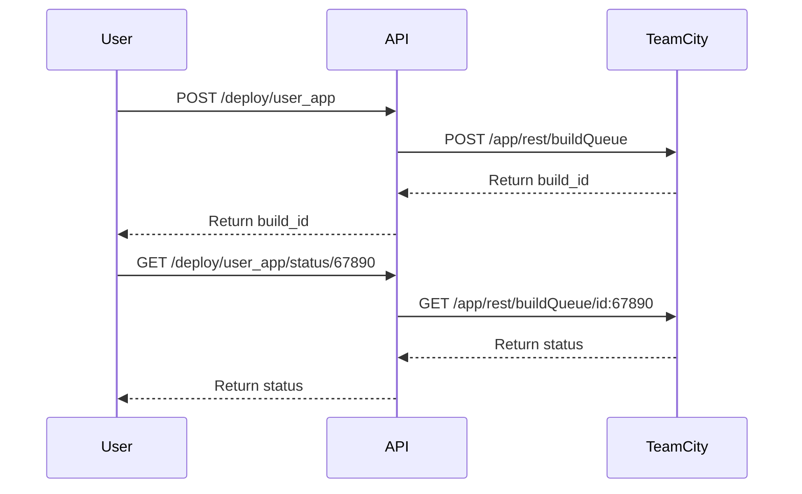

Below are the functional requirements for your application, organized into user stories and use cases, along with the necessary API endpoints and their request/response formats. Additionally, Mermaid diagrams illustrate the user-application interaction.

### User Stories

1. **User Story 1: User Authentication**
   - **As a** user,
   - **I want to** authenticate using a Bearer token,
   - **So that** I can securely access the deployment API.

   **API Endpoint:**
   - **POST** `/deploy/cyoda-env`
     - **Request:**
       ```json
       {
         "user_name": "test"
       }
       ```
     - **Response:**
       ```json
       {
         "token": "Bearer the_jwt_token"
       }
       ```

2. **User Story 2: Deploy Cyoda Environment**
   - **As a** user,
   - **I want to** deploy a Cyoda environment,
   - **So that** I can manage my configuration on Kubernetes.

   **API Endpoint:**
   - **POST** `/deploy/cyoda-env`
     - **Request:**
       ```json
       {
         "user_name": "test"
       }
       ```
     - **Response:**
       ```json
       {
         "build_id": "12345"
       }
       ```

3. **User Story 3: Deploy User Application**
   - **As a** user,
   - **I want to** deploy my application,
   - **So that** I can make it available to others.

   **API Endpoint:**
   - **POST** `/deploy/user_app`
     - **Request:**
       ```json
       {
         "repository_url": "http://example.com/my-app.git",
         "is_public": "true"
       }
       ```
     - **Response:**
       ```json
       {
         "build_id": "67890"
       }
       ```

4. **User Story 4: Check Deployment Status**
   - **As a** user,
   - **I want to** check the status of my deployment,
   - **So that** I can see if it is running successfully.

   **API Endpoint:**
   - **GET** `/deploy/cyoda-env/status/{id}`
     - **Response:**
       ```json
       {
         "status": "Running",
         "progress": "50%"
       }
       ```

5. **User Story 5: Retrieve Deployment Statistics**
   - **As a** user,
   - **I want to** access deployment statistics,
   - **So that** I can analyze the performance of my deployments.

   **API Endpoint:**
   - **GET** `/deploy/cyoda-env/statistics/{id}`
     - **Response:**
       ```json
       {
         "success": 100,
         "failed": 2
       }
       ```

6. **User Story 6: Cancel User Application**
   - **As a** user,
   - **I want to** cancel a deployment,
   - **So that** I can stop unwanted processes.

   **API Endpoint:**
   - **POST** `/deploy/cancel/user_app/{id}`
     - **Request:**
       ```json
       {
         "comment": "Canceling a queued build",
         "readdIntoQueue": false
       }
       ```
     - **Response:**
       ```json
       {
         "message": "Build canceled successfully"
       }
       ```

### Mermaid Diagram Representations

Below are two Mermaid diagrams representing user-app interaction for deployment and status retrieval.


```mermaid
sequenceDiagram
    participant User
    participant API
    participant TeamCity

    User->>API: POST /deploy/cyoda-env
    API->>TeamCity: POST /app/rest/buildQueue
    TeamCity-->>API: Return build_id
    API-->>User: Return build_id

    User->>API: GET /deploy/cyoda-env/status/12345
    API->>TeamCity: GET /app/rest/buildQueue/id:12345
    TeamCity-->>API: Return status
    API-->>User: Return status
```


```mermaid
sequenceDiagram
    participant User
    participant API
    participant TeamCity

    User->>API: POST /deploy/user_app
    API->>TeamCity: POST /app/rest/buildQueue
    TeamCity-->>API: Return build_id
    API-->>User: Return build_id

    User->>API: GET /deploy/user_app/status/67890
    API->>TeamCity: GET /app/rest/buildQueue/id:67890
    TeamCity-->>API: Return status
    API-->>User: Return status
```

### Summary

This structured set of functional requirements allows for clear development progress based on user interactions with the application. Subsequent iterations can focus on specifying non-functional requirements such as performance, security, and usability. Let me know if you need further clarification or adjustments.