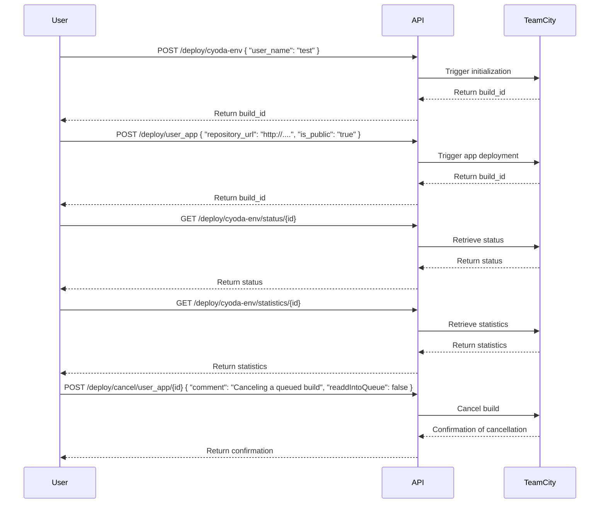

Here are the well-formatted functional requirements for your project, structured as user stories and use cases. Each user story includes necessary API endpoints, along with details on request and response formats. Additionally, visual representations using Mermaid diagrams are provided for user-app interactions.

### Functional Requirements

#### User Stories

1. **User Authentication and Authorization**
   - **As a** user, **I want** to authenticate using a Bearer token, **so that** I can access secure API endpoints.
   - **API Endpoint:** 
     - `POST /deploy/cyoda-env`
     - **Request Format:**
       ```json
       {
         "user_name": "test"
       }
       ```
     - **Response Format:** 
       ```json
       {
         "access_token": "Bearer token",
         "expires_in": 3600
       }
       ```

2. **Deploy Environment Initialization**
   - **As a** user, **I want** to initialize a deployment environment using a specified build type, **so that** a unique environment is created for my application.
   - **API Endpoint:** 
     - `POST /deploy/cyoda-env`
     - **Request Format:**
       ```json
       {
         "user_name": "test"
       }
       ```
     - **Response Format:**
       ```json
       {
         "build_id": "12345"
       }
       ```

3. **User Application Deployment**
   - **As a** user, **I want** to deploy my application by providing a repository URL and visibility status, **so that** I can have my application built.
   - **API Endpoint:** 
     - `POST /deploy/user_app`
     - **Request Format:**
       ```json
       {
         "repository_url": "http://example.com/my-repo",
         "is_public": "true"
       }
       ```
     - **Response Format:**
       ```json
       {
         "build_id": "67890"
       }
       ```

4. **Check Deployment Status**
   - **As a** user, **I want** to check the status of a deployment using the build ID, **so that** I can know if it was successful or not.
   - **API Endpoint:** 
     - `GET /deploy/cyoda-env/status/{id}`
     - **Response Format:**
       ```json
       {
         "status": "SUCCESS",
         "build_id": "12345"
       }
       ```

5. **View Deployment Statistics**
   - **As a** user, **I want** to view statistics about my deployment by the build ID, **so that** I can analyze deployment performance.
   - **API Endpoint:** 
     - `GET /deploy/cyoda-env/statistics/{id}`
     - **Response Format:**
       ```json
       {
         "build_id": "12345",
         "statistics": {
           "duration": "120s",
           "success_rate": "95%"
         }
       }
       ```

6. **Cancel a Deployment**
   - **As a** user, **I want** to cancel a deployment using the build ID, **so that** I can stop it if needed.
   - **API Endpoint:** 
     - `POST /deploy/cancel/user_app/{id}`
     - **Request Format:**
       ```json
       {
         "comment": "Canceling a queued build",
         "readdIntoQueue": false
       }
       ```
     - **Response Format:**
       ```json
       {
         "result": "Build canceled successfully",
         "build_id": "67890"
       }
       ```

#### Use Cases

1. **Use Case 1: User Authentication**
   - **Actors:** User
   - **Precondition:** The user has registered.
   - **Trigger:** User requests authentication.
   - **Main Flow:**
     1. User sends a request to `POST /deploy/cyoda-env` with their username.
     2. The system validates the user and returns a token.

2. **Use Case 2: Initialize Environment for Deployment**
   - **Actors:** User
   - **Precondition:** User is authenticated.
   - **Trigger:** User requests to initialize a deployment environment.
   - **Main Flow:**
     1. User sends `POST /deploy/cyoda-env`.
     2. The system creates the environment and returns the build ID.

3. **Use Case 3: Deploy User Application**
   - **Actors:** User
   - **Precondition:** Deployment environment is initialized.
   - **Trigger:** User submits a request to deploy an application.
   - **Main Flow:**
     1. User sends `POST /deploy/user_app`.
     2. The system processes the request and returns the build ID.

4. **Use Case 4: Check Deployment Status**
   - **Actors:** User
   - **Precondition:** A deployment has been initiated.
   - **Trigger:** User requests status check.
   - **Main Flow:**
     1. User sends `GET /deploy/cyoda-env/status/{id}`.
     2. The system returns the deployment status.

5. **Use Case 5: View Deployment Statistics**
   - **Actors:** User
   - **Precondition:** A deployment has occurred.
   - **Trigger:** User wishes to view statistics.
   - **Main Flow:**
     1. User sends `GET /deploy/cyoda-env/statistics/{id}`.
     2. The system returns statistics for the deployment.

6. **Use Case 6: Cancel Deployment**
   - **Actors:** User
   - **Precondition:** Deployment is queued.
   - **Trigger:** User decides to cancel the deployment.
   - **Main Flow:**
     1. User sends `POST /deploy/cancel/user_app/{id}`.
     2. The system cancels the deployment and confirms the action.

### Mermaid Diagram Representations


```mermaid
sequenceDiagram
    participant User
    participant API
    participant TeamCity

    User->>API: POST /deploy/cyoda-env { "user_name": "test" }
    API->>TeamCity: Trigger initialization
    TeamCity-->>API: Return build_id
    API-->>User: Return build_id

    User->>API: POST /deploy/user_app { "repository_url": "http://....", "is_public": "true" }
    API->>TeamCity: Trigger app deployment
    TeamCity-->>API: Return build_id
    API-->>User: Return build_id

    User->>API: GET /deploy/cyoda-env/status/{id}
    API->>TeamCity: Retrieve status
    TeamCity-->>API: Return status
    API-->>User: Return status

    User->>API: GET /deploy/cyoda-env/statistics/{id}
    API->>TeamCity: Retrieve statistics
    TeamCity-->>API: Return statistics
    API-->>User: Return statistics

    User->>API: POST /deploy/cancel/user_app/{id} { "comment": "Canceling a queued build", "readdIntoQueue": false }
    API->>TeamCity: Cancel build
    TeamCity-->>API: Confirmation of cancellation
    API-->>User: Return confirmation
```

This outline presents a comprehensive view of the functional requirements for your application. Further development can expand upon non-functional requirements and additional details, such as error handling and edge cases, as needed.