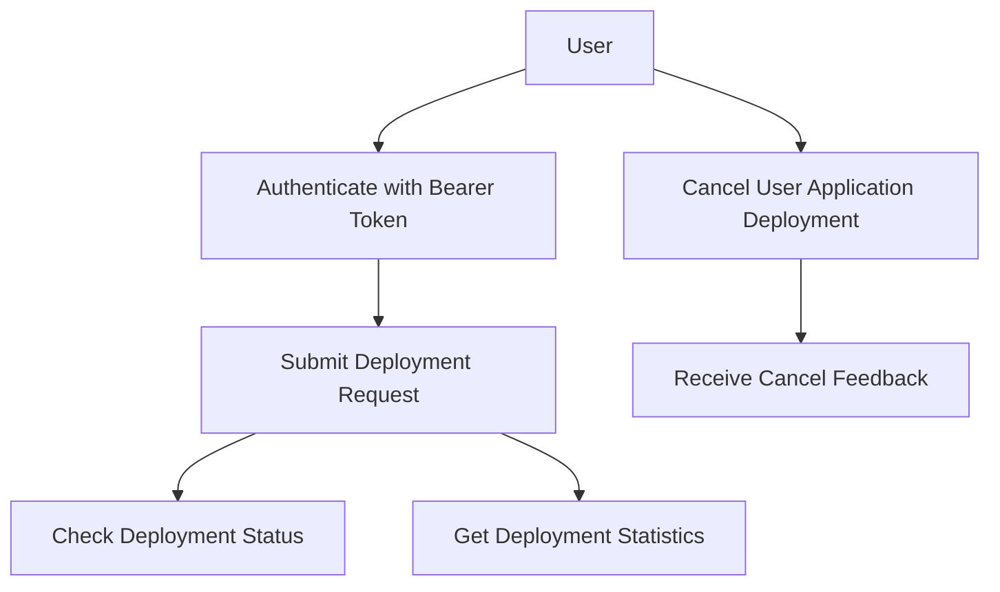

Here’s an outline of the functional requirements for your application in the form of user stories and use cases. Each user story includes the necessary API endpoints, request/response formats, and a visual representation of the user-app interaction using Mermaid diagrams.

### User Stories

1. **User Authentication and Authorization**
   - **As a** user,
   - **I want to** authenticate using a Bearer token,
   - **So that** I can access protected resources in the application.

   - **API Endpoint:** `POST /deploy/cyoda-env`
     - **Request Format:**
       ```json
       {
         "user_name": "test"
       }
       ```
     - **Response Format:**
       ```json
       {
         "token": "your_jwt_token"
       }
       ```
     
2. **Submit Deployment Request**
   - **As a** user,
   - **I want to** submit a deployment request for my environment,
   - **So that** a build is triggered with my configurations.

   - **API Endpoint:** `POST /deploy/cyoda-env`
     - **Request Format:**
       ```json
       {
         "user_name": "test"
       }
       ```
     - **Response Format:**
       ```json
       {
         "build_id": "12345"
       }
       ```

3. **Submit User Application Deployment Request**
   - **As a** user,
   - **I want to** submit a deployment request for my application,
   - **So that** it can be built and deployed with my repository.

   - **API Endpoint:** `POST /deploy/user_app`
     - **Request Format:**
       ```json
       {
         "repository_url": "http://example.com/repo.git",
         "is_public": "true"
       }
       ```
     - **Response Format:**
       ```json
       {
         "build_id": "54321"
       }
       ```

4. **Check Deployment Status**
   - **As a** user,
   - **I want to** check the status of my deployment,
   - **So that** I know if it succeeded or failed.

   - **API Endpoint:** `GET /deploy/cyoda-env/status/$id`
     - **Response Format:**
       ```json
       {
         "status": "successful",
         "details": {
           "repository_url": "http://example.com/repo.git",
           "is_public": "true"
         }
       }
       ```

5. **Get Deployment Statistics**
   - **As a** user,
   - **I want to** retrieve statistics for my deployment,
   - **So that** I can analyze the build performance.

   - **API Endpoint:** `GET /deploy/cyoda-env/statistics/$id`
     - **Response Format:**
       ```json
       {
         "build_time": "5min",
         "success_rate": "95%"
       }
       ```

6. **Cancel User Application Deployment**
   - **As a** user,
   - **I want to** cancel a deployment that is currently queued,
   - **So that** I can stop it from processing.

   - **API Endpoint:** `POST /deploy/cancel/user_app/$id`
     - **Request Format:**
       ```json
       {
         "comment": "Canceling a queued build",
         "readdIntoQueue": false
       }
       ```
     - **Response Format:**
       ```json
       {
         "message": "Build canceled successfully"
       }
       ```

### Mermaid Diagrams

Here’s a simple visualization of the user-app interaction using Mermaid syntax:


```mermaid
graph TD;
    User-->Auth[Authenticate with Bearer Token]
    Auth-->DeployEnv[Submit Deployment Request]
    DeployEnv-->BuildStatus[Check Deployment Status]
    DeployEnv-->BuildStatistics[Get Deployment Statistics]
    User-->CancelDeploy[Cancel User Application Deployment]
    CancelDeploy-->Feedback[Receive Cancel Feedback]
```

### Summary

The application will abide by RESTful principles, allowing users to manage deployment and environment configurations conveniently through a well-defined API. Each user story is translated into specific functionalities with a clear mapping of API requests and responses, creating a structured approach to develop your backend application.

Would you like to make any adjustments or add further details to these functional requirements?