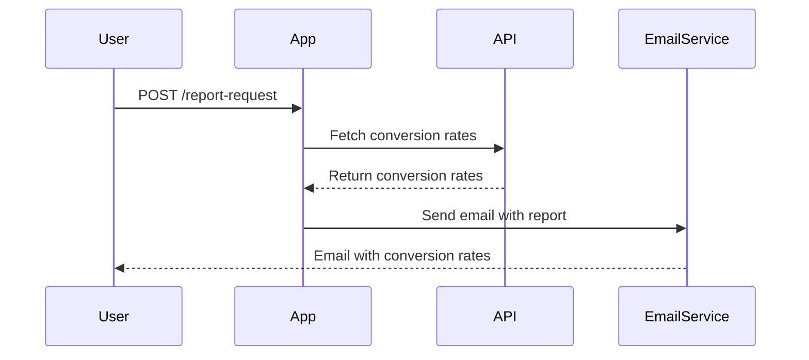

Here’s a well-formatted summary of the final functional requirements for your application:

### Functional Requirements

#### User Story 1: Request Conversion Rate Report
- **As a** user,  
- **I want to** request a conversion rate report for Bitcoin in USD or EUR,  
- **So that** I can receive the latest conversion rates via email.

##### Use Case: Request Conversion Rate Report
- **Actors:** User
- **Preconditions:** User has a valid email address.
- **Postconditions:** User receives an email with the conversion rate report.

###### API Endpoint:
- **Endpoint:** `POST /report-request`
- **Request Body:**
  ```json
  {
    "email": "user@example.com",
    "currency": "USD" // or "EUR"
  }
  ```
- **Response:**
  - **Success (200 OK):**
    ```json
    {
      "message": "Report requested successfully. You will receive an email shortly."
    }
    ```
  - **Error (400 Bad Request):**
    ```json
    {
      "error": "Invalid email address or currency."
    }
    ```

#### User Story 2: Receive Conversion Rate Report via Email
- **As a** user,  
- **I want to** receive an email with the conversion rates,  
- **So that** I can keep track of Bitcoin's value in my preferred currency.

##### Use Case: Send Conversion Rate Report
- **Actors:** System, Email Service
- **Preconditions:** Conversion rates are retrieved successfully.
- **Postconditions:** User receives an email with the conversion rates.

###### Internal Process:
- The system retrieves conversion rates from an external API (e.g., CoinGecko).
- The system sends an email using the configured email service (e.g., SMTP, SendGrid).

### Interaction Diagram


```mermaid
sequenceDiagram
    participant User
    participant App
    participant API
    participant EmailService

    User->>App: POST /report-request
    App->>API: Fetch conversion rates
    API-->>App: Return conversion rates
    App->>EmailService: Send email with report
    EmailService-->>User: Email with conversion rates
```

### Additional Notes
- **Rate Limiting:** The application will limit requests to one report per hour per user to prevent abuse.
- **Authentication:** Basic authentication will be required to access the `POST /report-request` endpoint.

Feel free to modify any details or add further requirements as necessary!