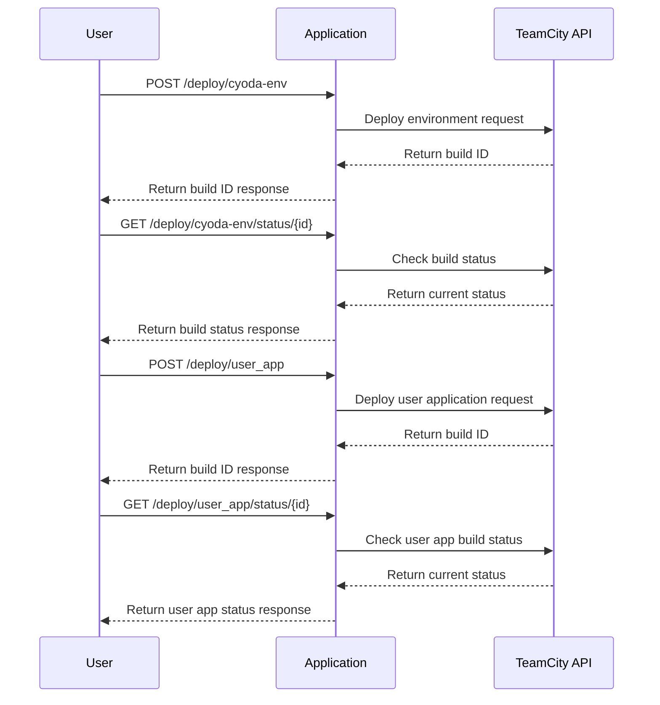

### Functional Requirements for Deployment and Environment Configuration Application

#### User Stories

1. **User Authentication**
   - **As a** user, **I want to** authenticate myself using a Bearer token **so that** I can access the application securely.
   
   **API Endpoint:**  
   - No specific API is listed for authentication as it uses a Bearer token with subsequent requests.

2. **Deploy Cyoda Environment**
   - **As a** user, **I want to** deploy a Cyoda environment **so that** I can customize it for my needs.
   
   **API Endpoint:**
   - `POST /deploy/cyoda-env`
   - **Request Format:**
     ```json
     {
         "user_name": "test"
     }
     ```
   - **Response Format:**
     ```json
     {
         "build_id": "1234"
     }
     ```

3. **Deploy User Application**
   - **As a** user, **I want to** deploy my application for use **so that** it can be accessed by me or others.
   
   **API Endpoint:**
   - `POST /deploy/user_app`
   - **Request Format:**
     ```json
     {
         "repository_url": "http://....",
         "is_public": "true"
     }
     ```
   - **Response Format:**
     ```json
     {
         "build_id": "5678"
     }
     ```

4. **Check Build Status for Cyoda Environment**
   - **As a** user, **I want to** check the status of my Cyoda environment deployment **so that** I can monitor its progress.
   
   **API Endpoint:**
   - `GET /deploy/cyoda-env/status/{id}`
   - **Response Format:**
     ```json
     {
         "status": "running",
         "repository_url": "http://....",
         "is_public": "true"
     }
     ```

5. **Check Build Statistics for Cyoda Environment**
   - **As a** user, **I want to** retrieve statistics of my Cyoda environment build **so that** I can analyze performance.
   
   **API Endpoint:**
   - `GET /deploy/cyoda-env/statistics/{id}`
   - **Response Format:**
     ```json
     {
         "statistics": {...},
         "repository_url": "http://....",
         "is_public": "true"
     }
     ```

6. **Check Build Status for User Application**
   - **As a** user, **I want to** check the status of my user application deployment **so that** I can monitor its progress.
   
   **API Endpoint:**
   - `GET /deploy/user_app/status/{id}`
   - **Response Format:**
     ```json
     {
         "status": "completed",
         "repository_url": "http://....",
         "is_public": "true"
     }
     ```

7. **Check Build Statistics for User Application**
   - **As a** user, **I want to** retrieve statistics of my user application build **so that** I can analyze its performance.
   
   **API Endpoint:**
   - `GET /deploy/user_app/statistics/{id}`
   - **Response Format:**
     ```json
     {
         "statistics": {...},
         "repository_url": "http://....",
         "is_public": "true"
     }
     ```

8. **Cancel User Application Build**
   - **As a** user, **I want to** cancel my user application build **so that** I can stop unnecessary resource usage.
   
   **API Endpoint:**
   - `POST /deploy/cancel/user_app/{id}`
   - **Request Format:**
     ```json
     {
         "comment": "Canceling a queued build",
         "readdIntoQueue": false
     }
     ```
   - **Response Format:**
     ```json
     {
         "success": true,
         "message": "Build canceled successfully."
     }
     ```

### Use Cases

- **Use Case 1: Deploy Cyoda Environment**
  - **Actor:** User
  - **Precondition:** User is authenticated with a Bearer token.
  - **Main Flow:**
    1. User sends a request to `POST /deploy/cyoda-env`.
    2. Application receives the request and interacts with TeamCity API.
    3. Application returns the build ID to the user.

- **Use Case 2: Retrieve Build Status**
  - **Actor:** User
  - **Precondition:** User has a valid build ID.
  - **Main Flow:**
    1. User sends a request to `GET /deploy/cyoda-env/status/{id}`.
    2. Application fetches the build status from TeamCity.
    3. Application returns the current status to the user.

### Visual Representation


```mermaid
sequenceDiagram
    participant User as User
    participant App as Application
    participant TeamCity as TeamCity API

    User->>App: POST /deploy/cyoda-env
    App->>TeamCity: Deploy environment request
    TeamCity-->>App: Return build ID
    App-->>User: Return build ID response

    User->>App: GET /deploy/cyoda-env/status/{id}
    App->>TeamCity: Check build status
    TeamCity-->>App: Return current status
    App-->>User: Return build status response

    User->>App: POST /deploy/user_app
    App->>TeamCity: Deploy user application request
    TeamCity-->>App: Return build ID
    App-->>User: Return build ID response

    User->>App: GET /deploy/user_app/status/{id}
    App->>TeamCity: Check user app build status
    TeamCity-->>App: Return current status
    App-->>User: Return user app status response
```

This outlines the functional requirements based on your application needs, structured in a way that clarifies the necessary interactions, expected inputs, and responses.