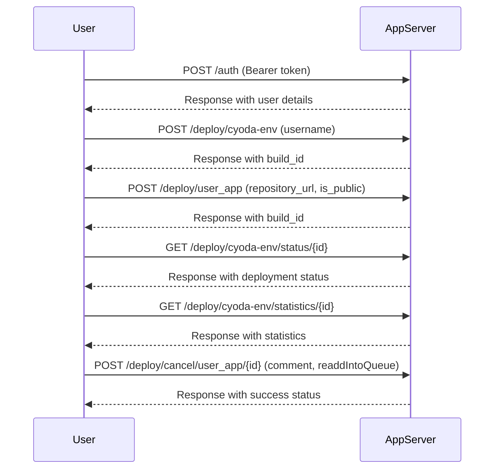

Here’s a set of functional requirements for your application, structured as user stories and use cases, along with the necessary API endpoints, request/response formats, and visual representations using Mermaid diagrams.

### User Stories

1. **User Authentication**
   - As a user, I want to authenticate the API using a Bearer token so that I can securely access the endpoints.
   
   **API Endpoint**
   - **POST** `/auth`
     - **Request**
       ```json
       {
         "token": "your_bearer_token"
       }
       ```
     - **Response**
       ```json
       {
         "status": "success",
         "user_name": "test_user"
       }
       ```

2. **Deploy Environment for User**
   - As a user, I want to create a deployment environment with a unique configuration for my applications.

   **API Endpoint**
   - **POST** `/deploy/cyoda-env`
     - **Request**
       ```json
       {
         "user_name": "test"
       }
       ```
     - **Response**
       ```json
       {
         "build_id": "12345"
       }
       ```

3. **Deploy User Application**
   - As a user, I want to deploy my application with a specified repository URL and visibility.

   **API Endpoint**
   - **POST** `/deploy/user_app`
     - **Request**
       ```json
       {
         "repository_url": "http://your-repo.url",
         "is_public": "true"
       }
       ```
     - **Response**
       ```json
       {
         "build_id": "67890"
       }
       ```

4. **Check Deployment Status**
   - As a user, I want to check the status of my deployment using the build ID so that I can track its progress.

   **API Endpoint**
   - **GET** `/deploy/cyoda-env/status/{id}`
     - **Response**
       ```json
       {
         "status": "running",
         "details": {
           "repository_url": "http://your-repo.url",
           "is_public": "true"
         }
       }
       ```

5. **Get Deployment Statistics**
   - As a user, I want to get statistics about my deployment using the build ID to analyze performance.

   **API Endpoint**
   - **GET** `/deploy/cyoda-env/statistics/{id}`
     - **Response**
       ```json
       {
         "build_id": "12345",
         "statistics": {
           // statistical information here
         }
       }
       ```

6. **Cancel Deployment**
   - As a user, I want to cancel a queued deployment using the build ID.

   **API Endpoint**
   - **POST** `/deploy/cancel/user_app/{id}`
     - **Request**
       ```json
       {
         "comment": "Canceling this deployment",
         "readdIntoQueue": false
       }
       ```
     - **Response**
       ```json
       {
         "status": "success"
       }
       ```

### Use Cases

#### Use Case 1: User Authentication
- **Actor**: User
- **Precondition**: User has a valid token.
- **Main Scenario**:
  1. User sends a POST request to `POST /auth` with the Bearer token.
  2. System validates the token and responds with user details.
  
#### Use Case 2: Deploy Environment
- **Actor**: User
- **Precondition**: User is authenticated.
- **Main Scenario**:
  1. User sends a request to `POST /deploy/cyoda-env` with the username.
  2. System queues the deployment and responds with a build ID.

#### Use Case 3: Deploy User Application
- **Actor**: User
- **Precondition**: User is authenticated.
- **Main Scenario**:
  1. User sends a request to `POST /deploy/user_app` with repository details.
  2. System queues the deployment and responds with a build ID.
  
#### Use Case 4: Check Deployment Status
- **Actor**: User
- **Precondition**: User is authenticated and has a valid build ID.
- **Main Scenario**:
  1. User sends a request to `GET /deploy/cyoda-env/status/{id}`.
  2. System retrieves and returns the deployment status.

#### Use Case 5: Get Deployment Statistics
- **Actor**: User
- **Precondition**: User is authenticated and has a valid build ID.
- **Main Scenario**:
  1. User sends a request to `GET /deploy/cyoda-env/statistics/{id}`.
  2. System retrieves and returns the deployment statistics.

#### Use Case 6: Cancel Deployment
- **Actor**: User
- **Precondition**: User is authenticated and has a valid build ID.
- **Main Scenario**:
  1. User sends a request to `POST /deploy/cancel/user_app/{id}`.
  2. System processes the cancellation and responds with a success message.

### Mermaid Diagram


```mermaid
sequenceDiagram
    participant User
    participant AppServer
    
    User->>AppServer: POST /auth (Bearer token)
    AppServer-->>User: Response with user details

    User->>AppServer: POST /deploy/cyoda-env (username)
    AppServer-->>User: Response with build_id

    User->>AppServer: POST /deploy/user_app (repository_url, is_public)
    AppServer-->>User: Response with build_id

    User->>AppServer: GET /deploy/cyoda-env/status/{id}
    AppServer-->>User: Response with deployment status

    User->>AppServer: GET /deploy/cyoda-env/statistics/{id}
    AppServer-->>User: Response with statistics

    User->>AppServer: POST /deploy/cancel/user_app/{id} (comment, readdIntoQueue)
    AppServer-->>User: Response with success status
```

This structured approach provides a detailed foundation for your application, covering the essential functional requirements and their corresponding interactions with the API.