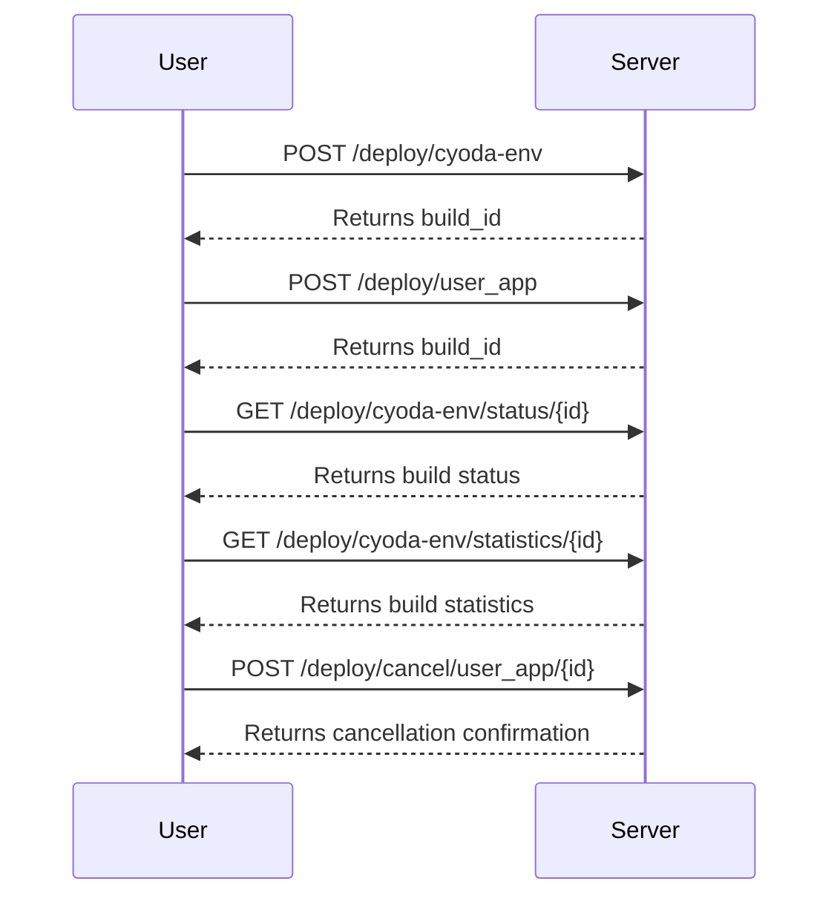

Here are the functional requirements for your application, broken down into user stories and use cases, along with the necessary API endpoints and request/response formats. The user-app interaction is visually represented using Mermaid diagrams.

### User Stories

1. **User Authentication**
   - As a user, I want to authenticate using a Bearer token so that I can securely access the application.
   
   **API Endpoint:**
   - **POST /deploy/cyoda-env**
     - **Request Body:**
       ```json
       {
           "user_name": "test"
       }
       ```
     - **Response:**
       ```json
       {
           "status": "success",
           "build_id": "12345"
       }
       ```

2. **Deploying a Cyoda Environment**
   - As a user, I want to initiate a deployment of a Cyoda environment using my username, so that the deployment can be tracked.
   
   **API Endpoint:**
   - **POST /deploy/cyoda-env**
     - **Request Body:**
       ```json
       {
           "user_name": "test"
       }
       ```
     - **Response:**
       ```json
       {
           "status": "success",
           "build_id": "12345"
       }
       ```

3. **Deploying a User App**
   - As a user, I want to deploy my own application with a specified repository URL, so that it can be built and deployed.
   
   **API Endpoint:**
   - **POST /deploy/user_app**
     - **Request Body:**
       ```json
       {
           "repository_url": "http://.../repo",
           "is_public": true
       }
       ```
     - **Response:**
       ```json
       {
           "status": "success",
           "build_id": "67890"
       }
       ```

4. **Checking Build Status**
   - As a user, I want to check the status of my deployment by providing a build ID, so that I can monitor its progress.
  
   **API Endpoint:**
   - **GET /deploy/cyoda-env/status/{id}**
     - **Response:**
       ```json
       {
           "status": "in progress",
           "build_id": "12345",
           "repository_url": "http://....",
           "is_public": true
       }
       ```

5. **Fetching Build Statistics**
   - As a user, I want to retrieve statistical data related to my build by using a build ID, so that I can analyze its performance.
  
   **API Endpoint:**
   - **GET /deploy/cyoda-env/statistics/{id}**
     - **Response:**
       ```json
       {
           "statistics": {
               "success": 90,
               "failures": 10
           },
           "build_id": "12345"
       }
       ```

6. **Canceling a User App Build**
   - As a user, I want to cancel a queued build request by specifying a build ID, so that I can manage my deployments effectively.
  
   **API Endpoint:**
   - **POST /deploy/cancel/user_app/{id}**
     - **Request Body:**
       ```json
       {
           "comment": "Canceling a queued build",
           "readdIntoQueue": false
       }
       ```
     - **Response:**
       ```json
       {
           "status": "success",
           "message": "Build canceled successfully"
       }
       ```

### Use Cases

#### Use Case 1: User Management
- **Actor:** User
- **Precondition:** User has a Bearer token.
- **Postcondition:** User is authenticated and can perform deployments and status checks.

#### Use Case 2: Deploy a Cyoda Environment
- **Actor:** User
- **Precondition:** User is authenticated.
- **Main Flow:**
  1. User posts deployment request with username.
  2. System initiates build and returns build ID.
  
#### Use Case 3: Deploy User App
- **Actor:** User
- **Precondition:** User is authenticated and wants to deploy an app.
- **Main Flow:**
  1. User posts app deployment request with repository URL.
  2. System initiates build and returns build ID.

#### Use Case 4: Retrieve Build Status
- **Actor:** User
- **Precondition:** User has a build ID and is authenticated.
- **Main Flow:**
  1. User requests status using build ID.
  2. System responds with current build status.

#### Use Case 5: Fetch Build Statistics
- **Actor:** User
- **Precondition:** User has a build ID and is authenticated.
- **Main Flow:**
  1. User requests statistics using build ID.
  2. System responds with build performance data.

#### Use Case 6: Cancel Build
- **Actor:** User
- **Precondition:** User has a build ID and is authenticated.
- **Main Flow:**
  1. User requests to cancel the build with a provided comment.
  2. System confirms the cancellation.

### Mermaid Diagram - User Interaction


```mermaid
sequenceDiagram
    participant User
    participant Server

    User->>Server: POST /deploy/cyoda-env
    Server-->>User: Returns build_id

    User->>Server: POST /deploy/user_app
    Server-->>User: Returns build_id

    User->>Server: GET /deploy/cyoda-env/status/{id}
    Server-->>User: Returns build status

    User->>Server: GET /deploy/cyoda-env/statistics/{id}
    Server-->>User: Returns build statistics

    User->>Server: POST /deploy/cancel/user_app/{id}
    Server-->>User: Returns cancellation confirmation
```

This format presents clear functional requirements that encapsulate user actions, corresponding API endpoints, and expected interactions.