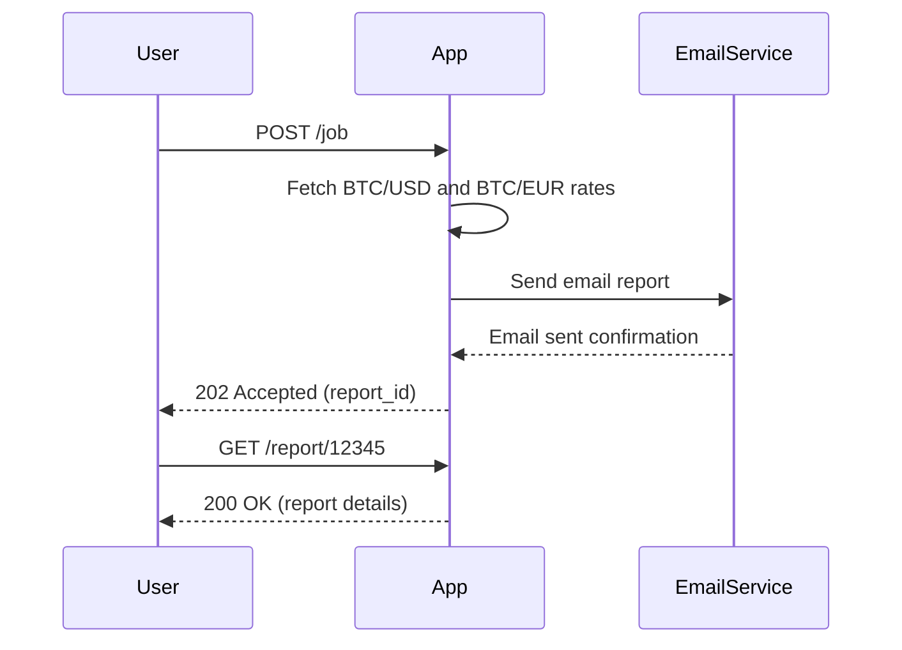

Here’s a well-formatted outline of the final functional requirements for your application:

---

## Functional Requirements

### User Stories

1. **Report Creation Initiation**
   - **As a user**, I want to initiate the report creation process so that I can receive the latest Bitcoin conversion rates.
     - **Endpoint**: `POST /job`
     - **Request**:
       - **Body** (optional):
         ```json
         {
           "email": "user@example.com"
         }
         ```
     - **Response**:
       - **Status**: `202 Accepted`
       - **Body**:
         ```json
         {
           "report_id": "12345",
           "status": "Report is being generated."
         }
         ```

2. **Retrieve Stored Report**
   - **As a user**, I want to retrieve the stored report by its ID so that I can view the conversion rates.
     - **Endpoint**: `GET /report/{report_id}`
     - **Request**:
       - **URL**: `/report/12345`
     - **Response**:
       - **Status**: `200 OK`
       - **Body**:
         ```json
         {
           "report_id": "12345",
           "timestamp": "2023-10-01T12:00:00Z",
           "btc_usd": "50000",
           "btc_eur": "42000"
         }
         ```

### API Endpoints Summary

| Method | Endpoint       | Request Body                | Response Body                                                                 |
|--------|----------------|-----------------------------|-------------------------------------------------------------------------------|
| POST   | /job           | `{ "email": "user@example.com" }` | `{ "report_id": "12345", "status": "Report is being generated." }`         |
| GET    | /report/{id}   | N/A                         | `{ "report_id": "12345", "timestamp": "2023-10-01T12:00:00Z", "btc_usd": "50000", "btc_eur": "42000" }` |

### Error Handling
- The application should handle potential errors such as:
  - Failure to fetch conversion rates.
  - Issues with sending emails.
  - Invalid report IDs.

### Additional Considerations
- The application may implement authentication for the endpoints to ensure secure access.
- Rate limiting for the conversion rate fetching process should be considered to prevent excessive API calls.

### User-App Interaction Diagram


```mermaid
sequenceDiagram
    participant User
    participant App
    participant EmailService

    User->>App: POST /job
    App->>App: Fetch BTC/USD and BTC/EUR rates
    App->>EmailService: Send email report
    EmailService-->>App: Email sent confirmation
    App-->>User: 202 Accepted (report_id)

    User->>App: GET /report/12345
    App-->>User: 200 OK (report details)
```

---

This format provides a comprehensive overview of the functional requirements, ensuring clarity and ease of understanding for the development process. If you need any modifications or additional details, please let me know!