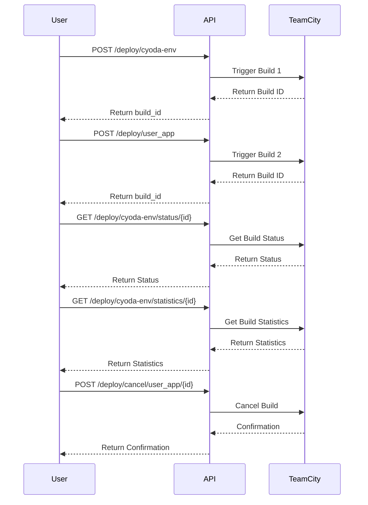

Below are the formatted functional requirements for your application expressed as user stories and use cases, including the necessary API endpoints, request/response formats, and visual representations using Mermaid diagrams.

### Functional Requirements

#### User Stories

1. **User Authentication**
   - **As a** user,
   - **I want to** authenticate with a Bearer token,
   - **So that** I can perform actions on the deployment and environment configuration.

   - **API Endpoint:** `POST /deploy/cyoda-env`
     - **Request Body:**
       ```json
       {
           "user_name": "test"
       }
       ```
     - **Response:**
       ```json
       {
           "build_id": "12345"
       }
       ```

2. **Deploy a User Environment**
   - **As a** user,
   - **I want to** deploy my application environment,
   - **So that** I can configure it based on my repository.

   - **API Endpoint:** `POST /deploy/user_app`
     - **Request Body:**
       ```json
       {
           "repository_url": "http://example.com/repo",
           "is_public": "true"
       }
       ```
     - **Response:**
       ```json
       {
           "build_id": "67890"
       }
       ```

3. **Check Deployment Status**
   - **As a** user,
   - **I want to** check the status of my deployment,
   - **So that** I can monitor its progress.

   - **API Endpoint:** `GET /deploy/cyoda-env/status/{id}`
     - **Response:**
       ```json
       {
           "status": "in_progress",
           "build_id": "{id}"
       }
       ```

4. **View Deployment Statistics**
   - **As a** user,
   - **I want to** view deployment statistics,
   - **So that** I can analyze previous deployments.

   - **API Endpoint:** `GET /deploy/cyoda-env/statistics/{id}`
     - **Response:**
       ```json
       {
           "statistics": {
               "success_rate": "90%",
               "average_time": "5min"
           }
       }
       ```

5. **Cancel a User Deployment**
   - **As a** user,
   - **I want to** cancel my deployment,
   - **So that** I can stop it from being executed.

   - **API Endpoint:** `POST /deploy/cancel/user_app/{id}`
     - **Request Body:**
       ```json
       {
           "comment": "Canceling a queued build",
           "readdIntoQueue": false
       }
       ```
     - **Response:**
       ```json
       {
           "success": true,
           "message": "Build canceled successfully"
       }
       ```

#### Use Cases

##### Use Case 1: Authenticate User
- **Actor:** User
- **Preconditions:** User must have valid credentials.
- **Flow:**
  1. User sends a POST request to `/deploy/cyoda-env` with the username.
  2. System validates the Bearer token.
  3. System returns a build ID.

##### Use Case 2: Deploy Application Environment
- **Actor:** User
- **Preconditions:** User must be authenticated.
- **Flow:**
  1. User sends a POST request to `/deploy/user_app` with the repository URL.
  2. System initiates the deployment process.
  3. System returns a build ID.

##### Use Case 3: Check Deployment Status
- **Actor:** User
- **Preconditions:** Deployment must be initiated.
- **Flow:**
  1. User sends a GET request to `/deploy/cyoda-env/status/{id}`.
  2. System retrieves the status of the specified build.
  3. System returns the deployment status.

##### Use Case 4: View Deployment Statistics
- **Actor:** User
- **Preconditions:** Deployment must exist.
- **Flow:**
  1. User sends a GET request to `/deploy/cyoda-env/statistics/{id}`.
  2. System retrieves statistics for the specified build ID.
  3. System returns the statistics.

##### Use Case 5: Cancel Deployment
- **Actor:** User
- **Preconditions:** User must have initiated a deployment.
- **Flow:**
  1. User sends a POST request to `/deploy/cancel/user_app/{id}` with cancel request details.
  2. System cancels the specified build.
  3. System returns a confirmation message.

### Visual Representation


```mermaid
sequenceDiagram
    participant User
    participant API
    participant TeamCity

    User->>API: POST /deploy/cyoda-env
    API->>TeamCity: Trigger Build 1
    TeamCity-->>API: Return Build ID
    API-->>User: Return build_id

    User->>API: POST /deploy/user_app
    API->>TeamCity: Trigger Build 2
    TeamCity-->>API: Return Build ID
    API-->>User: Return build_id

    User->>API: GET /deploy/cyoda-env/status/{id}
    API->>TeamCity: Get Build Status
    TeamCity-->>API: Return Status
    API-->>User: Return Status

    User->>API: GET /deploy/cyoda-env/statistics/{id}
    API->>TeamCity: Get Build Statistics
    TeamCity-->>API: Return Statistics
    API-->>User: Return Statistics

    User->>API: POST /deploy/cancel/user_app/{id}
    API->>TeamCity: Cancel Build
    TeamCity-->>API: Confirmation
    API-->>User: Return Confirmation
```

### Conclusion

This functional requirements document provides a detailed outline of the user stories, use cases, necessary API endpoints, and their respective request/response formats. The accompanying Mermaid diagram visualizes the interaction between the user, API, and TeamCity, giving a clear picture of the flow of information within the application.