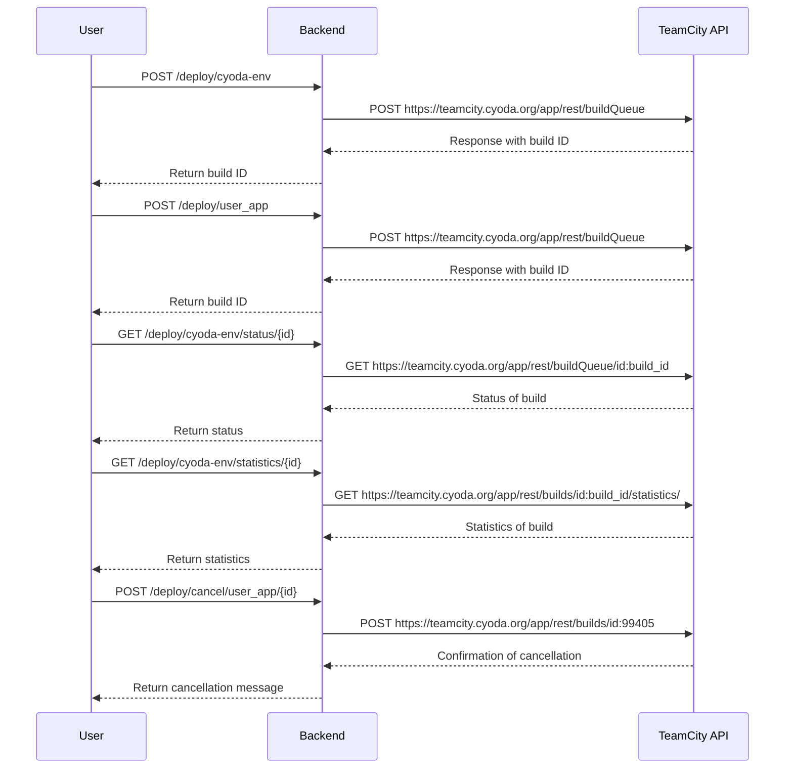

Here are the functional requirements for your deployment and environment configuration management application, outlined as user stories and use cases. This includes API endpoints with request and response details, as well as visual representations using Mermaid diagrams.

### User Stories

1. **User Story: User Authentication**
   - **As a** user, 
   - **I want** to authenticate using a Bearer token 
   - **So that** I can access the application securely.

   **API Endpoint:**
   - **No specific API call is defined** for authentication in the provided requirements, but authentication will be required for all API calls.

2. **User Story: Deploy Cyoda Environment**
   - **As a** user, 
   - **I want** to deploy a Cyoda environment 
   - **So that** I can configure my deployment based on my user settings.

   **API Endpoint:**
   - **POST** `/deploy/cyoda-env`
     - **Request Body:**
     ```json
     {
         "user_name": "test"
     }
     ```
     - **Response:**
     ```json
     {
         "build_id": "12345"
     }
     ```

3. **User Story: Deploy User Application**
   - **As a** user,
   - **I want** to deploy my application,
   - **So that** I can have my application run in the environment I defined.

   **API Endpoint:**
   - **POST** `/deploy/user_app`
     - **Request Body:**
     ```json
     {
         "repository_url": "http://....",
         "is_public": "true"
     }
     ```
     - **Response:**
     ```json
     {
         "build_id": "67890"
     }
     ```

4. **User Story: Check Deployment Status**
   - **As a** user,
   - **I want** to check the status of my Cyoda environment deployment,
   - **So that** I know its current state.

   **API Endpoint:**
   - **GET** `/deploy/cyoda-env/status/{id}`
     - **Response:**
     ```json
     {
         "status": "success",
         "details": { /* details about the build */ }
     }
     ```

5. **User Story: Get Deployment Statistics**
   - **As a** user,
   - **I want** to retrieve statistics for my specific deployment,
   - **So that** I can analyze performance.

   **API Endpoint:**
   - **GET** `/deploy/cyoda-env/statistics/{id}`
     - **Response:**
     ```json
     {
         "statistics": { /* statistical data */ }
     }
     ```

6. **User Story: Cancel User Application Deployment**
   - **As a** user,
   - **I want** to cancel a queued user application deployment,
   - **So that** I can manage my resources effectively.

   **API Endpoint:**
   - **POST** `/deploy/cancel/user_app/{id}`
     - **Request Body:**
     ```json
     {
         "comment": "Canceling a queued build",
         "readdIntoQueue": false
     }
     ```
     - **Response:**
     ```json
     {
         "message": "Build canceled successfully"
     }
     ```

### Visual Representation Using Mermaid Diagrams


```mermaid
sequenceDiagram
    participant U as User
    participant BE as Backend
    participant TC as TeamCity API

    U->>BE: POST /deploy/cyoda-env
    BE->>TC: POST https://teamcity.cyoda.org/app/rest/buildQueue
    TC-->>BE: Response with build ID
    BE-->>U: Return build ID
    
    U->>BE: POST /deploy/user_app
    BE->>TC: POST https://teamcity.cyoda.org/app/rest/buildQueue
    TC-->>BE: Response with build ID
    BE-->>U: Return build ID
    
    U->>BE: GET /deploy/cyoda-env/status/{id}
    BE->>TC: GET https://teamcity.cyoda.org/app/rest/buildQueue/id:build_id
    TC-->>BE: Status of build
    BE-->>U: Return status
    
    U->>BE: GET /deploy/cyoda-env/statistics/{id}
    BE->>TC: GET https://teamcity.cyoda.org/app/rest/builds/id:build_id/statistics/
    TC-->>BE: Statistics of build
    BE-->>U: Return statistics
    
    U->>BE: POST /deploy/cancel/user_app/{id}
    BE->>TC: POST https://teamcity.cyoda.org/app/rest/builds/id:99405
    TC-->>BE: Confirmation of cancellation
    BE-->>U: Return cancellation message
```

### Conclusion
These functional requirements cover the user interactions and the necessary API endpoints to fulfill the provided use cases. Should you require further iterations on non-functional requirements, or modifications to the functional requirements, please let me know.