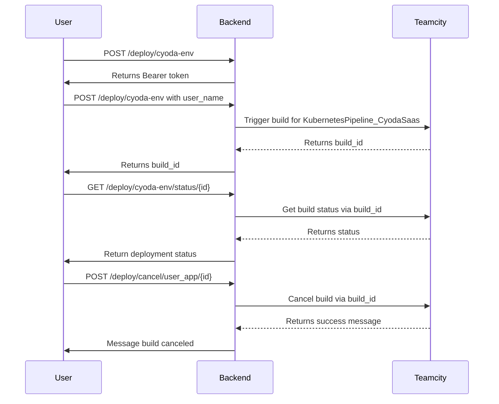

Below are the functional requirements defined in the form of user stories and use cases, complete with the necessary API endpoints, request/response formats, and visual diagrams using Mermaid syntax for user-app interaction.

### User Stories

1. **User Authentication**
   - As a user, I want to authenticate using a Bearer token so that I can securely access my deployment configurations.
   - **API Endpoint**: `POST /deploy/cyoda-env`
   - **Request**:
     ```json
     {
       "user_name": "test"
     }
     ```
   - **Response**:
     ```json
     {
       "token": "your_bearer_token"
     }
     ```

2. **Deploy Environment**
   - As a user, I want to initiate a deployment for my environment using a specified user name to manage properties effectively.
   - **API Endpoint**: `POST /deploy/cyoda-env`
   - **Request**:
     ```json
     {
       "user_name": "test"
     }
     ```
   - **Response**:
     ```json
     {
       "build_id": "12345"
     }
     ```

3. **Deploy User Application**
   - As a user, I want to deploy my application by providing a repository URL and access level (public/private).
   - **API Endpoint**: `POST /deploy/user_app`
   - **Request**:
     ```json
     {
       "repository_url": "http://....",
       "is_public": "true"
     }
     ```
   - **Response**:
     ```json
     {
       "build_id": "67890"
     }
     ```

4. **Check Deployment Status**
   - As a user, I want to check the status of my deployment using the build ID.
   - **API Endpoint**: `GET /deploy/cyoda-env/status/{id}`
   - **Response**:
     ```json
     {
       "status": "in_progress", 
       "build_id": "12345"
     }
     ```

5. **Get Deployment Statistics**
   - As a user, I want to retrieve statistical details about my deployment.
   - **API Endpoint**: `GET /deploy/cyoda-env/statistics/{id}`
   - **Response**:
     ```json
     {
       "statistics": {
         "duration": "10min",
         "success": true,
         "logs": "Logs here"
       }
     }
     ```

6. **Cancel User Application Deployment**
   - As a user, I want to cancel a previously queued deployment for my application.
   - **API Endpoint**: `POST /deploy/cancel/user_app/{id}`
   - **Request**:
     ```json
     {
       "comment": "Canceling a queued build",
       "readdIntoQueue": false
     }
     ```
   - **Response**:
     ```json
     {
       "message": "Build canceled successfully"
     }
     ```

### Use Cases

1. **Authenticate User**
   - **Actor**: User
   - **Precondition**: User has a valid username.
   - **Postcondition**: User receives a Bearer token.
   - **Main Flow**: 
     1. User sends authentication request.
     2. System validates user and returns a token.

2. **Deploy Environment for User**
   - **Actor**: User
   - **Precondition**: User is authenticated.
   - **Postcondition**: New deployment is initiated.
   - **Main Flow**:
     1. User submits a deployment request with the user name.
     2. System triggers the build and returns a build ID.

3. **Fetch Deployment Status**
   - **Actor**: User
   - **Precondition**: User has an active build ID.
   - **Postcondition**: User receives the current status of the deployment.
   - **Main Flow**:
     1. User requests the status using a build ID.
     2. System returns the deployment status.

### Visual Representation

Here is a visual representation of user-app interactions using Mermaid diagrams:


```mermaid
sequenceDiagram
    participant User
    participant Backend
    participant Teamcity

    User->>Backend: POST /deploy/cyoda-env
    Backend->>User: Returns Bearer token
  
    User->>Backend: POST /deploy/cyoda-env with user_name
    Backend->>Teamcity: Trigger build for KubernetesPipeline_CyodaSaas
    Teamcity-->>Backend: Returns build_id
    Backend->>User: Returns build_id

    User->>Backend: GET /deploy/cyoda-env/status/{id}
    Backend->>Teamcity: Get build status via build_id
    Teamcity-->>Backend: Returns status
    Backend->>User: Return deployment status
    
    User->>Backend: POST /deploy/cancel/user_app/{id}
    Backend->>Teamcity: Cancel build via build_id
    Teamcity-->>Backend: Returns success message
    Backend->>User: Message build canceled
```

These functional requirements, user stories, use cases, and diagrams provide a structured view of your application’s necessary functionalities. This will help in the development and potential future iterations of your application.