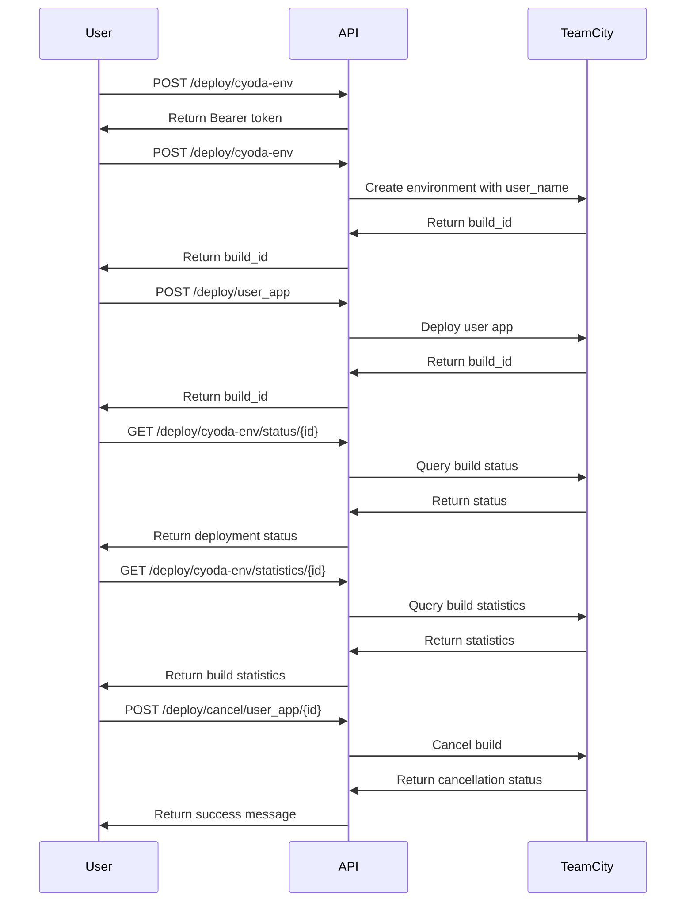

Here are the functional requirements for your deployment and environment configuration management application, expressed through user stories and use cases, along with the necessary API endpoints and their corresponding request/response formats.

### User Stories

1. **User Authentication**
   - As a user, I want to authenticate using a Bearer token so that I can access the deployment functionalities securely.

   **API Endpoint**: 
   ```http
   POST /deploy/cyoda-env
   ```
   **Request Format**:
   ```json
   {
       "user_name": "test"
   }
   ```
   **Response Format**:
   ```json
   {
       "token": "some_token"
   }
   ```

2. **Deploying Environment**
   - As a user, I want to create a deployment environment so that I can set up an application in a specific environment.

   **API Endpoint**:
   ```http
   POST /deploy/cyoda-env
   ```
   **Request Format**:
   ```json
   {
       "user_name": "test"
   }
   ```
   **Response Format**:
   ```json
   {
       "build_id": "12345"
   }
   ```

3. **Deploying User Application**
   - As a user, I want to deploy my application so that it can run in a Kubernetes environment.

   **API Endpoint**:
   ```http
   POST /deploy/user_app
   ```
   **Request Format**:
   ```json
   {
       "repository_url": "http://....",
       "is_public": true
   }
   ```
   **Response Format**:
   ```json
   {
       "build_id": "67890"
   }
   ```

4. **Checking Deployment Status**
   - As a user, I want to check the status of my deployment by build ID.

   **API Endpoint**:
   ```http
   GET /deploy/cyoda-env/status/{id}
   ```
   **Response Format**:
   ```json
   {
       "status": "running",
       "repository_url": "http://....",
       "is_public": true
   }
   ```

5. **Getting Build Statistics**
   - As a user, I want to retrieve statistics for a completed build.

   **API Endpoint**:
   ```http
   GET /deploy/cyoda-env/statistics/{id}
   ```
   **Response Format**:
   ```json
   {
       "statistics": {
           "success": 10,
           "failure": 2,
           "duration": "2m30s"
       },
       "repository_url": "http://....",
       "is_public": true
   }
   ```

6. **Canceling a User Application Deployment**
   - As a user, I want to cancel a queued deployment of my application to stop unnecessary resource usage.

   **API Endpoint**:
   ```http
   POST /deploy/cancel/user_app/{id}
   ```
   **Request Format**:
   ```json
   {
       "comment": "Canceling a queued build",
       "readdIntoQueue": false
   }
   ```
   **Response Format**:
   ```json
   {
       "message": "Build canceled"
   }
   ```

### Use Cases

1. **User Authentication Use Case**
   - **Actor**: User
   - **Precondition**: User has valid credentials.
   - **Main Flow**:
     1. User sends a POST request to `/deploy/cyoda-env` with their `user_name`.
     2. System verifies user and responds with a Bearer token.

2. **Environment Deployment Use Case**
   - **Actor**: User
   - **Precondition**: User is authenticated.
   - **Main Flow**:
     1. User sends a POST request to `/deploy/cyoda-env`.
     2. System processes the request and responds with a `build_id`.

3. **Application Deployment Use Case**
   - **Actor**: User
   - **Precondition**: User is authenticated.
   - **Main Flow**:
     1. User sends a POST request to `/deploy/user_app` with repository details.
     2. System processes the request and responds with a `build_id`.

4. **Retrieve Deployment Status Use Case**
   - **Actor**: User
   - **Precondition**: User is authenticated.
   - **Main Flow**:
     1. User sends a GET request to `/deploy/cyoda-env/status/{id}`.
     2. System retrieves and returns the deployment status.

5. **Retrieve Build Statistics Use Case**
   - **Actor**: User
   - **Precondition**: User is authenticated.
   - **Main Flow**:
     1. User sends a GET request to `/deploy/cyoda-env/statistics/{id}`.
     2. System retrieves and returns build statistics.

6. **Cancel Deployment Use Case**
   - **Actor**: User
   - **Precondition**: User is authenticated.
   - **Main Flow**:
     1. User sends a POST request to `/deploy/cancel/user_app/{id}`.
     2. System processes the cancellation and responds with a success message.

### Mermaid Diagrams for User-App Interaction


```mermaid
sequenceDiagram
    participant User
    participant API
    participant TeamCity

    User->>API: POST /deploy/cyoda-env
    API->>User: Return Bearer token

    User->>API: POST /deploy/cyoda-env
    API->>TeamCity: Create environment with user_name
    TeamCity->>API: Return build_id
    API->>User: Return build_id

    User->>API: POST /deploy/user_app
    API->>TeamCity: Deploy user app
    TeamCity->>API: Return build_id
    API->>User: Return build_id

    User->>API: GET /deploy/cyoda-env/status/{id}
    API->>TeamCity: Query build status
    TeamCity->>API: Return status
    API->>User: Return deployment status

    User->>API: GET /deploy/cyoda-env/statistics/{id}
    API->>TeamCity: Query build statistics
    TeamCity->>API: Return statistics
    API->>User: Return build statistics

    User->>API: POST /deploy/cancel/user_app/{id}
    API->>TeamCity: Cancel build
    TeamCity->>API: Return cancellation status
    API->>User: Return success message
```

This structured approach lays the foundation for defining the functional requirements of your application. If you have specific areas you would like to explore in further detail, please let me know.