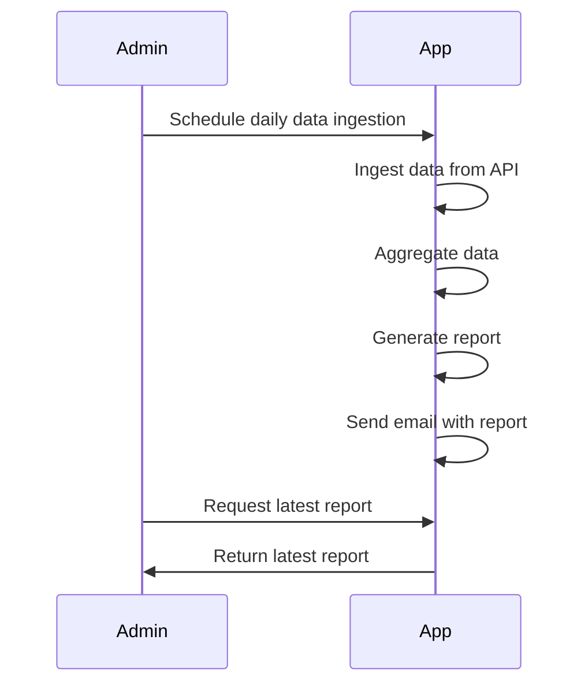

Here’s a well-formatted set of final functional requirements for your application, incorporating user stories, use cases, and API endpoint details.

---

## Functional Requirements for the Application

### User Stories

1. **Data Ingestion**
   - **As an** admin,
   - **I want** the application to ingest data from the specified data source daily,
   - **So that** I have the latest activities available for reporting.

2. **Data Aggregation**
   - **As an** admin,
   - **I want** the application to aggregate the ingested data,
   - **So that** I can receive a summarized report of the activities.

3. **Report Generation**
   - **As an** admin,
   - **I want** the application to generate a report after data aggregation,
   - **So that** I can review the activities in a structured format.

4. **Email Notification**
   - **As an** admin,
   - **I want** to receive the generated report via email,
   - **So that** I can access the report without logging into the application.

5. **Accessing Reports**
   - **As an** admin,
   - **I want** to be able to access the latest report via an API endpoint,
   - **So that** I can retrieve the report whenever needed.

### Use Cases

1. **Use Case: Ingest Data**
   - **Actor:** Admin
   - **Precondition:** The application is scheduled to run daily.
   - **Trigger:** Daily schedule.
   - **Main Flow:**
     1. Application sends a GET request to the data source.
     2. Application receives and processes the response.
   - **API Endpoint:** 
     - `GET /data/ingest`
     - **Response:** 
       ```json
       {
         "status": "success",
         "message": "Data ingested successfully."
       }
       ```

2. **Use Case: Aggregate Data**
   - **Actor:** Admin
   - **Precondition:** Data has been ingested.
   - **Trigger:** Completion of data ingestion.
   - **Main Flow:**
     1. Application aggregates the ingested data.
   - **API Endpoint:** 
     - `POST /data/aggregate`
     - **Response:** 
       ```json
       {
         "status": "success",
         "aggregatedData": { /* aggregated data structure */ }
       }
       ```

3. **Use Case: Generate Report**
   - **Actor:** Admin
   - **Precondition:** Data has been aggregated.
   - **Trigger:** Completion of data aggregation.
   - **Main Flow:**
     1. Application generates a report in JSON format.
   - **API Endpoint:** 
     - `POST /report/generate`
     - **Response:** 
       ```json
       {
         "status": "success",
         "reportId": "<unique_report_id>",
         "reportUrl": "<link_to_report>"
       }
       ```

4. **Use Case: Send Email Notification**
   - **Actor:** Admin
   - **Precondition:** Report has been generated.
   - **Trigger:** Completion of report generation.
   - **Main Flow:**
     1. Application sends an email with the report to the admin.
   - **API Endpoint:** 
     - `POST /report/send-email`
     - **Response:** 
       ```json
       {
         "status": "success",
         "message": "Report sent to admin's email."
       }
       ```

5. **Use Case: Access Reports**
   - **Actor:** Admin
   - **Precondition:** Reports are generated and cached.
   - **Trigger:** Admin requests the latest report.
   - **Main Flow:**
     1. Admin sends a GET request for the latest report.
   - **API Endpoint:** 
     - `GET /report`
     - **Response:** 
       ```json
       {
         "status": "success",
         "report": { /* report data structure */ }
       }
       ```

### Visual Representation of User-App Interaction


```mermaid
sequenceDiagram
    participant Admin
    participant App

    Admin->>App: Schedule daily data ingestion
    App->>App: Ingest data from API
    App->>App: Aggregate data
    App->>App: Generate report
    App->>App: Send email with report
    Admin->>App: Request latest report
    App->>Admin: Return latest report
```

---

This structured document outlines the functional requirements for your application, ensuring clarity and comprehensiveness. If you need further modifications or additions, feel free to let me know!