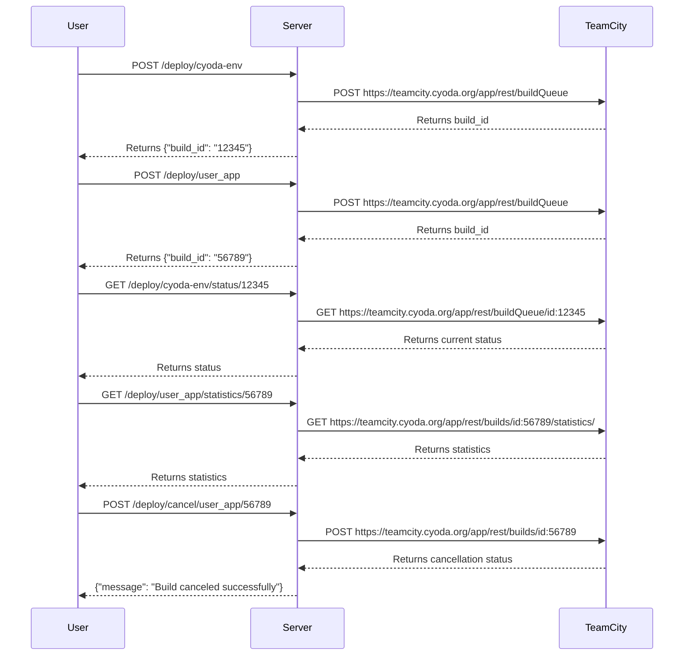

Here are the functional requirements for your application structured as user stories and use cases, along with the corresponding API endpoints and request/response formats. I've also included Mermaid diagrams for visual representation. 

### Functional Requirements

#### User Story 1: User Authentication
**As a** user,  
**I want** to authenticate using a Bearer token,  
**So that** I can access the deployment functionalities.

**Use Case:** Authenticate User  
**API Endpoint:**  
- **POST** `/deploy/cyoda-env`  
**Request Format:**  
```json
{
  "user_name": "test_username"
}
```
**Response Format:**  
```json
{
  "token": "Bearer token_string"
}
```

---

#### User Story 2: Deploy Environment Configuration
**As a** user,  
**I want** to deploy a configuration environment,  
**So that** I can set up my workspace.

**Use Case:** Deploy Cyoda Environment  
**API Endpoint:**  
- **POST** `/deploy/cyoda-env`  
**Request Format:**  
```json
{
  "user_name": "test_username"
}
```
**Response Format:**  
```json
{
  "build_id": "12345"
}
```

---

#### User Story 3: Deploy User Application
**As a** user,  
**I want** to deploy my application,  
**So that** it gets built using the specified repository.

**Use Case:** Deploy User Application  
**API Endpoint:**  
- **POST** `/deploy/user_app`  
**Request Format:**  
```json
{
  "repository_url": "http://example.com/repo.git",
  "is_public": "true"
}
```
**Response Format:**  
```json
{
  "build_id": "56789"
}
```

---

#### User Story 4: Check Deployment Status
**As a** user,  
**I want** to check the status of my deployments,  
**So that** I can monitor their progress.

**Use Cases:**  
- Check Cyoda Environment Status  
  **API Endpoint:**  
  - **GET** `/deploy/cyoda-env/status/{id}`  
  **Response Format:**  
  ```json
  {
    "status": "in_progress",
    "repository_url": "http://example.com/repo.git",
    "is_public": "true"
  }
  ```

- Check User Application Status  
  **API Endpoint:**  
  - **GET** `/deploy/user_app/status/{id}`  
  **Response Format:**  
  ```json
  {
    "status": "completed",
    "repository_url": "http://example.com/repo.git",
    "is_public": "true"
  }
  ```

---

#### User Story 5: Get Deployment Statistics
**As a** user,  
**I want** to retrieve statistics for my deployments,  
**So that** I can analyze the build performance.

**Use Cases:**  
- Get Cyoda Environment Statistics  
  **API Endpoint:**  
  - **GET** `/deploy/cyoda-env/statistics/{id}`  
  **Response Format:**  
  ```json
  {
    "statistics": {
      "duration": "120s",
      "successRate": "90%"
    }
  }
  ```

- Get User Application Statistics  
  **API Endpoint:**  
  - **GET** `/deploy/user_app/statistics/{id}`  
  **Response Format:**  
  ```json
  {
    "statistics": {
      "duration": "150s",
      "successRate": "85%"
    }
  }
  ```

---

#### User Story 6: Cancel User Application Build
**As a** user,  
**I want** to cancel an ongoing build,  
**So that** I can stop unnecessary resource usage.

**Use Case:** Cancel User Application Build  
**API Endpoint:**  
- **POST** `/deploy/cancel/user_app/{id}`  
**Request Format:**  
```json
{
  "comment": "Canceling a queued build",
  "readdIntoQueue": false
}
```
**Response Format:**  
```json
{
  "message": "Build canceled successfully"
}
```

---

### Visual Representation


```mermaid
sequenceDiagram
    participant User
    participant Server
    participant TeamCity

    User->>Server: POST /deploy/cyoda-env
    Server->>TeamCity: POST https://teamcity.cyoda.org/app/rest/buildQueue
    TeamCity-->>Server: Returns build_id
    Server-->>User: Returns {"build_id": "12345"}

    User->>Server: POST /deploy/user_app
    Server->>TeamCity: POST https://teamcity.cyoda.org/app/rest/buildQueue
    TeamCity-->>Server: Returns build_id
    Server-->>User: Returns {"build_id": "56789"}

    User->>Server: GET /deploy/cyoda-env/status/12345
    Server->>TeamCity: GET https://teamcity.cyoda.org/app/rest/buildQueue/id:12345
    TeamCity-->>Server: Returns current status
    Server-->>User: Returns status

    User->>Server: GET /deploy/user_app/statistics/56789
    Server->>TeamCity: GET https://teamcity.cyoda.org/app/rest/builds/id:56789/statistics/
    TeamCity-->>Server: Returns statistics
    Server-->>User: Returns statistics

    User->>Server: POST /deploy/cancel/user_app/56789
    Server->>TeamCity: POST https://teamcity.cyoda.org/app/rest/builds/id:56789
    TeamCity-->>Server: Returns cancellation status
    Server-->>User: {"message": "Build canceled successfully"}
```

### Conclusion
This formal specification outlines functional requirements clearly with a focus on user stories, use cases, API endpoints, request and response formats, and visual interactions. Further iterations can add details on non-functional requirements.