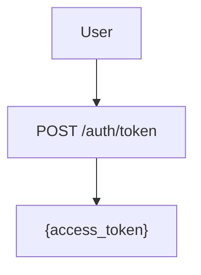
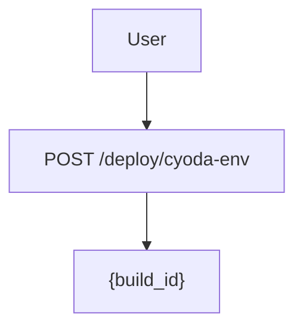
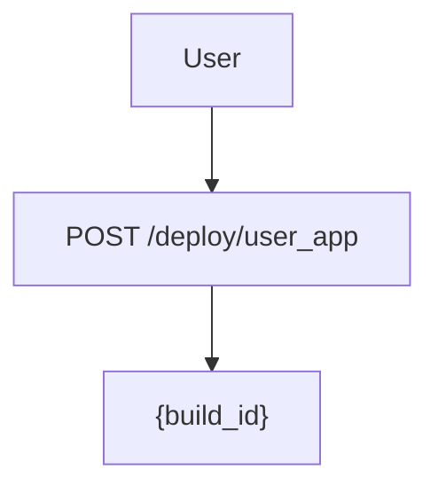

Certainly! Below are the well-formatted functional requirements for your backend application as user stories and use cases, along with the necessary API endpoints, request/response formats, and Mermaid diagrams for visual representation.

---

### Functional Requirements

#### User Stories

1. **User Authentication**
   - **As a** user, **I want** to authenticate using a Bearer token **so that** I can access the application's protected endpoints.

   - API Endpoint: 
     - **POST** /auth/token
   - Request Format:
     ```json
     {
       "username": "test_user",
       "password": "test_password"
     }
     ```
   - Response Format:
     ```json
     {
       "access_token": "Bearer <token>"
     }
     ```

2. **Deploy Environment Configuration**
   - **As a** user, **I want** to deploy a configuration for an environment **so that** I can manage my deployments.

   - API Endpoint:
     - **POST** /deploy/cyoda-env
   - Request Format:
     ```json
     {
       "user_name": "test_user"
     }
     ```
   - Response Format:
     ```json
     {
       "build_id": "12345"
     }
     ```

3. **Deploy User Application**
   - **As a** user, **I want** to deploy a user application **so that** I can manage my application's environment.

   - API Endpoint:
     - **POST** /deploy/user_app
   - Request Format:
     ```json
     {
       "repository_url": "http://my-app-repo.git",
       "is_public": true
     }
     ```
   - Response Format:
     ```json
     {
       "build_id": "54321"
     }
     ```

4. **Check Deployment Status**
   - **As a** user, **I want** to check the status of my deployment **so that** I am informed about its progress.

   - API Endpoint:
     - **GET** /deploy/cyoda-env/status/{id}
   - Response Format:
     ```json
     {
       "status": "In Progress",
       "build_details": {...}
     }
     ```

5. **Get Deployment Statistics**
   - **As a** user, **I want** to retrieve statistics of my deployment **so that** I can analyze its performance.

   - API Endpoint:
     - **GET** /deploy/cyoda-env/statistics/{id}
   - Response Format:
     ```json
     {
       "statistics": {...}
     }
     ```

6. **Cancel User Application Deployment**
   - **As a** user, **I want** to cancel a deployment of my application **so that** I can stop unnecessary processes.

   - API Endpoint:
     - **POST** /deploy/cancel/user_app/{id}
   - Request Format:
     ```json
     {
       "comment": "Canceling a queued build",
       "readdIntoQueue": false
     }
     ```
   - Response Format:
     ```json
     {
       "message": "Build cancelled successfully"
     }
     ```

---

### API Endpoints Summary

| Endpoint                                  | Method | Request Format                                     | Response Format                                  |
|-------------------------------------------|--------|----------------------------------------------------|--------------------------------------------------|
| /auth/token                               | POST   | { "username": "...", "password": "..." }         | { "access_token": "Bearer <token>" }             |
| /deploy/cyoda-env                         | POST   | { "user_name": "..." }                             | { "build_id": "12345" }                          |
| /deploy/user_app                          | POST   | { "repository_url": "...", "is_public": true }   | { "build_id": "54321" }                          |
| /deploy/cyoda-env/status/{id}            | GET    | None                                               | { "status": "...", "build_details": {...} }     |
| /deploy/cyoda-env/statistics/{id}        | GET    | None                                               | { "statistics": {...} }                           |
| /deploy/cancel/user_app/{id}             | POST   | { "comment": "...", "readdIntoQueue": false }    | { "message": "Build cancelled successfully" }     |

---

### Mermaid Diagrams

#### User Authentication Interaction


```mermaid
graph TD;
    User-->Auth[POST /auth/token];
    Auth-->Response["{access_token}"];
```

#### Deploy Environment Configuration Interaction


```mermaid
graph TD;
    User-->CyodaEnv[POST /deploy/cyoda-env];
    CyodaEnv-->Response["{build_id}"];
```

#### Deploy User Application Interaction


```mermaid
graph TD;
    User-->UserApp[POST /deploy/user_app];
    UserApp-->Response["{build_id}"];
```

#### Check Deployment Status Interaction

```mermaid
graph TD;
    User-->Status[GET /deploy/cyoda-env/status/{id}];
    Status-->Response["{status, build_details}"];
```

#### Cancel User Application Deployment Interaction

```mermaid
graph TD;
    User-->Cancel[POST /deploy/cancel/user_app/{id}];
    Cancel-->Response["{message}"];
```

---

This outline provides a comprehensive view of the functional requirements necessary for your application, ensuring a solid foundation for development. Let me know if you need any adjustments or additional details!