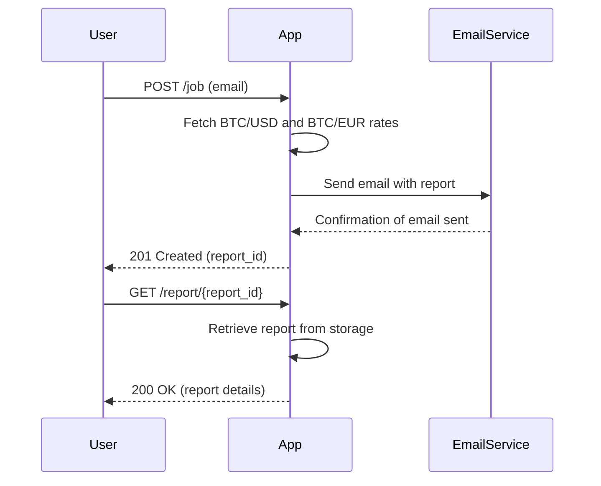

Here are the final functional requirements for your application, presented in a clear and structured format:

### Functional Requirements

#### User Stories

1. **Report Creation**
   - **As a user, I want to initiate the report creation process so that I can receive the latest Bitcoin conversion rates.**
   - **API Endpoint**: `POST /job`
     - **Request Format**:
       ```json
       {
         "email": "user@example.com"
       }
       ```
     - **Response Format**:
       - **Success (201 Created)**:
         ```json
         {
           "report_id": "12345",
           "message": "Report is being generated and will be sent to your email."
         }
         ```
       - **Error (400 Bad Request)**:
         ```json
         {
           "error": "Invalid email address."
         }
         ```

2. **Report Retrieval**
   - **As a user, I want to retrieve my previously generated report using its ID so that I can view the conversion rates.**
   - **API Endpoint**: `GET /report/{report_id}`
     - **Request Format**: N/A (report_id is part of the URL)
     - **Response Format**:
       - **Success (200 OK)**:
         ```json
         {
           "report_id": "12345",
           "btc_usd_rate": "50000",
           "btc_eur_rate": "42000",
           "timestamp": "2023-10-01T12:00:00Z"
         }
         ```
       - **Error (404 Not Found)**:
         ```json
         {
           "error": "Report not found."
         }
         ```

### Non-Functional Considerations (To Address Later)
- Email sending configuration and error handling
- Storage solution for reports (e.g., database, file system)
- Authentication methods for API endpoints
- Rate limiting and performance considerations

### User-App Interaction Diagram


```mermaid
sequenceDiagram
    participant User
    participant App
    participant EmailService

    User->>App: POST /job (email)
    App->>App: Fetch BTC/USD and BTC/EUR rates
    App->>EmailService: Send email with report
    EmailService-->>App: Confirmation of email sent
    App-->>User: 201 Created (report_id)

    User->>App: GET /report/{report_id}
    App->>App: Retrieve report from storage
    App-->>User: 200 OK (report details)
```

These functional requirements provide a comprehensive overview of the necessary features for your application, along with the API details and user interactions. If you have any modifications or additional requirements, please let me know!