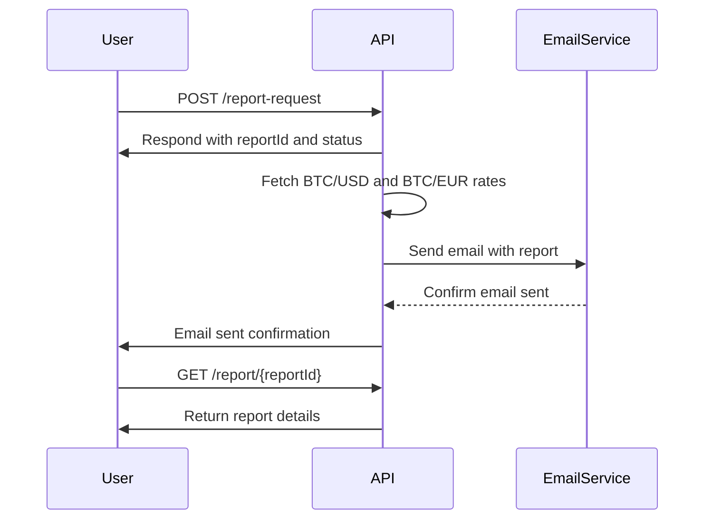

Here are the well-formatted final functional requirements for your Bitcoin conversion rate reporting application:

### Functional Requirements

#### User Stories

1. **Report Request**
   - **As a user**, I want to request a report of the current Bitcoin conversion rates so that I can receive it via email.
   - **Endpoint**: `POST /report-request`
     - **Request Body**:
       ```json
       {
         "email": "user@example.com"
       }
       ```
     - **Response**:
       ```json
       {
         "reportId": "12345",
         "status": "Report is being generated."
       }
       ```

2. **Retrieve Report**
   - **As a user**, I want to retrieve my previously generated report by its ID so that I can view the conversion rates.
   - **Endpoint**: `GET /report/{reportId}`
     - **Path Parameter**:
       - `reportId`: Unique identifier for the report (string).
     - **Response**:
       ```json
       {
         "reportId": "12345",
         "btcToUsd": "50000",
         "btcToEur": "42000",
         "timestamp": "2023-10-01T12:00:00Z"
       }
       ```

#### Additional Requirements

- **Email Configuration**: The application should support sending emails through a specified email service (e.g., SMTP, SendGrid) with necessary authentication and configuration details.

- **Report Storage**: The application should store reports in a database or file system, with a unique identifier for each report. The retention period for reports should be defined.

- **Error Handling**: The application should handle errors gracefully, including logging them and providing appropriate responses to users when issues arise (e.g., failure to fetch rates or send emails).

- **Rate Fetching Frequency**: The application should fetch the latest Bitcoin conversion rates on demand when a report is requested.

- **Authentication and Security**: Consider whether the endpoints need authentication or rate limiting to prevent abuse.

- **Response Structure**: Ensure consistency in response formats across all endpoints.

### Visual Representation

#### User Interaction Sequence Diagram


```mermaid
sequenceDiagram
    participant User
    participant API
    participant EmailService

    User->>API: POST /report-request
    API->>User: Respond with reportId and status
    API->>API: Fetch BTC/USD and BTC/EUR rates
    API->>EmailService: Send email with report
    EmailService-->>API: Confirm email sent
    API->>User: Email sent confirmation

    User->>API: GET /report/{reportId}
    API->>User: Return report details
```

This document provides a comprehensive overview of the functional requirements for your application, ensuring that the necessary features and interactions are clearly defined. If you need any further adjustments or additions, please let me know.