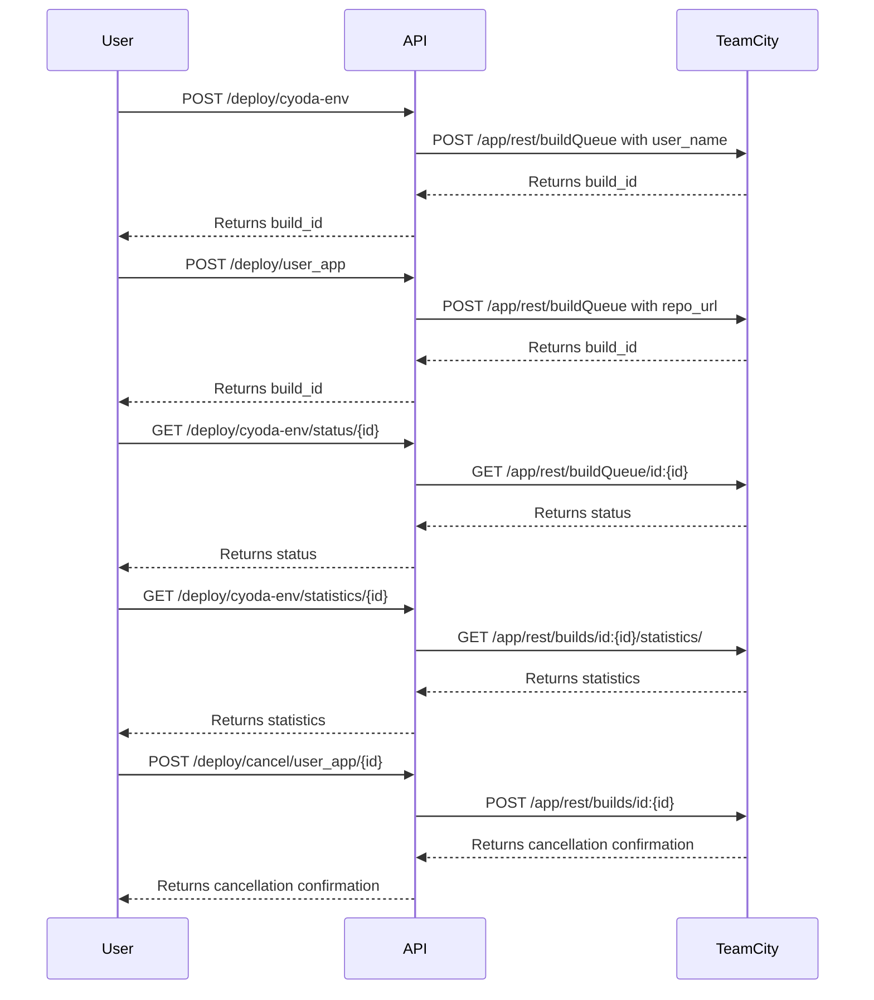

以下のように、あなたのプロジェクトに関する機能的要件をユーザーストーリーとユースケースの形式で詳述し、APIエンドポイントやリクエスト/レスポンスフォーマットを示します。

### Functional Requirements
---

#### User Story 1: User Deployment Configuration
**As a** user,  
**I want to** configure my deployment by providing a username,  
**so that** I can initiate build processes with specific configurations.

**Use Case 1: Create Deployment Environment**  
- **API Endpoint:** `POST /deploy/cyoda-env`
- **Request Format:**
    ```json
    {
        "user_name": "test"
    }
    ```
- **Response Format:**
    ```json
    {
        "build_id": "12345"
    }
    ```

---

#### User Story 2: Manage User Application Deployments
**As a** user,  
**I want to** deploy my application using a repository URL,  
**so that** my application can be built and deployed in the environment.

**Use Case 2: Deploy User Application**  
- **API Endpoint:** `POST /deploy/user_app`
- **Request Format:**
    ```json
    {
        "repository_url": "http://example.com/repo.git",
        "is_public": true
    }
    ```
- **Response Format:**
    ```json
    {
        "build_id": "67890"
    }
    ```

---

#### User Story 3: Check Deployment Status
**As a** user,  
**I want to** check the status of my deployments,  
**so that** I can monitor the progress and results of my builds.

**Use Case 3: Get Deployment Environment Status**  
- **API Endpoint:** `GET /deploy/cyoda-env/status/{id}`
- **Response Format:**
    ```json
    {
        "status": "In Progress | Completed | Failed",
        "repository_url": "http://example.com/repo.git",
        "is_public": true
    }
    ```

**Use Case 4: Get User Application Status**  
- **API Endpoint:** `GET /deploy/user_app/status/{id}`
- **Response Format:**
    ```json
    {
        "status": "In Progress | Completed | Failed",
        "repository_url": "http://example.com/repo.git",
        "is_public": true
    }
    ```

---

#### User Story 4: Retrieve Build Statistics
**As a** user,  
**I want to** retrieve statistics for my builds,  
**so that** I can analyze the performance of my deployments.

**Use Case 5: Get Build Statistics for Deployment Environment**  
- **API Endpoint:** `GET /deploy/cyoda-env/statistics/{id}`
- **Response Format:**
    ```json
    {
        "statistics": {
            "duration": "120s",
            "success_rate": "90%",
            "commit_details": [ /* Array of commit objects */ ]
        }
    }
    ```

**Use Case 6: Get Build Statistics for User Application**  
- **API Endpoint:** `GET /deploy/user_app/statistics/{id}`
- **Response Format:**
    ```json
    {
        "statistics": {
            "duration": "120s",
            "success_rate": "80%",
            "commit_details": [ /* Array of commit objects */ ]
        }
    }
    ```

---

#### User Story 5: Cancel Deployment
**As a** user,  
**I want to** cancel a queued build,  
**so that** I can halt unnecessary deployments.

**Use Case 7: Cancel User Application Build**  
- **API Endpoint:** `POST /deploy/cancel/user_app/{id}`
- **Request Format:**
    ```json
    {
        "comment": "Canceling a queued build",
        "readdIntoQueue": false
    }
    ```
- **Response Format:**
    ```json
    {
        "message": "Build canceled successfully."
    }
    ```

---

### Mermaid Diagrams


```mermaid
sequenceDiagram
    participant User
    participant API
    participant TeamCity

    User->>API: POST /deploy/cyoda-env
    API->>TeamCity: POST /app/rest/buildQueue with user_name
    TeamCity-->>API: Returns build_id
    API-->>User: Returns build_id

    User->>API: POST /deploy/user_app
    API->>TeamCity: POST /app/rest/buildQueue with repo_url
    TeamCity-->>API: Returns build_id
    API-->>User: Returns build_id

    User->>API: GET /deploy/cyoda-env/status/{id}
    API->>TeamCity: GET /app/rest/buildQueue/id:{id}
    TeamCity-->>API: Returns status
    API-->>User: Returns status

    User->>API: GET /deploy/cyoda-env/statistics/{id}
    API->>TeamCity: GET /app/rest/builds/id:{id}/statistics/
    TeamCity-->>API: Returns statistics
    API-->>User: Returns statistics

    User->>API: POST /deploy/cancel/user_app/{id}
    API->>TeamCity: POST /app/rest/builds/id:{id}
    TeamCity-->>API: Returns cancellation confirmation
    API-->>User: Returns cancellation confirmation
```

### Summary
This document provides a comprehensive outline of the functional requirements for your application. Each user story is paired with its use case, specified API endpoints, and request/response formats to ensure clarity in the development process. The accompanying Mermaid diagram depicts user interactions with the API, illustrating the flow of requests and responses.

If you have any further specifications or modifications you would like to make, please feel free to ask.