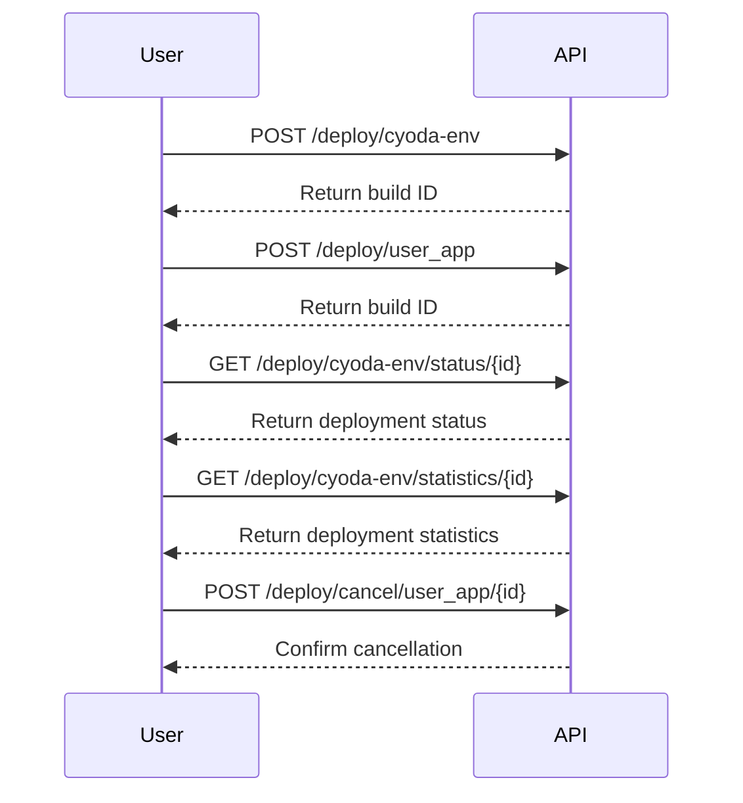

Here are the functional requirements for your application presented in the form of user stories, use cases, API endpoints, and Mermaid diagrams for visual representation.

### User Stories

1. **User Authentication and Session Management**
   - As a user, I want to authenticate myself using a Bearer token so that I can securely access the application and manage deployments.
  
   **Acceptance Criteria:**
   - Valid Bearer token is required for all actions.
  
   **API Endpoint:**
   - This is implicit as part of all endpoints; use middleware for token validation.

2. **Environment Deployment Management**
   - As a user, I want to create a deployment for my environment to ensure my configurations are applied.
  
   **Acceptance Criteria:**
   - Deployment is created with user-specific configurations.
  
   **API Endpoints:**
   - **POST /deploy/cyoda-env**
     - Request Body:
       ```json
       {
         "user_name": "test"
       }
       ```
     - Response Body:
       ```json
       {
         "build_id": "123456"
       }
       ```

3. **User Application Deployment**
   - As a user, I want to deploy my application so that I can manage its environment.
  
   **Acceptance Criteria:**
   - Application is deployed with user-defined properties.
  
   **API Endpoints:**
   - **POST /deploy/user_app**
     - Request Body:
       ```json
       {
         "repository_url": "http://example.com/repo",
         "is_public": "true"
       }
       ```
     - Response Body:
       ```json
       {
         "build_id": "654321"
       }
       ```

4. **Retrieve Deployment Status**
   - As a user, I want to check the status of my deployment so that I can monitor its progress.
  
   **Acceptance Criteria:**
   - Users can retrieve current deployment status with a specific build ID.
  
   **API Endpoints:**
   - **GET /deploy/cyoda-env/status/{id}**
     - Response Body:
       ```json
       {
         "status": "in_progress|successful|failed",
         "repository_url": "http://example.com/repo",
         "is_public": "true"
       }
       ```

5. **View Deployment Statistics**
   - As a user, I want to see the statistics of my deployments to analyze their performance.
  
   **Acceptance Criteria:**
   - Retrieval of statistics should include relevant performance metrics.
  
   **API Endpoints:**
   - **GET /deploy/cyoda-env/statistics/{id}**
     - Response Body:
       ```json
       {
         "statistics": {
           "duration": "120s",
           "errors": 0,
           "success": true
         }
       }
       ```

6. **Cancel a User Application Deployment**
   - As a user, I want to cancel my application deployment if it's queued or running.
  
   **Acceptance Criteria:**
   - Successfully cancel the deployment and notify the user.
  
   **API Endpoints:**
   - **POST /deploy/cancel/user_app/{id}**
     - Request Body:
       ```json
       {
         "comment": "Canceling a queued build",
         "readdIntoQueue": false
       }
       ```
     - Response Body:
       ```json
       {
         "message": "Deployment cancelled successfully."
       }
       ```

### Mermaid Diagrams

Below is a representation of user-app interactions using Mermaid syntax.


```mermaid
sequenceDiagram
    participant User
    participant API
    
    User->>API: POST /deploy/cyoda-env
    API-->>User: Return build ID
    
    User->>API: POST /deploy/user_app
    API-->>User: Return build ID
    
    User->>API: GET /deploy/cyoda-env/status/{id}
    API-->>User: Return deployment status
    
    User->>API: GET /deploy/cyoda-env/statistics/{id}
    API-->>User: Return deployment statistics
    
    User->>API: POST /deploy/cancel/user_app/{id}
    API-->>User: Confirm cancellation
```

### Summary

The functional requirements outlined above cover the critical user interactions with the deployment management application. Each user story corresponds to specific API endpoints detailing request-response formats. The designs set a basis for your API development to ensure they comply with RESTful principles. 

Feel free to ask for more details or modifications in any section!