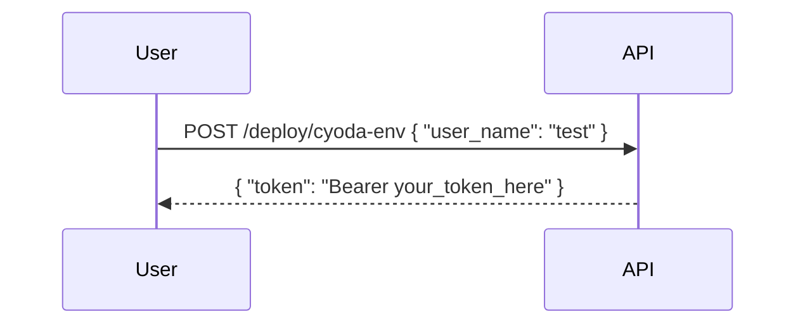
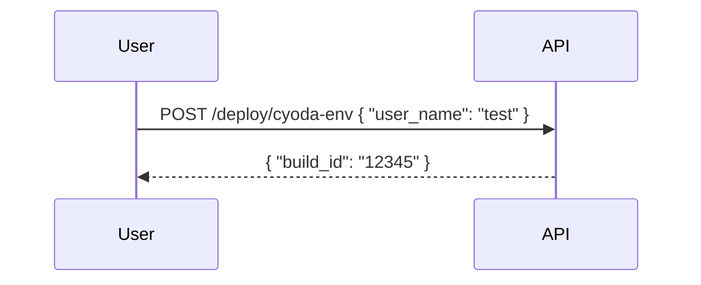
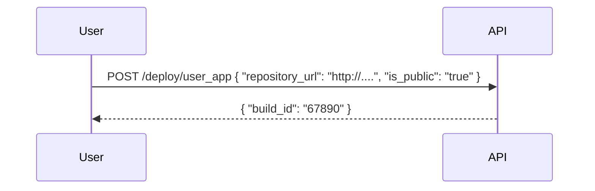
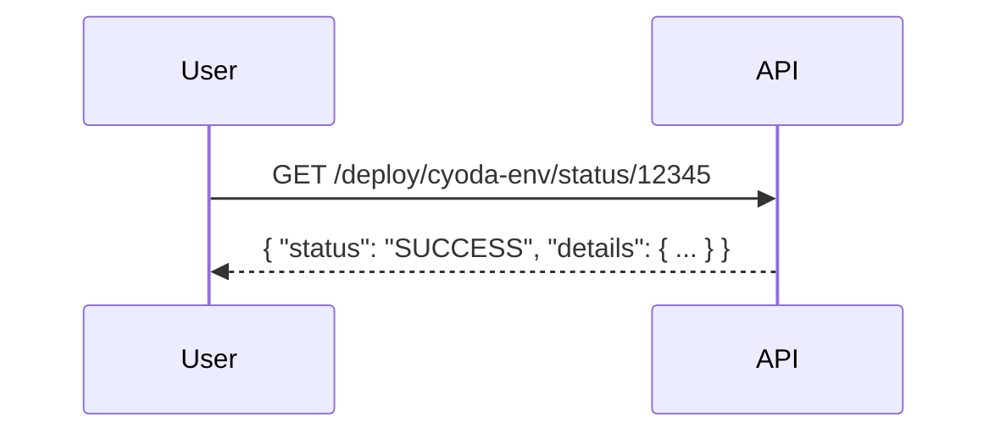
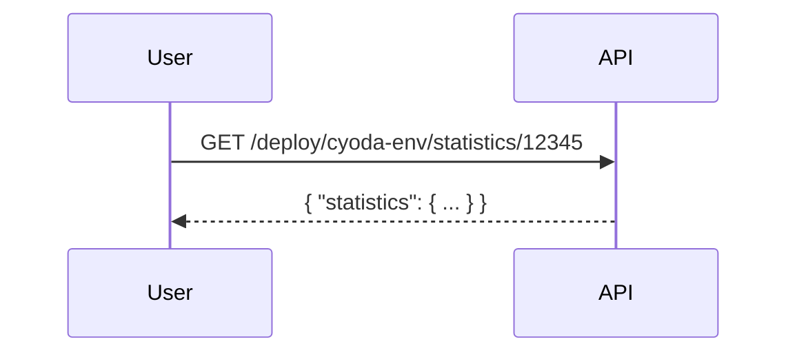
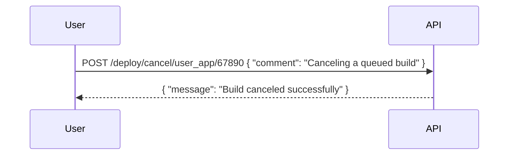

Here’s a comprehensive outline of the functional requirements for your application, represented as user stories and use cases. Each section includes specific API endpoints along with request/response formats. Additionally, I have included Mermaid diagrams to visualize user-app interactions.

---

### User Stories

1. **User Authentication & Authorization**
   - **As a user, I want to authenticate using a Bearer token so that I can securely access the application.**

   **Use Case: User Authentication**
   - **API Endpoint:** `POST /deploy/cyoda-env`
   - **Request Format:**
     ```json
     {
       "user_name": "test"
     }
     ```
   - **Response Format:**
     ```json
     {
       "token": "Bearer your_token_here"
     }
     ```

2. **Deployment of Kubernetes Pipeline for Environment**
   - **As a user, I want to deploy a Kubernetes pipeline for my environment, so that I can manage different configurations.**

   **Use Case: Deploy Environment**
   - **API Endpoint:** `POST /deploy/cyoda-env`
   - **Request Format:**
     ```json
     {
       "user_name": "test"
     }
     ```
   - **Response Format:**
     ```json
     {
       "build_id": "12345"
     }
     ```

3. **Deployment of User Application**
   - **As a user, I want to deploy my user application, so that it can be built and configured dynamically.**

   **Use Case: Deploy User Application**
   - **API Endpoint:** `POST /deploy/user_app`
   - **Request Format:**
     ```json
     {
       "repository_url": "http://....",
       "is_public": "true"
     }
     ```
   - **Response Format:**
     ```json
     {
       "build_id": "67890"
     }
     ```

4. **Check Build Status**
   - **As a user, I want to check the status of a deployment build, so that I can monitor its progress.**

   **Use Case: Get Build Status**
   - **API Endpoint:** `GET /deploy/cyoda-env/status/{id}`
   - **Response Format:**
     ```json
     {
       "status": "SUCCESS/FAILED",
       "details": {
         // detailed status information
       }
     }
     ```

5. **Get Build Statistics**
   - **As a user, I want to retrieve statistics for my builds, so that I can analyze their performance.**

   **Use Case: Get Build Statistics**
   - **API Endpoint:** `GET /deploy/cyoda-env/statistics/{id}`
   - **Response Format:**
     ```json
     {
       "statistics": {
         // statistics data
       }
     }
     ```

6. **Cancel a User Application Build**
   - **As a user, I want to cancel a queued build for my application, so that I can manage my deployments effectively.**

   **Use Case: Cancel Build**
   - **API Endpoint:** `POST /deploy/cancel/user_app/{id}`
   - **Request Format:**
     ```json
     {
       "comment": "Canceling a queued build",
       "readdIntoQueue": false
     }
     ```
   - **Response Format:**
     ```json
     {
       "message": "Build canceled successfully"
     }
     ```

---

### API Summary

| User Story                           | API Endpoint                            | Method | Request Body                                   | Response Body                                   |
|--------------------------------------|----------------------------------------|--------|------------------------------------------------|-------------------------------------------------|
| Authenticate User                    | `/deploy/cyoda-env`                   | POST   | `{ "user_name": "test" }`                     | `{ "token": "Bearer your_token_here" }`        |
| Deploy Environment                   | `/deploy/cyoda-env`                   | POST   | `{ "user_name": "test" }`                     | `{ "build_id": "12345" }`                      |
| Deploy User Application              | `/deploy/user_app`                    | POST   | `{ "repository_url": "http://....", "is_public": "true" }` | `{ "build_id": "67890" }`                      |
| Check Build Status                   | `/deploy/cyoda-env/status/{id}`       | GET    | N/A                                            | `{ "status": "SUCCESS/FAILED", "details": { ... } }` |
| Get Build Statistics                 | `/deploy/cyoda-env/statistics/{id}`   | GET    | N/A                                            | `{ "statistics": { ... } }`                    |
| Cancel User Application Build        | `/deploy/cancel/user_app/{id}`        | POST   | `{ "comment": "Canceling a queued build", "readdIntoQueue": false }` | `{ "message": "Build canceled successfully" }` |

---

### User-App Interaction Diagrams

**User Authentication**

```mermaid
sequenceDiagram
    participant User
    participant API
    User->>API: POST /deploy/cyoda-env { "user_name": "test" }
    API-->>User: { "token": "Bearer your_token_here" }
```

**Deploy Environment**

```mermaid
sequenceDiagram
    participant User
    participant API
    User->>API: POST /deploy/cyoda-env { "user_name": "test" }
    API-->>User: { "build_id": "12345" }
```

**Deploy User Application**

```mermaid
sequenceDiagram
    participant User
    participant API
    User->>API: POST /deploy/user_app { "repository_url": "http://....", "is_public": "true" }
    API-->>User: { "build_id": "67890" }
```

**Check Build Status**

```mermaid
sequenceDiagram
    participant User
    participant API
    User->>API: GET /deploy/cyoda-env/status/12345
    API-->>User: { "status": "SUCCESS", "details": { ... } }
```

**Get Build Statistics**

```mermaid
sequenceDiagram
    participant User
    participant API
    User->>API: GET /deploy/cyoda-env/statistics/12345
    API-->>User: { "statistics": { ... } }
```

**Cancel User Application Build**

```mermaid
sequenceDiagram
    participant User
    participant API
    User->>API: POST /deploy/cancel/user_app/67890 { "comment": "Canceling a queued build" }
    API-->>User: { "message": "Build canceled successfully" }
```

---

This structured approach should give you a clear roadmap for implementing the functional requirements of your application. If you have additional requests or any modifications to make, feel free to let me know!