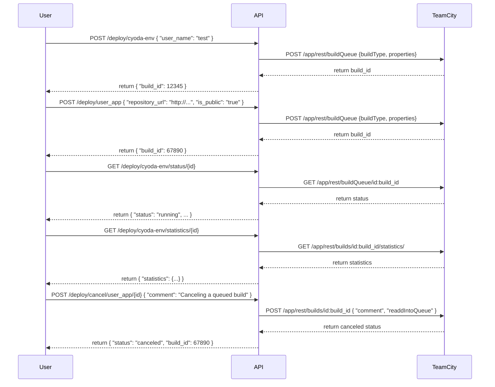

Here are the defined functional requirements for your application in the form of user stories and use cases. I've also outlined the necessary API endpoints along with request/response formats and provided Mermaid diagrams to visualize user-app interaction.

### User Stories

1. **As a user, I want to create a deployment environment so that I can manage my configurations easily.**
   - **API Endpoint:** `POST /deploy/cyoda-env`
     - **Request Format:**
       ```json
       {
         "user_name": "test"
       }
       ```
     - **Response Format:**
       ```json
       {
         "build_id": 12345
       }
       ```

2. **As a user, I want to deploy my application so that I can have it running in my environment.**
   - **API Endpoint:** `POST /deploy/user_app`
     - **Request Format:**
       ```json
       {
         "repository_url": "http://...",
         "is_public": "true"
       }
       ```
     - **Response Format:**
       ```json
       {
         "build_id": 67890
       }
       ```

3. **As a user, I want to check the status of my deployment so that I know if it's running successfully.**
   - **API Endpoint:** `GET /deploy/cyoda-env/status/{id}`
     - **Response Format:**
       ```json
       {
         "status": "running",
         "repository_url": "http://...",
         "is_public": "true"
       }
       ```

4. **As a user, I want to retrieve the statistics of my deployment to analyze the performance metrics.**
   - **API Endpoint:** `GET /deploy/cyoda-env/statistics/{id}`
     - **Response Format:**
       ```json
       {
         "statistics": {
           "success_rate": 95,
           "execution_time": 120
         }
       }
       ```

5. **As a user, I want to cancel my deployment if needed.**
   - **API Endpoint:** `POST /deploy/cancel/user_app/{id}`
     - **Request Format:**
       ```json
       {
         "comment": "Canceling a queued build",
         "readdIntoQueue": false
       }
       ```
     - **Response Format:**
       ```json
       {
         "status": "canceled",
         "build_id": 67890
       }
       ```

### Use Cases

1. **Use Case: Create Deployment Environment**
   - **Actors:** User
   - **Preconditions:** User is authenticated with a Bearer token.
   - **Postconditions:** A new deployment environment is created.
   - **Flow:**
     1. User sends a POST request to `/deploy/cyoda-env` with the `user_name`.
     2. The system processes the request and creates a deployment environment.
     3. The system returns the `build_id`.

2. **Use Case: Deploy Application**
   - **Actors:** User
   - **Preconditions:** User has a valid repository URL.
   - **Postconditions:** The application is queued for deployment.
   - **Flow:**
     1. User sends a POST request to `/deploy/user_app` with the `repository_url` and `is_public`.
     2. The system processes the request and queues the build.
     3. The system returns the `build_id`.

3. **Use Case: Check Deployment Status**
   - **Actors:** User
   - **Preconditions:** User has initiated a deployment.
   - **Postconditions:** User receives the current status of the deployment.
   - **Flow:**
     1. User sends a GET request to `/deploy/cyoda-env/status/{id}`.
     2. The system retrieves the status for the given `build_id`.
     3. The system returns the current status.

### User-App Interaction Diagram (Mermaid)


```mermaid
sequenceDiagram
    participant User
    participant API
    participant TeamCity

    User->>API: POST /deploy/cyoda-env { "user_name": "test" }
    API->>TeamCity: POST /app/rest/buildQueue {buildType, properties}
    TeamCity-->>API: return build_id
    API-->>User: return { "build_id": 12345 }

    User->>API: POST /deploy/user_app { "repository_url": "http://...", "is_public": "true" }
    API->>TeamCity: POST /app/rest/buildQueue {buildType, properties}
    TeamCity-->>API: return build_id
    API-->>User: return { "build_id": 67890 }

    User->>API: GET /deploy/cyoda-env/status/{id}
    API->>TeamCity: GET /app/rest/buildQueue/id:build_id
    TeamCity-->>API: return status
    API-->>User: return { "status": "running", ... }

    User->>API: GET /deploy/cyoda-env/statistics/{id}
    API->>TeamCity: GET /app/rest/builds/id:build_id/statistics/
    TeamCity-->>API: return statistics
    API-->>User: return { "statistics": {...} }

    User->>API: POST /deploy/cancel/user_app/{id} { "comment": "Canceling a queued build" }
    API->>TeamCity: POST /app/rest/builds/id:build_id { "comment", "readdIntoQueue" }
    TeamCity-->>API: return canceled status
    API-->>User: return { "status": "canceled", "build_id": 67890 }
```

These functional requirements provide a clear framework for your application. Let me know if you need further refinements or additional details on any specific points!