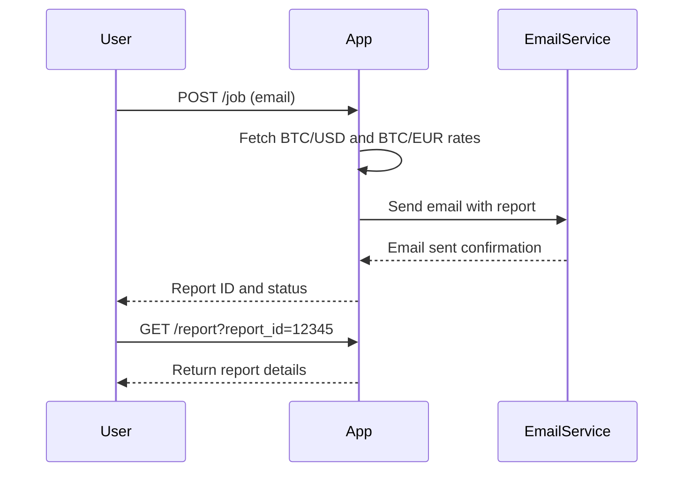

Here are the final functional requirements for your application, presented in a well-structured format:

### Functional Requirements

#### User Stories

1. **Initiate Report Creation**
   - **As a user**, I want to initiate the report creation process so that I can receive the latest Bitcoin conversion rates.
   - **Endpoint**: `POST /job`
   - **Request Format**: 
     ```json
     {
       "email": "user@example.com"
     }
     ```
   - **Response Format**: 
     ```json
     {
       "report_id": "12345",
       "status": "Report is being generated."
     }
     ```

2. **Retrieve Stored Report**
   - **As a user**, I want to retrieve the stored report by its ID so that I can view the conversion rates.
   - **Endpoint**: `GET /report`
   - **Request Format**: 
     ```
     GET /report?report_id=12345
     ```
   - **Response Format**: 
     ```json
     {
       "report_id": "12345",
       "timestamp": "2023-10-01T12:00:00Z",
       "btc_usd": "50000.00",
       "btc_eur": "42000.00"
     }
     ```

#### API Endpoints Summary

| Endpoint       | Method | Request Format                               | Response Format                                   |
|----------------|--------|----------------------------------------------|--------------------------------------------------|
| `/job`         | POST   | `{ "email": "user@example.com" }`          | `{ "report_id": "12345", "status": "..." }`    |
| `/report`      | GET    | `GET /report?report_id=12345`              | `{ "report_id": "12345", "timestamp": "...", "btc_usd": "...", "btc_eur": "..." }` |

#### User-App Interaction


```mermaid
sequenceDiagram
    participant User
    participant App
    participant EmailService

    User->>App: POST /job (email)
    App->>App: Fetch BTC/USD and BTC/EUR rates
    App->>EmailService: Send email with report
    EmailService-->>App: Email sent confirmation
    App-->>User: Report ID and status

    User->>App: GET /report?report_id=12345
    App-->>User: Return report details
```

### Additional Considerations
- **Error Handling**: The application should handle errors gracefully, returning appropriate HTTP status codes and messages.
- **Authentication**: An API key-based authentication system should be considered for securing endpoints.
- **Scalability**: As the application grows, consider potential enhancements like scheduled report generation.

This structured format provides a comprehensive overview of the functional requirements for your application. If you need any further modifications or have additional requirements, feel free to ask!