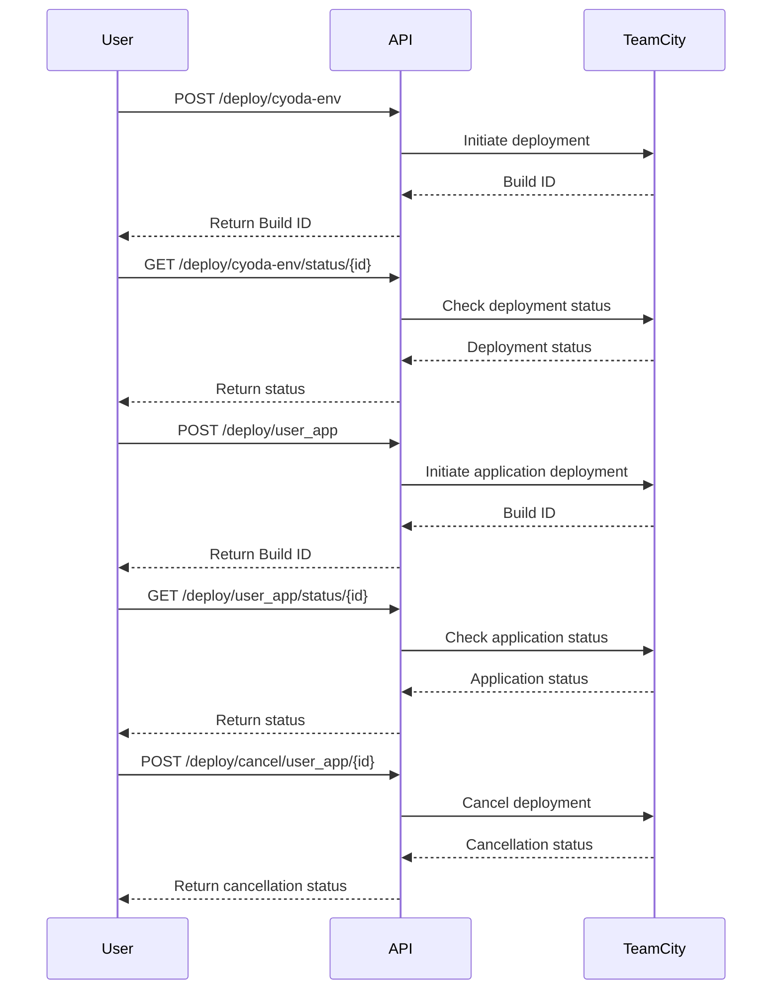

Here’s a well-structured set of functional requirements for your application, presented as user stories and use cases. 

### User Stories

1. **User Authentication**
   - **As** a user, **I want** to authenticate using a Bearer token **so that** I can securely access the application.
   - **API Endpoints:**
     - **POST /deploy/cyoda-env**
       - **Request:**
         ```json
         {
           "user_name": "test"
         }
         ```
       - **Response:**
         ```json
         {
           "token": "bearer_token"
         }
         ```

2. **Deploying Environment**
   - **As** a user, **I want** to deploy an environment using a predefined build type **so that** I can manage user-specific configurations.
   - **API Endpoints:**
     - **POST /deploy/cyoda-env**
       - **Request:**
         ```json
         {
           "user_name": "test"
         }
         ```
       - **Response:**
         ```json
         {
           "build_id": "12345"
         }
         ```

3. **Deploying User Application**
   - **As** a user, **I want** to deploy my application **so that** I can manage its configuration.
   - **API Endpoints:**
     - **POST /deploy/user_app**
       - **Request:**
         ```json
         {
           "repository_url": "http://...",
           "is_public": "true"
         }
         ```
       - **Response:**
         ```json
         {
           "build_id": "67890"
         }
         ```

4. **Checking Environment Deployment Status**
   - **As** a user, **I want** to get the status of my deployed environment **so that** I can track its progress.
   - **API Endpoints:**
     - **GET /deploy/cyoda-env/status/{id}**
       - **Request:**
         - URL: `/deploy/cyoda-env/status/12345`
       - **Response:**
         ```json
         {
           "status": "success",
           "details": "Deployment details here."
         }
         ```

5. **Retrieving Application Status**
   - **As** a user, **I want** to get the status of my application deployment **so that** I can monitor its health.
   - **API Endpoints:**
     - **GET /deploy/user_app/status/{id}**
       - **Request:**
         - URL: `/deploy/user_app/status/67890`
       - **Response:**
         ```json
         {
           "status": "running",
           "details": "Application details here."
         }
         ```

6. **Cancelling a User Application Deployment**
   - **As** a user, **I want** to cancel a queued application deployment **so that** I can manage my resources.
   - **API Endpoints:**
     - **POST /deploy/cancel/user_app/{id}**
       - **Request:**
         - URL: `/deploy/cancel/user_app/67890`
         - Body:
         ```json
         {
           "comment": "Canceling a queued build",
           "readdIntoQueue": false
         }
         ```
       - **Response:**
         ```json
         {
           "status": "canceled",
           "build_id": "67890"
         }
         ```

### Use Cases

1. **Authentication Use Case:**
   - **Actor:** User
   - **Precondition:** User must be registered.
   - **Main Flow:**
     1. User sends a POST request to `/deploy/cyoda-env` with the username.
     2. Server authenticates user and returns a Bearer token.

2. **Deploy Environment Use Case:**
   - **Actor:** User
   - **Precondition:** User is authenticated.
   - **Main Flow:**
     1. User sends a POST request to `/deploy/cyoda-env`.
     2. Server processes deployment and returns a build ID.

3. **Deploy User Application Use Case:**
   - **Actor:** User
   - **Precondition:** User is authenticated.
   - **Main Flow:**
     1. User sends a POST request to `/deploy/user_app` with application details.
     2. Server initiates deployment and returns a build ID.

4. **Check Environment Deployment Status Use Case:**
   - **Actor:** User
   - **Precondition:** An environment deployment exists.
   - **Main Flow:**
     1. User sends a GET request to `/deploy/cyoda-env/status/{id}`.
     2. Server returns the status of the deployment.

5. **Retrieve Application Status Use Case:**
   - **Actor:** User
   - **Precondition:** An application deployment exists.
   - **Main Flow:**
     1. User sends a GET request to `/deploy/user_app/status/{id}`.
     2. Server returns the status of the application.

6. **Cancel User Application Deployment Use Case:**
   - **Actor:** User
   - **Precondition:** A deployment is queued for cancellation.
   - **Main Flow:**
     1. User sends a POST request to `/deploy/cancel/user_app/{id}`.
     2. Server cancels the deployment and returns the cancellation status.

### User-App Interaction Diagram (Mermaid)


```mermaid
sequenceDiagram
    participant User
    participant API
    participant TeamCity

    User->>API: POST /deploy/cyoda-env
    API->>TeamCity: Initiate deployment
    TeamCity-->>API: Build ID
    API-->>User: Return Build ID

    User->>API: GET /deploy/cyoda-env/status/{id}
    API->>TeamCity: Check deployment status
    TeamCity-->>API: Deployment status
    API-->>User: Return status

    User->>API: POST /deploy/user_app
    API->>TeamCity: Initiate application deployment
    TeamCity-->>API: Build ID
    API-->>User: Return Build ID

    User->>API: GET /deploy/user_app/status/{id}
    API->>TeamCity: Check application status
    TeamCity-->>API: Application status
    API-->>User: Return status

    User->>API: POST /deploy/cancel/user_app/{id}
    API->>TeamCity: Cancel deployment
    TeamCity-->>API: Cancellation status
    API-->>User: Return cancellation status
```

This structured format presents the functional requirements clearly and should serve as a good foundation for your application development.