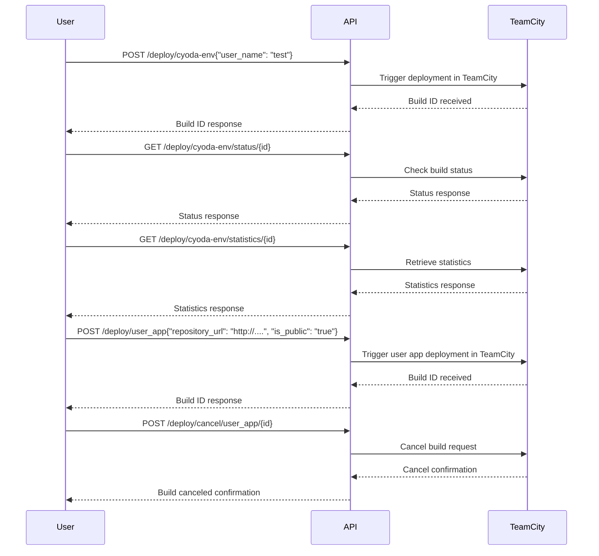

Here are the functional requirements for your application, structured as user stories and use cases, along with associated API endpoints, request/response formats, and a visual representation using Mermaid diagrams.

### User Stories

1. **User Authentication**
   - As a user, I want to authenticate using a Bearer token so that I can access the application securely.
   
2. **Deploy Cyoda Environment**
   - As a user, I want to deploy the Cyoda environment by providing my username so that I can create an environment specific to me.
   
3. **Deploy User Application**
   - As a user, I want to deploy a user application by providing a repository URL and visibility settings, so that I can manage my application deployments.

4. **Check Deployment Status**
   - As a user, I want to check the status of my deployed Cyoda environment or user application using the build ID so that I can monitor deployments.

5. **Retrieve Deployment Statistics**
   - As a user, I want to retrieve statistics about my deployments using the build ID to analyze performance.

6. **Cancel Deployment**
   - As a user, I want to cancel a deployment using the build ID so that I can stop any queued builds that are no longer needed.

### Use Cases and API Endpoints

#### 1. User Authentication
- **Endpoint**: `POST /deploy/cyoda-env`
- **Request**:
    ```json
    {
        "user_name": "test"
    }
    ```
- **Response**:
    ```json
    {
        "id": "build_id",
        "status": "queued",
        "message": "Deployment initiated."
    }
    ```

#### 2. Deploy Cyoda Environment
- **Action**: Triggers a build in TeamCity.
- **Endpoint**: `POST /deploy/cyoda-env`
- **Request**:
    ```json
    {
        "user_name": "test"
    }
    ```
- **Response**:
    ```json
    {
        "build_id": "build_id"
    }
    ```

#### 3. Deploy User Application
- **Endpoint**: `POST /deploy/user_app`
- **Request**:
    ```json
    {
        "repository_url": "http://....",
        "is_public": "true"
    }
    ```
- **Response**:
    ```json
    {
        "build_id": "build_id"
    }
    ```

#### 4. Check Deployment Status
- **Endpoint**: `GET /deploy/cyoda-env/status/{id}`
- **Response**:
    ```json
    {
        "status": "running",  // or "success", "failed", etc.
        "details": "Deployment in progress."
    }
    ```

#### 5. Retrieve Deployment Statistics
- **Endpoint**: `GET /deploy/cyoda-env/statistics/{id}`
- **Response**:
    ```json
    {
        "success": 10,
        "failed": 2,
        "duration": "5m",
        "resource_usage": {
            "cpu": "50%",
            "memory": "2GB"
        }
    }
    ```

#### 6. Cancel Deployment
- **Endpoint**: `POST /deploy/cancel/user_app/{id}`
- **Request**:
    ```json
    {
        "comment": "Canceling a queued build",
        "readdIntoQueue": false
    }
    ```
- **Response**:
    ```json
    {
        "message": "Build canceled successfully."
    }
    ```

### Mermaid Diagram


```mermaid
sequenceDiagram
    participant U as User
    participant A as API
    participant T as TeamCity
    
    U->>A: POST /deploy/cyoda-env{"user_name": "test"}
    A->>T: Trigger deployment in TeamCity
    T-->>A: Build ID received
    A-->>U: Build ID response
    
    U->>A: GET /deploy/cyoda-env/status/{id}
    A->>T: Check build status
    T-->>A: Status response
    A-->>U: Status response
    
    U->>A: GET /deploy/cyoda-env/statistics/{id}
    A->>T: Retrieve statistics
    T-->>A: Statistics response
    A-->>U: Statistics response
    
    U->>A: POST /deploy/user_app{"repository_url": "http://....", "is_public": "true"}
    A->>T: Trigger user app deployment in TeamCity
    T-->>A: Build ID received
    A-->>U: Build ID response
    
    U->>A: POST /deploy/cancel/user_app/{id}
    A->>T: Cancel build request
    T-->>A: Cancel confirmation
    A-->>U: Build canceled confirmation
```

### Summary

The above functional requirements capture the essential interactions that users can have with the application, detailing the necessary API endpoints, request and response formats, along with a visual sequence of user actions. If there are additional functionalities or clarifications needed, feel free to ask!