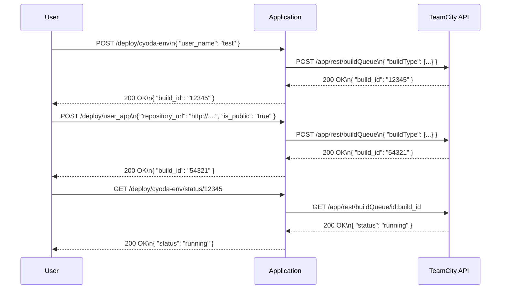

Here are the functional requirements for your application, represented as user stories and use cases. Each user story is accompanied by the necessary API endpoints, including request and response formats.

### User Stories and Use Cases

#### User Story 1: User Authentication
**As a user, I want to authenticate myself so that I can access deployment and environment configuration features.**

- **Use Case 1.1: Authenticate User**
  - **API Endpoint:** `POST /deploy/cyoda-env`
  - **Request Format:**
    ```json
    {
      "user_name": "test"
    }
    ```
  - **Response Format:**
    ```json
    {
      "token": "Bearer your_access_token"
    }
    ```

---

#### User Story 2: Manage Cyoda Environment Deployment
**As a user, I want to deploy a Cyoda environment specific to my user account.**

- **Use Case 2.1: Create Deployment for Cyoda Environment**
  - **API Endpoint:** `POST /deploy/cyoda-env`
  - **Request Format:**
    ```json
    {
      "user_name": "test"
    }
    ```
  - **Action:**
    ```http
    POST https://teamcity.cyoda.org/app/rest/buildQueue
    ```
  - **Payload:**
    ```json
    {
      "buildType": {
        "id": "KubernetesPipeline_CyodaSaas"
      },
      "properties": {
        "property": [
          { "name": "user_defined_keyspace", "value": "test" },
          { "name": "user_defined_namespace", "value": "test" }
        ]
      }
    }
    ```
  - **Response Format:**
    ```json
    {
      "build_id": "12345"
    }
    ```

---

#### User Story 3: Manage User Application Deployment
**As a user, I want to deploy my application using a Git repository.**

- **Use Case 3.1: Create User Application Deployment**
  - **API Endpoint:** `POST /deploy/user_app`
  - **Request Format:**
    ```json
    {
      "repository_url": "http://....",
      "is_public": "true"
    }
    ```
  - **Action:**
    ```http
    POST https://teamcity.cyoda.org/app/rest/buildQueue
    ```
  - **Payload:**
    ```json
    {
      "buildType": {
        "id": "KubernetesPipeline_CyodaSaasUserEnv"
      },
      "properties": {
        "property": [
          { "name": "user_defined_keyspace", "value": "test" },
          { "name": "user_defined_namespace", "value": "test" }
        ]
      }
    }
    ```
  - **Response Format:**
    ```json
    {
      "build_id": "54321"
    }
    ```

---

#### User Story 4: Check Deployment Status
**As a user, I want to check the status of my deployments.**

- **Use Case 4.1: Get Deployment Status**
  - **API Endpoint:** `GET /deploy/cyoda-env/status/{id}`
  - **Request Format:** (Path variable)
  - **Action:**
    ```http
    GET https://teamcity.cyoda.org/app/rest/buildQueue/id:build_id
    ```
  - **Response Format:**
    ```json
    {
      "status": "running",
      "details": "..."
    }
    ```

#### User Story 5: Retrieve Deployment Statistics
**As a user, I want to retrieve statistical information about my deployments.**

- **Use Case 5.1: Get Deployment Statistics**
  - **API Endpoint:** `GET /deploy/cyoda-env/statistics/{id}`
  - **Request Format:** (Path variable)
  - **Action:**
    ```http
    GET https://teamcity.cyoda.org/app/rest/builds/id:build_id/statistics/
    ```
  - **Response Format:**
    ```json
    {
      "statistics": {...}
    }
    ```

---

#### User Story 6: Cancel Deployment
**As a user, I want to cancel a deployment if needed.**

- **Use Case 6.1: Cancel User Application Deployment**
  - **API Endpoint:** `POST /deploy/cancel/user_app/{id}`
  - **Request Format:** (Path variable)
  - **Action:**
    ```http
    POST https://teamcity.cyoda.org/app/rest/builds/id:build_id
    ```
  - **Payload:**
    ```json
    {
      "comment": "Canceling a queued build",
      "readdIntoQueue": false
    }
    ```
  - **Response Format:**
    ```json
    {
      "status": "canceled"
    }
    ```

---

### Mermaid Diagram
Here's a visual representation of the user-app interaction:


```mermaid
sequenceDiagram
    participant U as User
    participant A as Application
    participant T as TeamCity API

    U->>A: POST /deploy/cyoda-env\n{ "user_name": "test" }
    A->>T: POST /app/rest/buildQueue\n{ "buildType": {...} }
    T-->>A: 200 OK\n{ "build_id": "12345" }
    A-->>U: 200 OK\n{ "build_id": "12345" }

    U->>A: POST /deploy/user_app\n{ "repository_url": "http://....", "is_public": "true" }
    A->>T: POST /app/rest/buildQueue\n{ "buildType": {...} }
    T-->>A: 200 OK\n{ "build_id": "54321" }
    A-->>U: 200 OK\n{ "build_id": "54321" }

    U->>A: GET /deploy/cyoda-env/status/12345
    A->>T: GET /app/rest/buildQueue/id:build_id
    T-->>A: 200 OK\n{ "status": "running" }
    A-->>U: 200 OK\n{ "status": "running" }
```

This format provides a clear outline of your functional requirements and user interactions. If you have any additional questions or need further adjustments, feel free to ask.