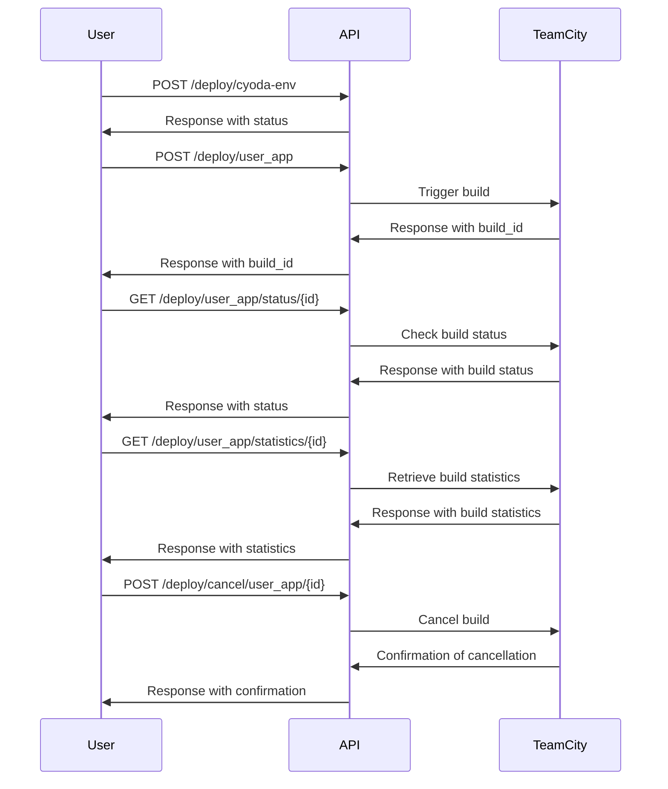

Here are the functional requirements for your application, structured as user stories and corresponding use cases. Each user story details the related API endpoints, along with the request and response formats. Following that is the visual representation using Mermaid diagrams.

### User Stories and Use Cases

1. **User Story: User Authentication**
   - **As a** user,
   - **I want** to authenticate myself using a Bearer token,
   - **So that** I can gain access to the deployment APIs.

   **Use Case: Authenticate User**
   - **Endpoint**: `POST /deploy/cyoda-env`
   - **Request Format**:
     ```json
     {
       "user_name": "test"
     }
     ```
   - **Response Format**:
     - Returns a status code (e.g., 200 for success, 401 for unauthorized).
     - Optionally includes user information or token verification results.

2. **User Story: Create Deployment for User Environment**
   - **As a** user,
   - **I want** to trigger the deployment of my application using a specified repository URL,
   - **So that** my app can be built in an isolated user environment.

   **Use Case: Deploy User Application**
   - **Endpoint**: `POST /deploy/user_app`
   - **Request Format**:
     ```json
     {
       "repository_url": "http://.../",
       "is_public": "true"
     }
     ```
   - **Response Format**:
     ```json
     {
       "build_id": "12345"
     }
     ```

3. **User Story: Check Deployment Status**
   - **As a** user,
   - **I want** to check the deployment status of my application,
   - **So that** I can know if it succeeded or failed.

   **Use Cases**:
   - **Check Deployment Status for User App**:
     - **Endpoint**: `GET /deploy/user_app/status/$id`
     - **Response Format**:
       ```json
       {
         "status": "in-progress|completed|failed",
         "repository_url": "http://.../",
         "is_public": "true"
       }
       ```

   - **Check Deployment Status for Cyoda Env**:
     - **Endpoint**: `GET /deploy/cyoda-env/status/$id`
     - **Response Format**:
       ```json
       {
         "status": "in-progress|completed|failed",
         "repository_url": "http://.../",
         "is_public": "true"
       }
       ```

4. **User Story: Retrieve Deployment Statistics**
   - **As a** user,
   - **I want** to get statistics related to my deployment,
   - **So that** I can analyze its performance.

   **Use Cases**:
   - **Get User App Statistics**:
     - **Endpoint**: `GET /deploy/user_app/statistics/$id`
     - **Response Format**:
       ```json
       {
         "statistics": { /* detailed statistics */ },
         "repository_url": "http://.../",
         "is_public": "true"
       }
       ```

   - **Get Cyoda Env Statistics**:
     - **Endpoint**: `GET /deploy/cyoda-env/statistics/$id`
     - **Response Format**:
       ```json
       {
         "statistics": { /* detailed statistics */ },
         "repository_url": "http://.../",
         "is_public": "true"
       }
       ```

5. **User Story: Cancel a Deployment**
   - **As a** user,
   - **I want** to cancel any queued deployment,
   - **So that** I can halt unnecessary resource usage.

   **Use Case: Cancel User Application Deployment**
   - **Endpoint**: `POST /deploy/cancel/user_app/$id`
   - **Request Format**:
     ```json
     {
       "comment": "Canceling a queued build",
       "readdIntoQueue": false
     }
     ```
   - **Response Format**:
     - Returns confirmation of cancellation (e.g., status code 200 for success).

### Visual Representation of User-App Interaction

Here’s a visual representation of how users may interact with the application using Mermaid syntax:


```mermaid
sequenceDiagram
    participant User
    participant API
    participant TeamCity

    User->>API: POST /deploy/cyoda-env
    API->>User: Response with status 

    User->>API: POST /deploy/user_app
    API->>TeamCity: Trigger build
    TeamCity->>API: Response with build_id
    API->>User: Response with build_id

    User->>API: GET /deploy/user_app/status/{id}
    API->>TeamCity: Check build status
    TeamCity->>API: Response with build status
    API->>User: Response with status

    User->>API: GET /deploy/user_app/statistics/{id}
    API->>TeamCity: Retrieve build statistics
    TeamCity->>API: Response with build statistics
    API->>User: Response with statistics

    User->>API: POST /deploy/cancel/user_app/{id}
    API->>TeamCity: Cancel build
    TeamCity->>API: Confirmation of cancellation
    API->>User: Response with confirmation
```

These well-structured functional requirements will serve as a solid basis for developing the application, ensuring that all necessary interactions are covered. Please let me know if you need further adjustments or clarifications.