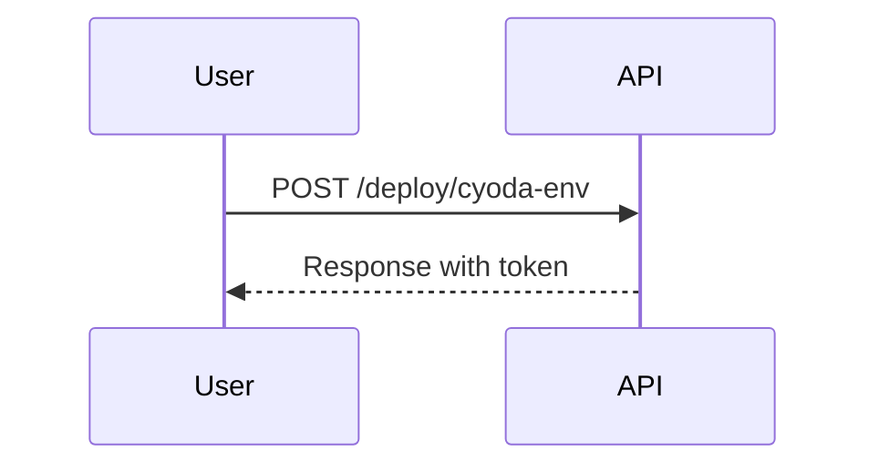
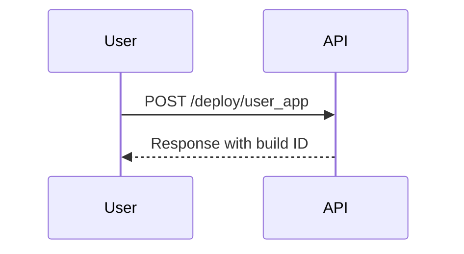
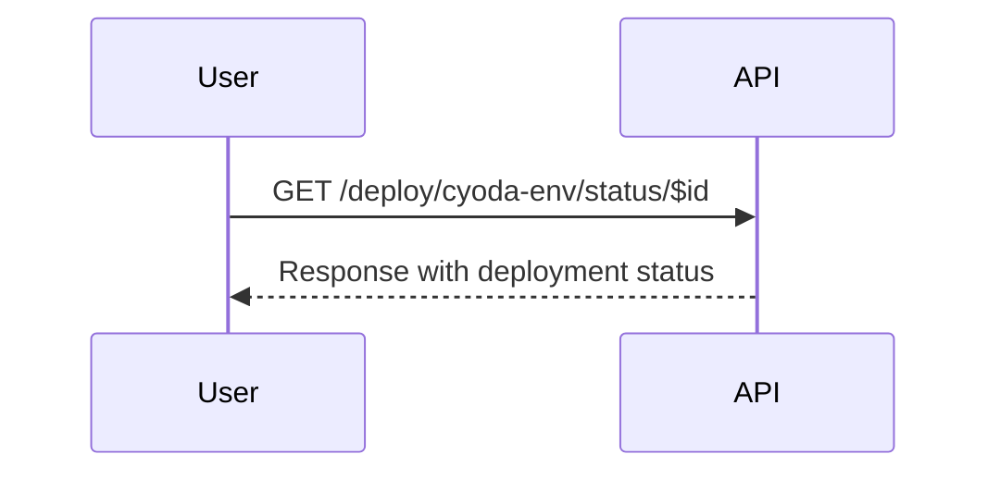
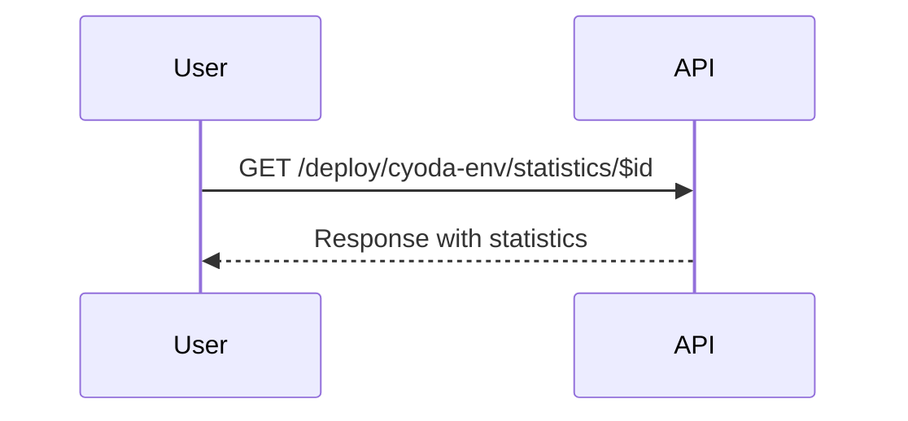
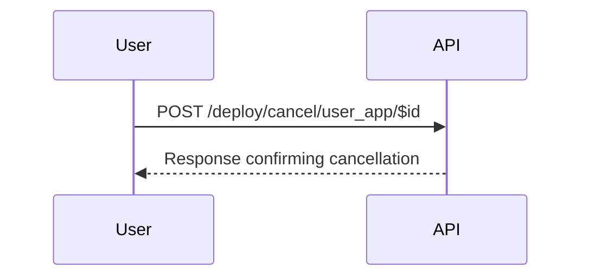

Here are the defined functional requirements for your application in the form of user stories and use cases. Each user story includes necessary API endpoints, request/response formats, and visual representations using Mermaid diagrams. 

### User Stories

#### User Story 1: User Authentication
**As a** user,  
**I want** to authenticate by providing a Bearer token,  
**So that** I can access the APIs for deployments and configurations.

**API Endpoint**: 
- **POST** `/deploy/cyoda-env`  
  - **Request**: 
    ```json
    {
      "user_name": "test"
    }
    ```
  - **Response**: 
    ```json
    {
      "message": "Authenticated successfully",
      "token": "Bearer token"
    }
    ```

**Mermaid Diagram**:

```mermaid
sequenceDiagram
    participant User
    participant API
    User->>API: POST /deploy/cyoda-env
    API-->>User: Response with token
```

---

#### User Story 2: Deploy Application Configuration
**As a** user,  
**I want** to deploy a environment configuration for my application,  
**So that** I can manage my application's deployment settings.

**API Endpoint**: 
- **POST** `/deploy/user_app`  
  - **Request**: 
    ```json
    {
      "repository_url": "http://....",
      "is_public": true
    }
    ```
  - **Response**: 
    ```json
    {
      "build_id": "12345"
    }
    ```

**Mermaid Diagram**:

```mermaid
sequenceDiagram
    participant User
    participant API
    User->>API: POST /deploy/user_app
    API-->>User: Response with build ID
```

---

#### User Story 3: Check Deployment Status
**As a** user,  
**I want** to check the status of my deployment,  
**So that** I can know whether it was successful or if it failed.

**API Endpoint**: 
- **GET** `/deploy/cyoda-env/status/$id`  
  - **Response**: 
    ```json
    {
      "status": "In Progress",
      "build_id": "$id"
    }
    ```

**Mermaid Diagram**:

```mermaid
sequenceDiagram
    participant User
    participant API
    User->>API: GET /deploy/cyoda-env/status/$id
    API-->>User: Response with deployment status
```

---

#### User Story 4: Get Deployment Statistics
**As a** user,  
**I want** to obtain statistics related to my deployment,  
**So that** I can analyze its performance and metrics.

**API Endpoint**: 
- **GET** `/deploy/cyoda-env/statistics/$id`  
  - **Response**: 
    ```json
    {
      "statistics": {
        "success_rate": "95%",
        "duration": "120s"
      }
    }
    ```

**Mermaid Diagram**:

```mermaid
sequenceDiagram
    participant User
    participant API
    User->>API: GET /deploy/cyoda-env/statistics/$id
    API-->>User: Response with statistics
```

---

#### User Story 5: Cancel a Deployment
**As a** user,  
**I want** to cancel my queued deployment,  
**So that** I can stop unnecessary resource allocation.

**API Endpoint**: 
- **POST** `/deploy/cancel/user_app/$id`  
  - **Request**: 
    ```json
    {
      "comment": "Canceling a queued build",
      "readdIntoQueue": false
    }
    ```
  - **Response**: 
    ```json
    {
      "message": "Build canceled successfully"
    }
    ```

**Mermaid Diagram**:

```mermaid
sequenceDiagram
    participant User
    participant API
    User->>API: POST /deploy/cancel/user_app/$id
    API-->>User: Response confirming cancellation
```

---

### Final Summary
This specification outlines the functional requirements for your application, framed as user stories, along with the necessary API endpoints, request/response formats, and sequence diagrams for visualization of user interactions. Each user story aims to facilitate deployment and environment configuration management effectively. 

If any details need to be modified or further clarified, feel free to ask.