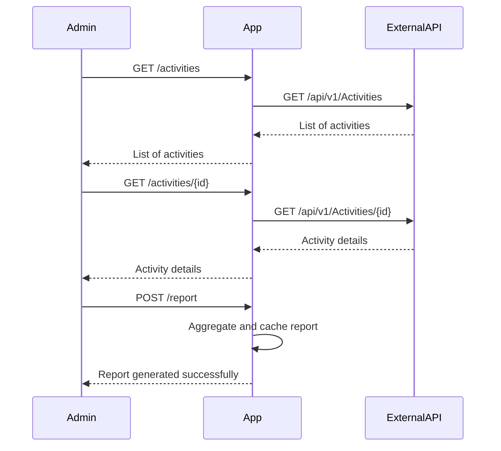
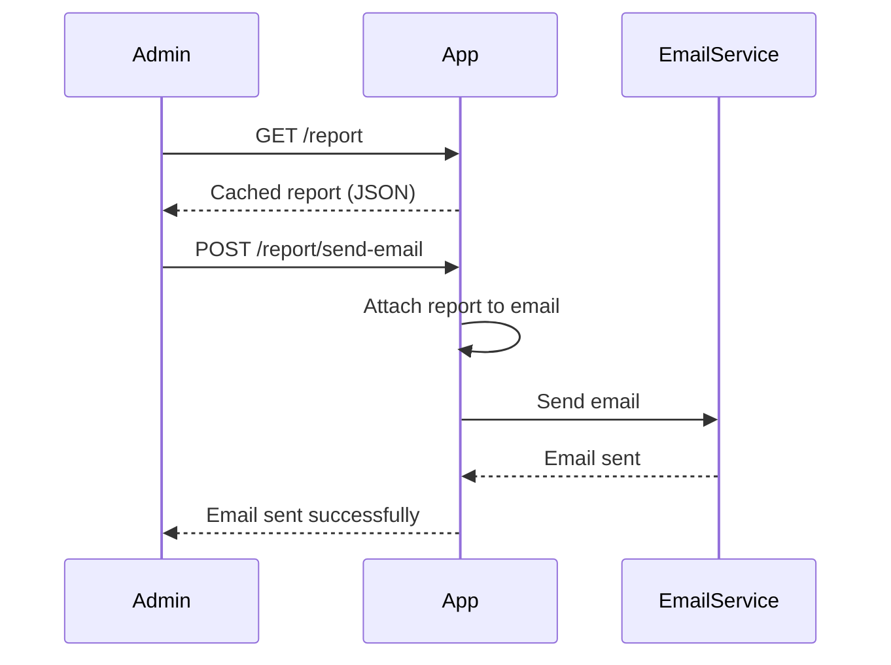

Here are the **final functional requirements** for your project, formatted clearly and structured for easy reference. These requirements are based on the user stories, use cases, and API endpoints discussed earlier.

---

## **Functional Requirements**

### **1. Data Ingestion**
- **Description**: The application must fetch a list of activities from a specified external API and retrieve detailed information for each activity.
- **Requirements**:
  1. Fetch a list of activities from the external API (`GET /api/v1/Activities`).
  2. For each activity, fetch detailed information using its ID (`GET /api/v1/Activities/{id}`).
  3. Store the combined data in a temporary cache for further processing.

---

### **2. Data Aggregation**
- **Description**: The application must aggregate the fetched activity data into a single report.
- **Requirements**:
  1. Combine all activity details into a single JSON structure.
  2. Save the aggregated report to a cache for future retrieval.

---

### **3. Report Generation**
- **Description**: The application must generate a report from the aggregated data and make it available for retrieval.
- **Requirements**:
  1. Provide an endpoint (`POST /report`) to trigger the report generation process.
  2. Cache the generated report in JSON format.
  3. Return a success message upon completion.

---

### **4. Report Retrieval**
- **Description**: The application must allow the admin to retrieve the cached report.
- **Requirements**:
  1. Provide an endpoint (`GET /report`) to fetch the cached report.
  2. Return the report in JSON format.

---

### **5. Email Notification**
- **Description**: The application must send the cached report to the admin’s email.
- **Requirements**:
  1. Provide an endpoint (`POST /report/send-email`) to trigger the email sending process.
  2. Attach the cached report to the email.
  3. Send the email to a predefined admin email address.
  4. Return a success message upon completion.

---

### **6. Scheduling**
- **Description**: The application must automatically run the data ingestion and report generation process once a day.
- **Requirements**:
  1. Use a scheduler to trigger the data ingestion and report generation process daily.
  2. Cache the generated report for future use.

---

## **API Endpoints**

### **1. Fetch Activities**
- **Endpoint**: `GET /activities`
- **Description**: Fetches a list of activities from the external API.
- **Request**: No request body.
- **Response**:
  ```json
  [
    {
      "id": 1,
      "title": "Activity 1",
      "dueDate": "2025-02-10T22:55:28.3667842+00:00",
      "completed": false
    },
    {
      "id": 2,
      "title": "Activity 2",
      "dueDate": "2025-02-10T23:55:28.3667859+00:00",
      "completed": true
    }
  ]
  ```

---

### **2. Fetch Activity Details**
- **Endpoint**: `GET /activities/{id}`
- **Description**: Fetches detailed information for a specific activity by its ID.
- **Request**: No request body.
- **Response**:
  ```json
  {
    "id": 1,
    "title": "Activity 1",
    "dueDate": "2025-02-10T22:56:42.2882278+00:00",
    "completed": false
  }
  ```

---

### **3. Generate Report**
- **Endpoint**: `POST /report`
- **Description**: Aggregates activity data and generates a report.
- **Request**: No request body.
- **Response**:
  ```json
  {
    "status": "success",
    "message": "Report generated and cached successfully."
  }
  ```

---

### **4. Retrieve Report**
- **Endpoint**: `GET /report`
- **Description**: Retrieves the cached report.
- **Request**: No request body.
- **Response**:
  ```json
  [
    {
      "id": 1,
      "title": "Activity 1",
      "dueDate": "2025-02-10T22:56:42.2882278+00:00",
      "completed": false
    },
    {
      "id": 2,
      "title": "Activity 2",
      "dueDate": "2025-02-10T23:55:28.3667859+00:00",
      "completed": true
    }
  ]
  ```

---

### **5. Send Report via Email**
- **Endpoint**: `POST /report/send-email`
- **Description**: Sends the cached report to the admin’s email.
- **Request**: No request body.
- **Response**:
  ```json
  {
    "status": "success",
    "message": "Report sent to admin@example.com."
  }
  ```

---

## **Non-Functional Requirements (To Be Addressed Later)**
- **Performance**: The application should handle large datasets efficiently.
- **Security**: Ensure secure communication with the external API and email service.
- **Scalability**: Design the application to scale with increasing data volumes.
- **Error Handling**: Implement robust error handling and logging mechanisms.

---

## **Visual Representation**

### **User-App Interaction for Fetching and Generating a Report**

```mermaid
sequenceDiagram
    participant Admin
    participant App
    participant ExternalAPI

    Admin->>App: GET /activities
    App->>ExternalAPI: GET /api/v1/Activities
    ExternalAPI-->>App: List of activities
    App-->>Admin: List of activities

    Admin->>App: GET /activities/{id}
    App->>ExternalAPI: GET /api/v1/Activities/{id}
    ExternalAPI-->>App: Activity details
    App-->>Admin: Activity details

    Admin->>App: POST /report
    App->>App: Aggregate and cache report
    App-->>Admin: Report generated successfully
```

### **User-App Interaction for Retrieving and Emailing a Report**

```mermaid
sequenceDiagram
    participant Admin
    participant App

    Admin->>App: GET /report
    App-->>Admin: Cached report (JSON)

    Admin->>App: POST /report/send-email
    App->>App: Attach report to email
    App->>EmailService: Send email
    EmailService-->>App: Email sent
    App-->>Admin: Email sent successfully
```

### **Scheduled Data Ingestion**
```mermaid
sequenceDiagram
    participant Scheduler
    participant App
    participant ExternalAPI

    Scheduler->>App: Trigger data ingestion
    App->>ExternalAPI: GET /api/v1/Activities
    ExternalAPI-->>App: List of activities
    App->>App: Fetch details for each activity
    App->>App: Aggregate and cache report
