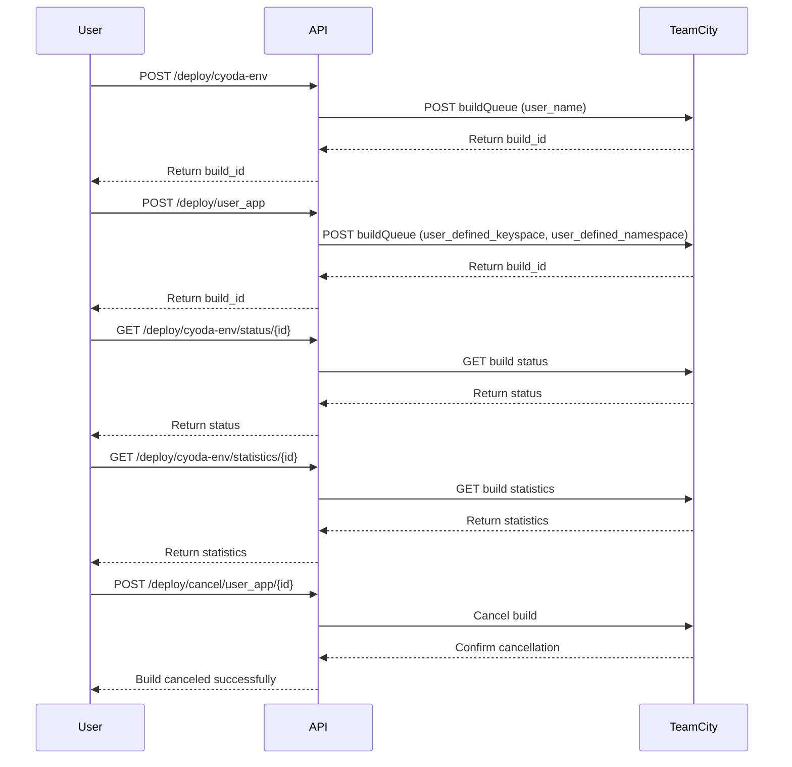

Here’s a structured approach to defining the functional requirements for your application. We'll separate the functional requirements into user stories and use cases, including the associated API endpoints, request/response formats, and a visual representation using Mermaid diagrams.

### User Stories

1. **User Authentication**
   - **As a** user, **I want** to authenticate using a Bearer token, **so that** I can securely access deployment management features.

   **API Endpoint:**
   - No specific endpoint for authentication is defined, but it will use the Bearer token in the headers for subsequent requests.

2. **Manage Environment Deployment**
   - **As a** user, **I want** to create deployment configurations for a specific environment, **so that** I can manage my application deployments.

   **API Endpoint:**
   - **POST** `/deploy/cyoda-env`
   
   **Request Format:**
   ```json
   {
       "user_name": "test"
   }
   ```
   
   **Response Format:**
   ```json
   {
       "build_id": "12345"
   }
   ```

3. **Deploy User Application**
   - **As a** user, **I want** to deploy my application, **so that** my application is available in the desired environment.

   **API Endpoint:**
   - **POST** `/deploy/user_app`

   **Request Format:**
   ```json
   {
       "repository_url": "http://....",
       "is_public": "true"
   }
   ```

   **Response Format:**
   ```json
   {
       "build_id": "67890"
   }
   ```

4. **Retrieve Build Status for Environment Deployment**
   - **As a** user, **I want** to check the status of my environment deployment, **so that** I know whether it succeeded or failed.

   **API Endpoint:**
   - **GET** `/deploy/cyoda-env/status/{id}`

   **Response Format:**
   ```json
   {
       "status": "successful | failed",
       "details": { ... }
   }
   ```

5. **Retrieve Statistics for Environment Deployment**
   - **As a** user, **I want** to get statistics related to my environment deployment, **so that** I can analyze its performance.

   **API Endpoint:**
   - **GET** `/deploy/cyoda-env/statistics/{id}`

   **Response Format:**
   ```json
   {
       "build_statistics": { ... }
   }
   ```

6. **Retrieve Build Status for User Application**
   - **As a** user, **I want** to check the status of my user application, **so that** I know whether it is currently deployed or in error.

   **API Endpoint:**
   - **GET** `/deploy/user_app/status/{id}`

   **Response Format:**
   ```json
   {
       "status": "successful | failed",
       "details": { ... }
   }
   ```

7. **Retrieve Statistics for User Application**
   - **As a** user, **I want** to get statistics related to my user application, **so that** I can analyze its performance.

   **API Endpoint:**
   - **GET** `/deploy/user_app/statistics/{id}`

   **Response Format:**
   ```json
   {
       "build_statistics": { ... }
   }
   ```

8. **Cancel User Application Deployment**
   - **As a** user, **I want** to cancel a queued build for my user application, **so that** I can stop unnecessary deployments.

   **API Endpoint:**
   - **POST** `/deploy/cancel/user_app/{id}`

   **Request Format:**
   ```json
   {
       "comment": "Canceling a queued build",
       "readdIntoQueue": false
   }
   ```

   **Response Format:**
   ```json
   {
       "message": "Build canceled successfully."
   }
   ```

### Mermaid Diagrams

Below is a simple representation of user-app interaction using Mermaid syntax:


```mermaid
sequenceDiagram
    participant User
    participant API
    participant TeamCity

    User->>API: POST /deploy/cyoda-env
    API->>TeamCity: POST buildQueue (user_name)
    TeamCity-->>API: Return build_id
    API-->>User: Return build_id

    User->>API: POST /deploy/user_app
    API->>TeamCity: POST buildQueue (user_defined_keyspace, user_defined_namespace)
    TeamCity-->>API: Return build_id
    API-->>User: Return build_id

    User->>API: GET /deploy/cyoda-env/status/{id}
    API->>TeamCity: GET build status
    TeamCity-->>API: Return status
    API-->>User: Return status

    User->>API: GET /deploy/cyoda-env/statistics/{id}
    API->>TeamCity: GET build statistics
    TeamCity-->>API: Return statistics
    API-->>User: Return statistics

    User->>API: POST /deploy/cancel/user_app/{id}
    API->>TeamCity: Cancel build
    TeamCity-->>API: Confirm cancellation
    API-->>User: Build canceled successfully
```

### Final Functional Requirements Summary

- **User Authentication**: Not a specific endpoint, but requires Bearer token for all requests.
- **Environment Deployment Management**: Endpoint for creating deployments based on user configuration.
- **User Application Deployment**: Endpoint for deploying user applications with necessary parameters.
- **Build Status Retrieval**: Endpoints for checking status and retrieving statistics for both environment deployments and user applications.
- **Cancellation of Deployments**: Endpoint to allow users to cancel queued builds.

This structure provides a clear and organized specification for your application's functional requirements and can serve as a basis for development efforts. If you have any further clarifications or need to expand on specific areas, feel free to ask.