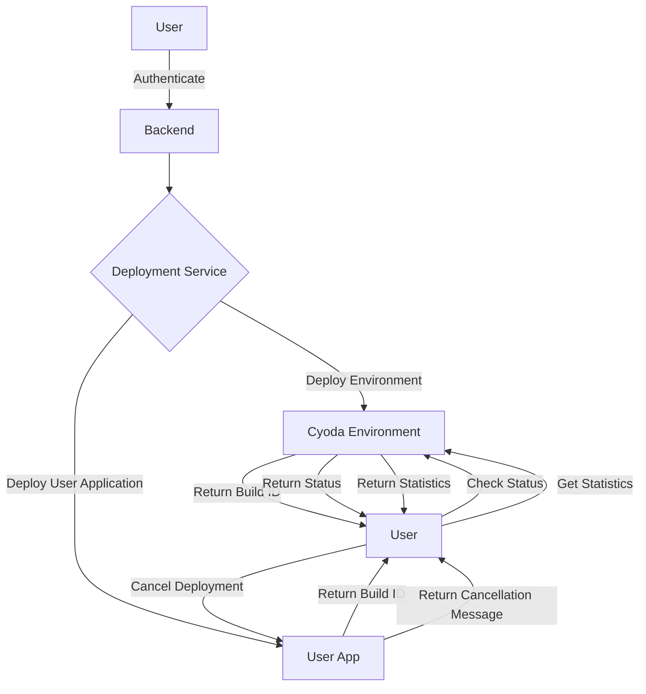

Here’s a detailed outline of your functional requirements, including user stories, use cases, API endpoints, request/response formats, and visual representations using Mermaid diagrams:

### Functional Requirements

#### User Stories

1. **User Authentication**
   - **As a** user, **I want to** authenticate using a Bearer token **so that** I can access the application securely.

2. **Deploy Environment Configuration**
   - **As a** user, **I want to** deploy a configuration environment for my application **so that** I can customize my deployment settings.

3. **Deploy User Application**
   - **As a** user, **I want to** deploy my application repository **so that** I can have it running in the configured environment.

4. **Check Deployment Status**
   - **As a** user, **I want to** check the status of my deployment **so that** I can monitor its progress.

5. **Retrieve Deployment Statistics**
   - **As a** user, **I want to** get statistics about my deployment **so that** I can analyze its performance.

6. **Cancel User Application Deployment**
   - **As a** user, **I want to** cancel a deployment if needed **so that** I can stop it from proceeding.

---

### Use Cases with API Endpoints

1. **User Authentication**
   - **Endpoint**: No specific endpoint (handled by token-based authentication).
   - **Request**: N/A
   - **Response**: N/A

2. **Deploy Environment Configuration**
   - **Endpoint**: `POST /deploy/cyoda-env`
   - **Request Format**:
     ```json
     {
         "user_name": "test"
     }
     ```
   - **Response Format**:
     ```json
     {
         "build_id": "12345"
     }
     ```

3. **Deploy User Application**
   - **Endpoint**: `POST /deploy/user_app`
   - **Request Format**:
     ```json
     {
         "repository_url": "http://example.com/myapp.git",
         "is_public": "true"
     }
     ```
   - **Response Format**:
     ```json
     {
         "build_id": "67890"
     }
     ```

4. **Check Deployment Status**
   - **Endpoint**: `GET /deploy/cyoda-env/status/{id}`
   - **Request**: N/A
   - **Response Format**:
     ```json
     {
         "status": "in_progress",
         "repository_url": "http://example.com/myapp.git",
         "is_public": true
     }
     ```

5. **Retrieve Deployment Statistics**
   - **Endpoint**: `GET /deploy/cyoda-env/statistics/{id}`
   - **Request**: N/A
   - **Response Format**:
     ```json
     {
         "statistics": {
             "success_rate": 90,
             "build_time": "5m"
         }
     }
     ```

6. **Cancel User Application Deployment**
   - **Endpoint**: `POST /deploy/cancel/user_app/{id}`
   - **Request Format**:
     ```json
     {
         "comment": "Canceling a queued build",
         "readdIntoQueue": false
     }
     ```
   - **Response Format**:
     ```json
     {
         "message": "Deployment canceled successfully."
     }
     ```

---

### Visual Representation using Mermaid Diagrams


```mermaid
graph TD;
    A[User] -->|Authenticate| B[Backend]
    B --> C{Deployment Service}
    C -->|Deploy Environment| D[Cyoda Environment]
    D -->|Return Build ID| E[User]
    
    C -->|Deploy User Application| F[User App]
    F -->|Return Build ID| E
    
    E -->|Check Status| D
    D -->|Return Status| E

    E -->|Get Statistics| D
    D -->|Return Statistics| E

    E -->|Cancel Deployment| F
    F -->|Return Cancellation Message| E
```

---

These functional requirements are designed to serve as a strong foundation for your backend application development. If you have any further modifications or additional features in mind, feel free to specify, and we can refine these requirements accordingly.