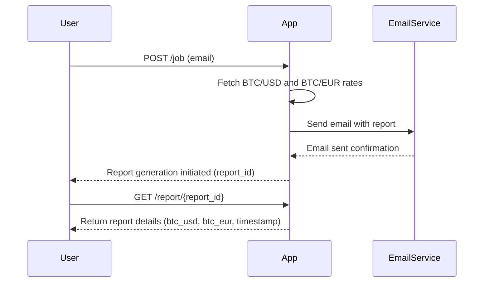

Here are the final functional requirements for your Bitcoin conversion rates application, formatted clearly for ease of understanding:

### Functional Requirements

#### User Stories

1. **Report Generation**
   - **As a user**, I want to initiate the report creation process so that I can receive the latest Bitcoin conversion rates via email.
   - **Endpoint**: `POST /job`
     - **Request Format**:
       ```json
       {
         "email": "user@example.com"
       }
       ```
     - **Response Format**:
       ```json
       {
         "report_id": "12345",
         "status": "Report generation initiated."
       }
       ```

2. **Report Retrieval**
   - **As a user**, I want to retrieve my report by its ID so that I can view the conversion rates.
   - **Endpoint**: `GET /report/{report_id}`
     - **Response Format**:
       ```json
       {
         "report_id": "12345",
         "btc_usd": "45000.00",
         "btc_eur": "38000.00",
         "timestamp": "2023-10-01T12:00:00Z",
         "status": "Report generated and emailed."
       }
       ```

### API Endpoints Summary

| Method | Endpoint         | Description                              | Request Format                         | Response Format                        |
|--------|------------------|-----------------------------------------|---------------------------------------|---------------------------------------|
| POST   | `/job`           | Initiates report creation and sends email. | `{ "email": "user@example.com" }`    | `{ "report_id": "12345", "status": "Report generation initiated." }` |
| GET    | `/report/{report_id}` | Retrieves the stored report by ID.     | N/A                                   | `{ "report_id": "12345", "btc_usd": "45000.00", "btc_eur": "38000.00", "timestamp": "2023-10-01T12:00:00Z", "status": "Report generated and emailed." }` |

### User-App Interaction Diagram


```mermaid
sequenceDiagram
    participant User
    participant App
    participant EmailService

    User->>App: POST /job (email)
    App->>App: Fetch BTC/USD and BTC/EUR rates
    App->>EmailService: Send email with report
    EmailService-->>App: Email sent confirmation
    App-->>User: Report generation initiated (report_id)

    User->>App: GET /report/{report_id}
    App-->>User: Return report details (btc_usd, btc_eur, timestamp)
```

These requirements provide a comprehensive overview of the application's functionalities, ensuring clarity for the development process. If there are any additional requirements or modifications you would like to discuss, feel free to ask!