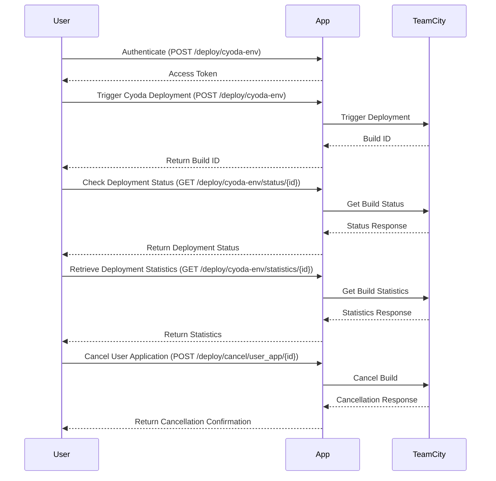

Here are the final functional requirements structured as user stories and use cases, along with the necessary API endpoints and their request/response formats. Following that, I'll provide visual representations using Mermaid diagrams.

### Functional Requirements

#### User Story 1: User Authentication
**As a** user,  
**I want to** authenticate using a Bearer token,  
**So that** I can securely access the deployment and environment management functions.

**Use Case**: Authenticate User  
- **Endpoint**: `POST /deploy/cyoda-env`  
- **Request Format**:  
  ```json
  {
      "user_name": "test"
  }
  ```
- **Response Format**:  
   ```json
   {
      "access_token": "your_access_token",
      "token_type": "Bearer"
   }
   ```

---

#### User Story 2: Trigger Deployment for Cyoda Environment
**As a** user,  
**I want to** trigger a deployment for my specific environment,  
**So that** my environment can be updated with the latest configurations.

**Use Case**: Trigger Cyoda Deployment  
- **Endpoint**: `POST /deploy/cyoda-env`  
- **Request Format**:  
  ```json
  {
      "user_name": "test"
  }
  ```
- **Response Format**: 
   ```json
   {
       "build_id": "123456"
   }
   ```

---

#### User Story 3: Trigger Deployment for User Application
**As a** user,  
**I want to** trigger a deployment for my user application,  
**So that** my application can be deployed with my specified repository.

**Use Case**: Trigger User Application Deployment  
- **Endpoint**: `POST /deploy/user_app`  
- **Request Format**:  
  ```json
  {
      "repository_url": "http://....",
      "is_public": "true"
  }
  ```
- **Response Format**:  
   ```json
   {
       "build_id": "654321"
   }
   ```

---

#### User Story 4: Check Deployment Status
**As a** user,  
**I want to** check the status of my deployments,  
**So that** I can monitor the progress and outcomes of my deployments.

**Use Case**: Get Cyoda Environment Status  
- **Endpoint**: `GET /deploy/cyoda-env/status/{id}`  
- **Response Format**:  
   ```json
   {
       "status": "queued/running/success/failure",
       "repository_url": "http://....",
       "is_public": "true"
   }
   ```

---

#### User Story 5: Retrieve Deployment Statistics
**As a** user,  
**I want to** retrieve statistics for my deployments,  
**So that** I can analyze the performance and success rates of my deployments.

**Use Case**: Get Cyoda Environment Statistics  
- **Endpoint**: `GET /deploy/cyoda-env/statistics/{id}`  
- **Response Format**:  
   ```json
   {
       "statistics": {
           "duration": "5m",
           "success_rate": "80%",
           ...
       },
       "repository_url": "http://....",
       "is_public": "true"
   }
   ```

---

#### User Story 6: Cancel a User Application Deployment
**As a** user,  
**I want to** cancel my queued user application deployments,  
**So that** I can stop the deployment process if it’s no longer needed.

**Use Case**: Cancel User Application Deployment  
- **Endpoint**: `POST /deploy/cancel/user_app/{id}`  
- **Request Format**:  
   ```json
   {
       "comment": "Canceling a queued build",
       "readdIntoQueue": false
   }
   ```
- **Response Format**:  
   ```json
   {
       "message": "Build canceled successfully."
   }
   ```

### Mermaid Diagrams for User-Application Interaction


```mermaid
sequenceDiagram
    participant User
    participant App
    participant TeamCity

    User->>App: Authenticate (POST /deploy/cyoda-env)
    App-->>User: Access Token

    User->>App: Trigger Cyoda Deployment (POST /deploy/cyoda-env)
    App->>TeamCity: Trigger Deployment
    TeamCity-->>App: Build ID
    App-->>User: Return Build ID

    User->>App: Check Deployment Status (GET /deploy/cyoda-env/status/{id})
    App->>TeamCity: Get Build Status
    TeamCity-->>App: Status Response
    App-->>User: Return Deployment Status

    User->>App: Retrieve Deployment Statistics (GET /deploy/cyoda-env/statistics/{id})
    App->>TeamCity: Get Build Statistics
    TeamCity-->>App: Statistics Response
    App-->>User: Return Statistics

    User->>App: Cancel User Application (POST /deploy/cancel/user_app/{id})
    App->>TeamCity: Cancel Build
    TeamCity-->>App: Cancellation Response
    App-->>User: Return Cancellation Confirmation
```

This structured format provides a clear understanding of the functional requirements for your application, along with user stories, use cases, and the visual representation of the user application interaction. Let me know if you need any further adjustments or additional details.