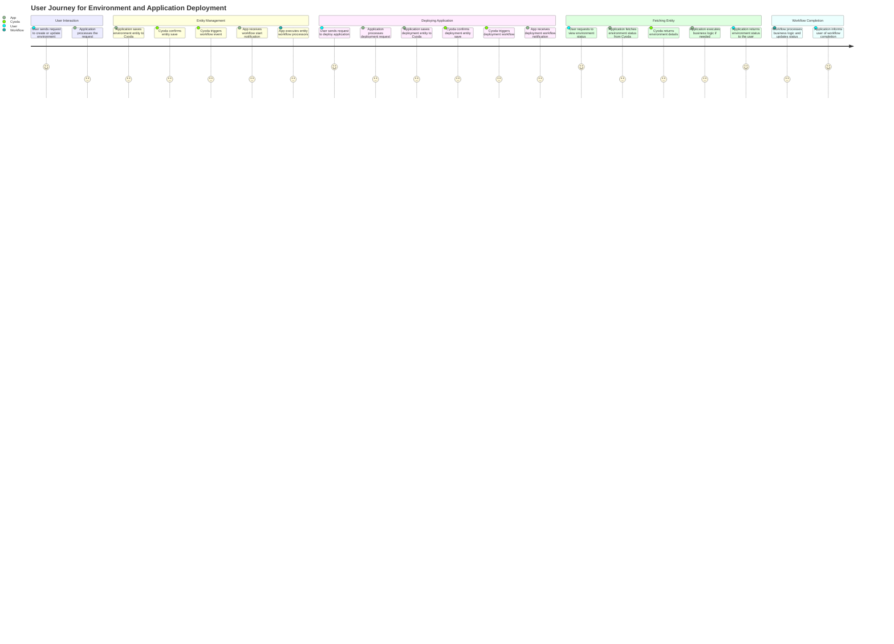
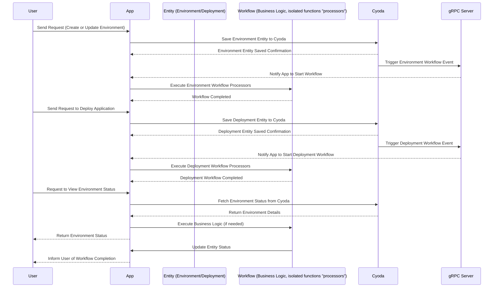

Here’s the validated user requirement document, including user stories, a customized journey diagram, and a sequence diagram tailored to your deployment and environment management application:

### User Requirement Document

#### User Stories

1. **User Story 1**: As a user, I want to create or update my environment configuration so that I can manage my application settings easily.
2. **User Story 2**: As a user, I want to deploy my application using a specified repository URL, so that I can ensure my application is running the correct version.
3. **User Story 3**: As a user, I want to view the status of my deployed environment, so I can monitor its performance and health.
4. **User Story 4**: As a user, I want to cancel a queued deployment if I change my mind, so I can manage my resources efficiently.
5. **User Story 5**: As a user, I want to receive notifications about the completion of my workflows, so I can take further actions based on the results.

### Journey Diagram

### Sequence Diagram

### Explanation of Choices

1. **User Stories**: The user stories capture the specific needs and actions of the user within the application, facilitating a clear understanding of user expectations.

2. **Journey Diagram**: The journey diagram visualizes the steps a user takes when interacting with the application, focusing on key actions like creating/updating environments and deploying applications, and the corresponding responses from Cyoda.

3. **Sequence Diagram**: The sequence diagram illustrates the flow of interactions between the user, the application, Cyoda, and the workflow processors. It provides a detailed view of how requests are processed, workflows are triggered, and responses are returned, ensuring clarity in the overall process.

These diagrams and user stories collectively form a comprehensive understanding of how users will interact with the application and the underlying mechanics driven by Cyoda's architecture.