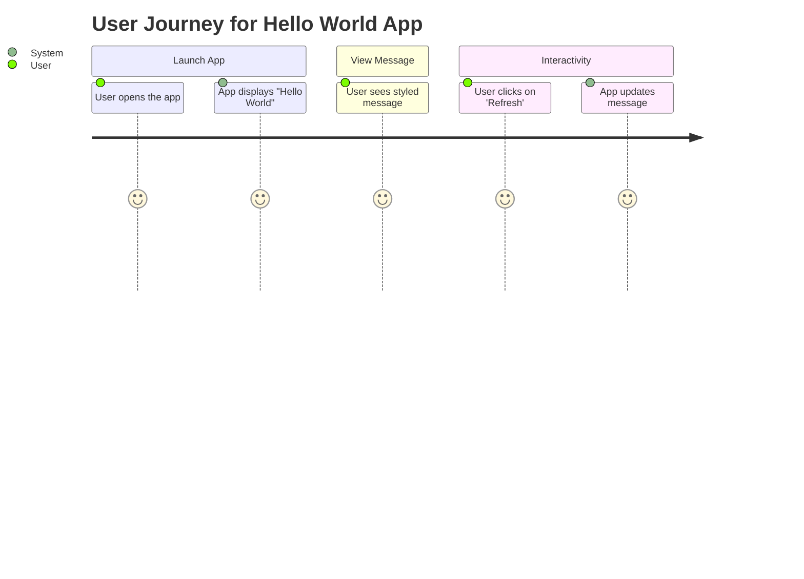
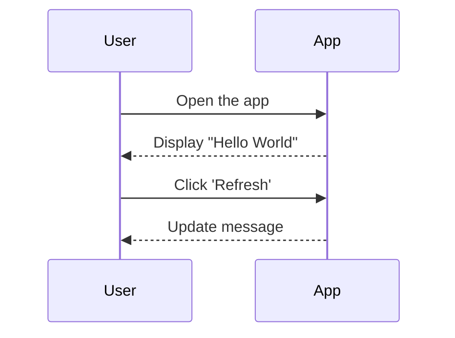

Got it! You want me to validate your requirement and create a user requirement document that includes user stories, a journey diagram, and a sequence diagram. You’re looking for everything in markdown format, and you'd like the diagrams in the mermaid dialect. 

### User Requirement Document

#### User Stories
Here are some simple user stories to capture what a user might want from your "Hello World" app:

1. **As a user, I want to see a "Hello World" message when I open the app.**
   - This is the core feature and should be very straightforward!

2. **As a user, I want to see the message styled in a friendly and welcoming way.**
   - This adds a nice touch to the user experience!

3. **As a user, I want to refresh the message or see an updated message when I click a button.**
   - This gives users a little interactivity!

#### Journey Diagram
This diagram can represent how a user would interact with your app.

#### Sequence Diagram
This diagram shows the sequence of actions that happen when the user interacts with the app.

### Explanation
I chose these user stories to capture the essential features of your app, focusing on the user experience. The journey diagram visualizes how users will interact with the app, while the sequence diagram outlines the specific interactions and responses between the user and the app. 

The goal here is to keep everything user-focused and ensure that the app is friendly and easy to use. If you have any additional features or thoughts, just let me know, and we can tweak this together! 😊