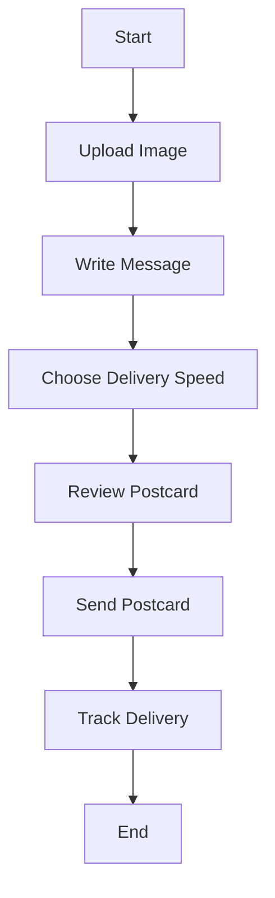
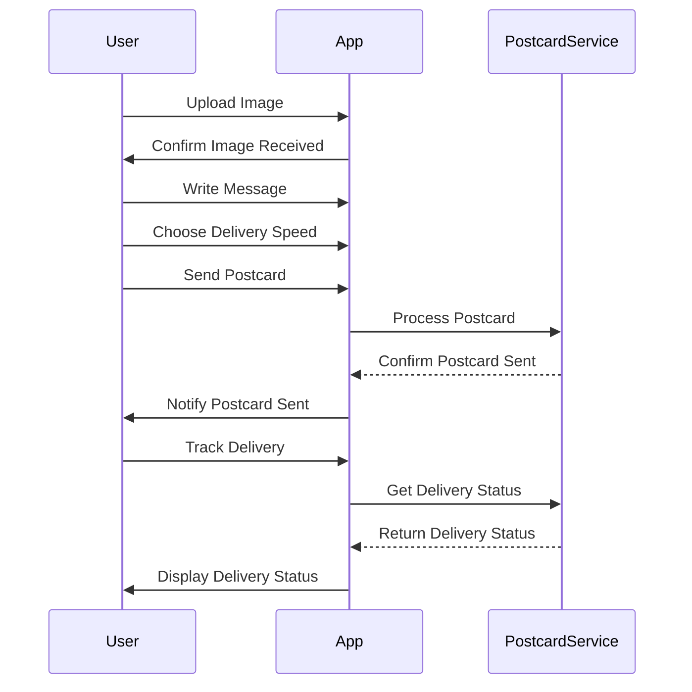

I understand that you're looking to validate and enhance your requirement for the postcard-sending app. You want to create a user requirement document that includes user stories, a journey diagram, and a sequence diagram. That’s a great approach to clarify your vision!

### User Requirement Document

#### User Stories
Here are some user stories that describe what different users might want to do with the app:

1. **As a user**, I want to upload an image for my postcard, so I can create a personalized card.
2. **As a user**, I want to write a message on my postcard, so I can send a heartfelt note to my friends.
3. **As a user**, I want to choose a delivery speed option, so I can decide how quickly my postcard arrives.
4. **As a user**, I want to track the delivery status of my postcard, so I know when it has been received.

#### Journey Diagram
This diagram illustrates how a user might interact with the app from start to finish:

#### Sequence Diagram
This diagram shows the flow of actions when a user sends a postcard:

### Explanation
- **User Stories** help us understand what the users expect from the app, providing clarity on features and functionalities.
- **Journey Diagram** visualizes the steps a user takes, making it easier to spot areas for improvement or additional features.
- **Sequence Diagram** outlines the interactions between the user and the app, as well as the backend processes, which helps in designing the architecture of the app.

I hope this helps you see your requirement more clearly! If there’s anything more you’d like to discuss or add, just let me know! 😊