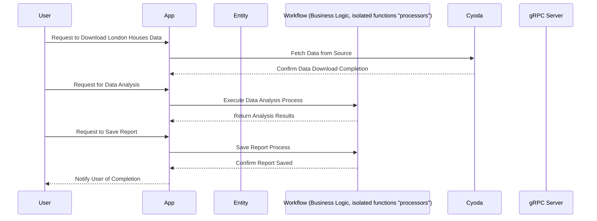

### User Requirement Document for London Houses Data Analysis

#### Requirements Overview

The requirement involves downloading data related to houses in London, analyzing it with the Pandas library, and saving the results as a report. This process will be orchestrated through Cyoda's entity management and workflow orchestration capabilities.

---

### User Stories

1. **User Story 1: Download Data**
   - **As a** user,
   - **I want** to download the London Houses Data,
   - **So that** I can analyze it for insights regarding the housing market.

2. **User Story 2: Analyze Data**
   - **As a** user,
   - **I want** to use Pandas to analyze the downloaded data,
   - **So that** I can generate relevant insights and trends.

3. **User Story 3: Save Report**
   - **As a** user,
   - **I want** to save the generated report after analysis,
   - **So that** I can share it with stakeholders or refer to it later.

---

### Questions for Clarification

1. **Data Source:** Where will the London Houses Data be sourced from? Is there a specific API or database?
2. **Output Format:** In what format do you want to save the report (e.g., CSV, PDF, Excel)?
3. **Frequency of Analysis:** Is this a one-time requirement, or will it need to be scheduled to run regularly?

---

### User Journey Diagram

```mermaid
journey
    title User Journey for London Houses Data Analysis
    section Step 1: Download Data
      User Download Request: 5: User
      Application Fetches Data: 4: App
      Cyoda Confirms Download: 4: Cyoda
    section Step 2: Analyze Data
      User Initiates Analysis: 5: User
      Application Utilizes Pandas: 4: App
      Application Proceeds with Analysis: 5: App
    section Step 3: Save Report
      User Sustains Results: 5: User
      Application Saves Report: 4: App
      User Receives Confirmation: 5: User
```

---

### Sequence Diagram



---

### Explanation of Choices

- **User Stories** capture user needs concretely and help drive the development process focused on delivering value.
- **Journey Diagram** visualizes the steps and experiences a user will encounter, aiding in identifying any gaps or pain points in the user experience.
- **Sequence Diagram** illustrates the detailed interactions between systems, ensuring clarity in how the workflow will function within Cyoda's architecture.

By outlining the user needs, visualizing their journey, and detailing the system interactions, we create a comprehensive foundation for implementation within a Cyoda-compliant application.