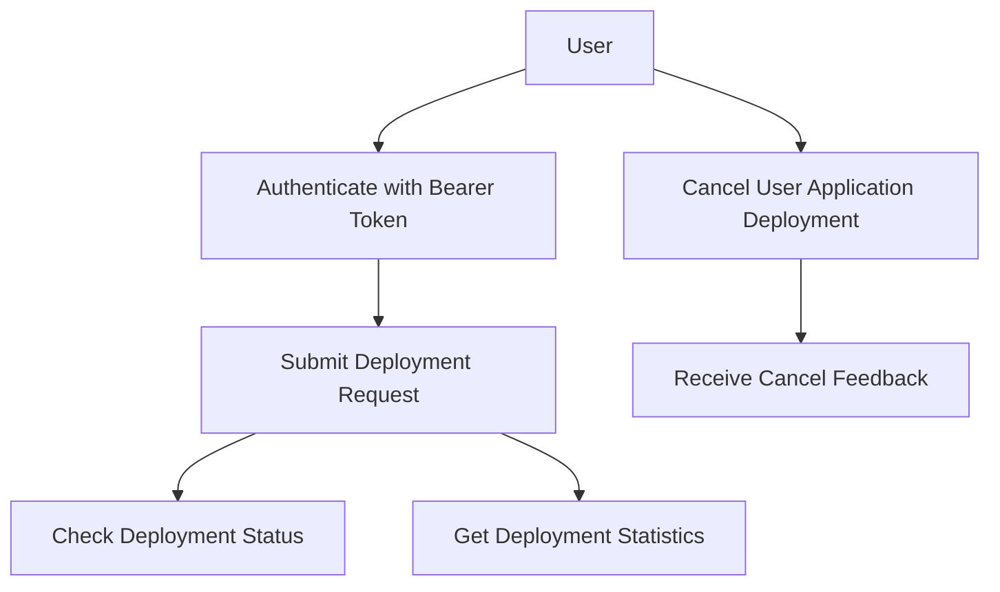
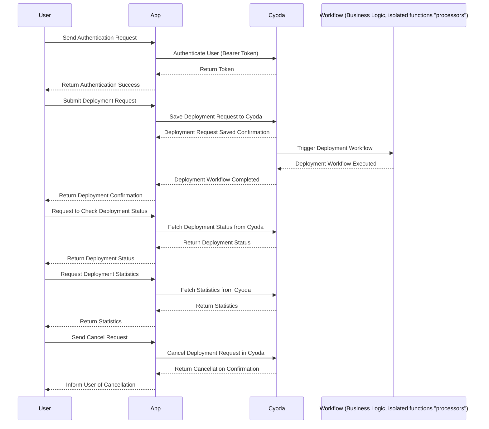

### User Requirement Document

#### User Stories

1. **User Authentication and Authorization**  
   - **As a** user,  
   - **I want to** authenticate using a Bearer token,  
   - **So that** I can access protected resources in the application.  
   - **API Endpoint:** `POST /deploy/cyoda-env`  
   - **Request Format:**  
     ```json  
     {  
       "user_name": "test"  
     }  
     ```  
   - **Response Format:**  
     ```json  
     {  
       "token": "your_jwt_token"  
     }  
     ```

2. **Submit Deployment Request**  
   - **As a** user,  
   - **I want to** submit a deployment request for my environment,  
   - **So that** a build is triggered with my configurations.  
   - **API Endpoint:** `POST /deploy/cyoda-env`  
   - **Request Format:**  
     ```json  
     {  
       "user_name": "test"  
     }  
     ```  
   - **Response Format:**  
     ```json  
     {  
       "build_id": "12345"  
     }  
     ```

3. **Submit User Application Deployment Request**  
   - **As a** user,  
   - **I want to** submit a deployment request for my application,  
   - **So that** it can be built and deployed with my repository.  
   - **API Endpoint:** `POST /deploy/user_app`  
   - **Request Format:**  
     ```json  
     {  
       "repository_url": "http://example.com/repo.git",  
       "is_public": "true"  
     }  
     ```  
   - **Response Format:**  
     ```json  
     {  
       "build_id": "54321"  
     }  
     ```

4. **Check Deployment Status**  
   - **As a** user,  
   - **I want to** check the status of my deployment,  
   - **So that** I know if it succeeded or failed.  
   - **API Endpoint:** `GET /deploy/cyoda-env/status/$id`  
   - **Response Format:**  
     ```json  
     {  
       "status": "successful",  
       "details": {  
         "repository_url": "http://example.com/repo.git",  
         "is_public": "true"  
       }  
     }  
     ```

5. **Get Deployment Statistics**  
   - **As a** user,  
   - **I want to** retrieve statistics for my deployment,  
   - **So that** I can analyze the build performance.  
   - **API Endpoint:** `GET /deploy/cyoda-env/statistics/$id`  
   - **Response Format:**  
     ```json  
     {  
       "build_time": "5min",  
       "success_rate": "95%"  
     }  
     ```

6. **Cancel User Application Deployment**  
   - **As a** user,  
   - **I want to** cancel a deployment that is currently queued,  
   - **So that** I can stop it from processing.  
   - **API Endpoint:** `POST /deploy/cancel/user_app/$id`  
   - **Request Format:**  
     ```json  
     {  
       "comment": "Canceling a queued build",  
       "readdIntoQueue": false  
     }  
     ```  
   - **Response Format:**  
     ```json  
     {  
       "message": "Build canceled successfully"  
     }  
     ```

#### Journey Diagram



#### Sequence Diagram



### Explanation of Choices

1. **User Stories**:
   We have detailed each user requirement in the form of user stories, which help clarify what functionalities need to be developed from the user's perspective. Each story includes specific API endpoints, request and response formats, which are crucial for implementation.

2. **Journey Diagram**:
   The journey diagram visualizes the flow of interactions a user has with the application. It helps in understanding the various actions a user can perform and how these actions connect to form a complete process.

3. **Sequence Diagram**:
   The sequence diagram illustrates the detailed back-and-forth communication between components when a user performs actions. This helps in understanding the relationships and dependencies between the User, App, Cyoda, and Workflow entities. It captures the entire lifecycle of requests from user authentication to deployment cancellation.

### Customization of Diagrams:
The general diagrams were adjusted to reflect the specific contexts of user authentication, deployment requests, checking status, and cancellation in your application. This ensures that the diagrams accurately represent the unique flows and processes defined in your requirements, thereby enhancing clarity and focus during development.