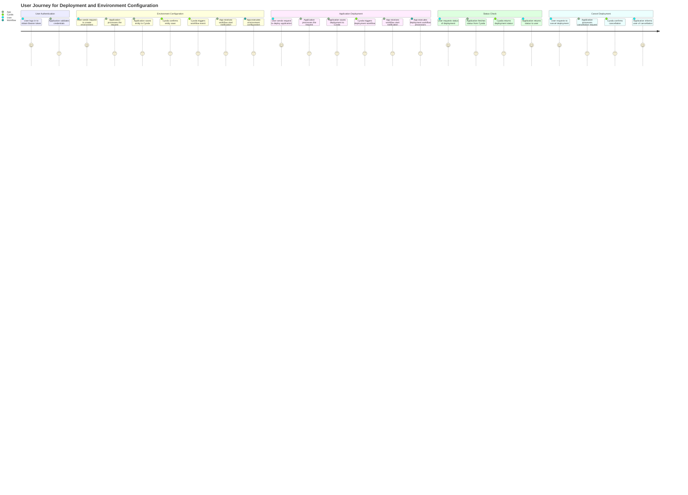
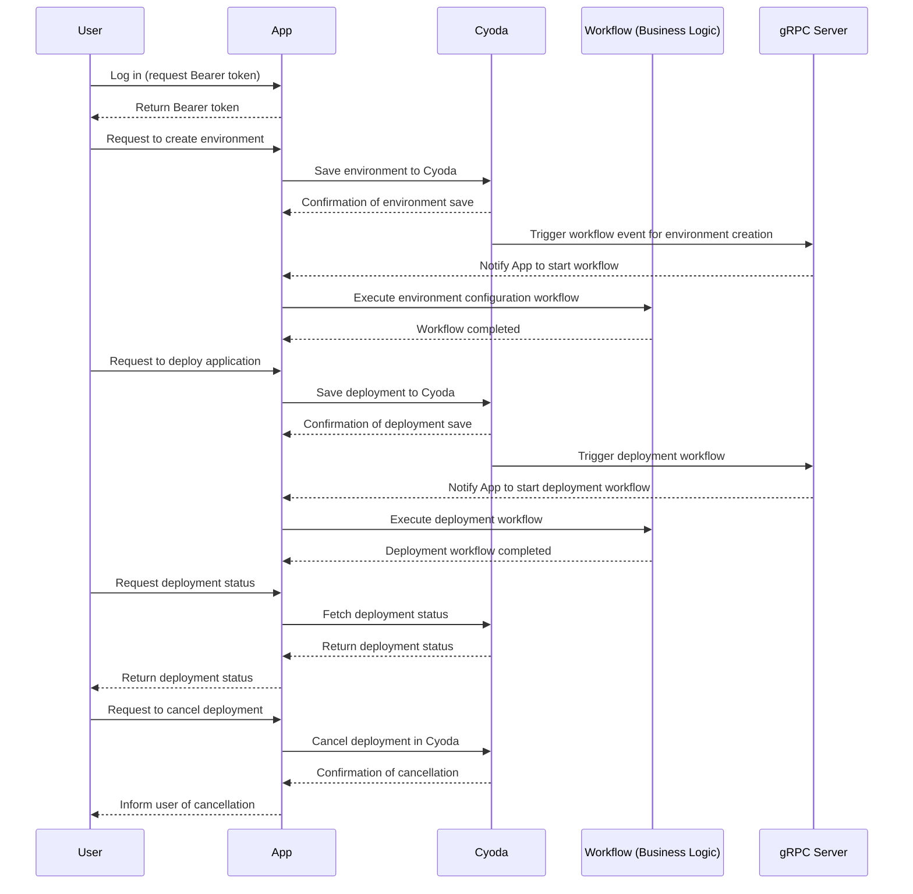

### User Requirement Document

This user requirement document outlines user stories, a journey diagram, and a sequence diagram customized for the deployment and environment configuration application.

#### User Stories
1. **As a user**, I want to authenticate using a Bearer token so that I can securely access the system.
2. **As a user**, I want to create and configure my deployment environment, so I can manage my resources efficiently.
3. **As a user**, I want to initiate the deployment of my application via a specified repository, to ensure my application is up-to-date and accessible.
4. **As a user**, I want to check the status of my deployment, so I can monitor progress and resolve issues promptly.
5. **As a user**, I want to cancel my queued deployment if it's no longer needed, to avoid unnecessary resource allocation.
6. **As a user**, I want to view the statistics of my deployed application to understand its performance and resource usage.

### Journey Diagram

### Sequence Diagram

### Explanation of Choices
- **User Stories**: I structured the user stories to cover all necessary interactions a user may need to perform. Each story focuses on a specific user requirement that adds value to the user experience.
  
- **Journey Diagram**: The journey diagram reflects the flow from user authentication to environment configuration and application deployment, including status checks and cancellation requests. This provides a visual representation of end-user interactions.

- **Sequence Diagram**: The sequence diagram details the interactions between the user, application, Cyoda, and workflows. I used this format to show the asynchronous nature of requests and how workflows are triggered and processed, making it easier to visualize the system's operation, especially in a Cyoda-like application architecture.

All diagrams are tailored to fit the specific context and requirements of the deployment and environment configuration app, ensuring clarity and usability for stakeholders involved in the development process.